# 我的SpringCloud笔记


## 认识微服务

随着互联网行业的发展，对服务的要求也越来越高，服务架构也从单体架构逐渐演变为现在流行的微服务架构。这些架构之间有怎样的差别呢？


### 单体架构

**单体架构**：将业务的所有功能集中在一个项目中开发，打成一个包部署。


单体架构的优缺点如下：

**优点：**

- 架构简单
- 部署成本低

**缺点：**

- 耦合度高（维护困难、升级困难）


### 分布式架构

**分布式架构**：根据业务功能对系统做拆分，每个业务功能模块作为独立项目开发，称为一个服务。


分布式架构的优缺点：

**优点：**

- 降低服务耦合
- 有利于服务升级和拓展

**缺点：**

- 服务调用关系错综复杂


分布式架构虽然降低了服务耦合，但是服务拆分时也有很多问题需要思考：

- 服务拆分的粒度如何界定？
- 服务之间如何调用？
- 服务的调用关系如何管理？

人们需要制定一套行之有效的标准来约束分布式架构。


### 微服务

微服务的架构特征：

- 单一职责：微服务拆分粒度更小，每一个服务都对应唯一的业务能力，做到单一职责
- 自治：团队独立、技术独立、数据独立，独立部署和交付
- 面向服务：服务提供统一标准的接口，与语言和技术无关
- 隔离性强：服务调用做好隔离、容错、降级，避免出现级联问题


微服务的上述特性其实是在给分布式架构制定一个标准，进一步降低服务之间的耦合度，提供服务的独立性和灵活性。做到高内聚，低耦合。

因此，可以认为**微服务**是一种经过良好架构设计的**分布式架构方案** 。

但方案该怎么落地？选用什么样的技术栈？全球的互联网公司都在积极尝试自己的微服务落地方案。

其中在Java领域最引人注目的就是SpringCloud提供的方案了。


### SpringCloud

SpringCloud是目前国内使用最广泛的微服务框架。官网地址：https://spring.io/projects/spring-cloud。

SpringCloud集成了各种微服务功能组件，并基于SpringBoot实现了这些组件的自动装配，从而提供了良好的开箱即用体验。

其中常见的组件包括：


另外，SpringCloud底层是依赖于SpringBoot的，并且有版本的兼容关系，如下：


我们课堂学习的版本是 Hoxton.SR10，因此对应的SpringBoot版本是2.3.x版本。


### 总结

- 单体架构：简单方便，高度耦合，扩展性差，适合小型项目。例如：学生管理系统

- 分布式架构：松耦合，扩展性好，但架构复杂，难度大。适合大型互联网项目，例如：京东、淘宝

- 微服务：一种良好的分布式架构方案

  ①优点：拆分粒度更小、服务更独立、耦合度更低

  ②缺点：架构非常复杂，运维、监控、部署难度提高

- SpringCloud是微服务架构的一站式解决方案，集成了各种优秀微服务功能组件


## 服务拆分和远程调用

任何分布式架构都离不开服务的拆分，微服务也是一样。

### 服务拆分原则

这里我总结了微服务拆分时的几个原则：

- 不同微服务，不要重复开发相同业务
- 微服务数据独立，不要访问其它微服务的数据库
- 微服务可以将自己的业务暴露为接口，供其它微服务调用


### 服务拆分示例

以课前资料中的微服务cloud-demo为例，其结构如下：


cloud-demo：父工程，管理依赖

- order-service：订单微服务，负责订单相关业务
- user-service：用户微服务，负责用户相关业务

要求：

- 订单微服务和用户微服务都必须有各自的数据库，相互独立
- 订单服务和用户服务都对外暴露Restful的接口
- 订单服务如果需要查询用户信息，只能调用用户服务的Restful接口，不能查询用户数据库


### 导入Sql语句

首先，将课前资料提供的`cloud-order.sql`和`cloud-user.sql`导入到mysql中：


cloud-user表中初始数据如下：


cloud-order表中初始数据如下：


cloud-order表中持有cloud-user表中的id字段。


### 导入demo工程

用IDEA导入课前资料提供的Demo：


项目结构如下：


导入后，会在IDEA右下角出现弹窗：


点击弹窗，然后按下图选择：


会出现这样的菜单：


配置下项目使用的JDK：


### 实现远程调用案例


在order-service服务中，有一个根据id查询订单的接口：


根据id查询订单，返回值是Order对象，如图：


其中的user为null


在user-service中有一个根据id查询用户的接口：


查询的结果如图：


### 案例需求：

修改order-service中的根据id查询订单业务，要求在查询订单的同时，根据订单中包含的userId查询出用户信息，一起返回。


因此，我们需要在order-service中 向user-service发起一个http的请求，调用http://localhost:8081/user/{userId}这个接口。

大概的步骤是这样的：

- 注册一个RestTemplate的实例到Spring容器
- 修改order-service服务中的OrderService类中的queryOrderById方法，根据Order对象中的userId查询User
- 将查询的User填充到Order对象，一起返回


### 注册RestTemplate

首先，我们在order-service服务中的OrderApplication启动类中，注册RestTemplate实例：

```java
package com.ganga.order;

import org.mybatis.spring.annotation.MapperScan;
import org.springframework.boot.SpringApplication;
import org.springframework.boot.autoconfigure.SpringBootApplication;
import org.springframework.context.annotation.Bean;
import org.springframework.web.client.RestTemplate;

@MapperScan("com.ganga.order.mapper")
@SpringBootApplication
public class OrderApplication {

  public static void main(String[] args) {
    SpringApplication.run(OrderApplication.class, args);
  }

  @Bean
  public RestTemplate restTemplate() {
    return new RestTemplate();
  }
}
```


### 实现远程调用

修改order-service服务中的com.ganga.order.service包下的OrderService类中的queryOrderById方法：


### 提供者与消费者

在服务调用关系中，会有两个不同的角色：

**服务提供者**：一次业务中，被其它微服务调用的服务。（提供接口给其它微服务）

**服务消费者**：一次业务中，调用其它微服务的服务。（调用其它微服务提供的接口）


但是，服务提供者与服务消费者的角色并不是绝对的，而是相对于业务而言。

如果服务A调用了服务B，而服务B又调用了服务C，服务B的角色是什么？

- 对于A调用B的业务而言：A是服务消费者，B是服务提供者
- 对于B调用C的业务而言：B是服务消费者，C是服务提供者


因此，服务B既可以是服务提供者，也可以是服务消费者。


## 组件-注册中心


### Eureka注册中心


假如我们的服务提供者user-service部署了多个实例，如图：


大家思考几个问题：

- order-service在发起远程调用的时候，该如何得知user-service实例的ip地址和端口？
- 有多个user-service实例地址，order-service调用时该如何选择？
- order-service如何得知某个user-service实例是否依然健康，是不是已经宕机？


#### Eureka的结构和作用

这些问题都需要利用SpringCloud中的注册中心来解决，其中最广为人知的注册中心就是Eureka，其结构如下：


回答之前的各个问题。

问题1：order-service如何得知user-service实例地址？

获取地址信息的流程如下：

- user-service服务实例启动后，将自己的信息注册到eureka-server（Eureka服务端）。这个叫服务注册
- eureka-server保存服务名称到服务实例地址列表的映射关系
- order-service根据服务名称，拉取实例地址列表。这个叫服务发现或服务拉取


问题2：order-service如何从多个user-service实例中选择具体的实例？

- order-service从实例列表中利用负载均衡算法选中一个实例地址
- 向该实例地址发起远程调用


问题3：order-service如何得知某个user-service实例是否依然健康，是不是已经宕机？

- user-service会每隔一段时间（默认30秒）向eureka-server发起请求，报告自己状态，称为心跳
- 当超过一定时间没有发送心跳时，eureka-server会认为微服务实例故障，将该实例从服务列表中剔除
- order-service拉取服务时，就能将故障实例排除了


> 注意：一个微服务，既可以是服务提供者，又可以是服务消费者，因此eureka将服务注册、服务发现等功能统一封装到了eureka-client端


因此，接下来我们动手实践的步骤包括：


#### 搭建eureka-server

首先大家注册中心服务端：eureka-server，这必须是一个独立的微服务

##### 创建eureka-server服务

在cloud-demo父工程下，创建一个子模块：


填写模块信息：


然后填写服务信息：


##### 引入eureka依赖

引入SpringCloud为eureka提供的starter依赖：

```xml
<dependency>
  <groupId>org.springframework.cloud</groupId>
  <artifactId>spring-cloud-starter-netflix-eureka-server</artifactId>
</dependency>
```


##### 编写启动类

给eureka-server服务编写一个启动类，一定要添加一个@EnableEurekaServer注解，开启eureka的注册中心功能：

```java
package com.ganga.eureka;

import org.springframework.boot.SpringApplication;
import org.springframework.boot.autoconfigure.SpringBootApplication;
import org.springframework.cloud.netflix.eureka.server.EnableEurekaServer;

@SpringBootApplication
@EnableEurekaServer
public class EurekaApplication {
  public static void main(String[] args) {
    SpringApplication.run(EurekaApplication.class, args);
  }
}
```


##### 编写配置文件

编写一个application.yml文件，内容如下：

```yaml
server:
  port: 10086
spring:
  application:
    name: eureka-server
eureka:
  client:
    service-url:
      defaultZone: http://127.0.0.1:10086/eureka
```


##### 启动服务

启动微服务，然后在浏览器访问：http://127.0.0.1:10086

看到下面结果应该是成功了：


#### 服务注册

下面，我们将user-service注册到eureka-server中去。

##### 引入依赖

在user-service的pom文件中，引入下面的eureka-client依赖：

```xml
<dependency>
  <groupId>org.springframework.cloud</groupId>
  <artifactId>spring-cloud-starter-netflix-eureka-client</artifactId>
</dependency>
```


##### 配置文件

在user-service中，修改application.yml文件，添加服务名称、eureka地址：

```yaml
spring:
  application:
    name: userservice
eureka:
  client:
    service-url:
      defaultZone: http://127.0.0.1:10086/eureka
```


##### 启动多个user-service实例

为了演示一个服务有多个实例的场景，我们添加一个SpringBoot的启动配置，再启动一个user-service。


首先，复制原来的user-service启动配置：


然后，在弹出的窗口中，填写信息：


现在，SpringBoot窗口会出现两个user-service启动配置：


不过，第一个是8081端口，第二个是8082端口。

启动两个user-service实例：


查看eureka-server管理页面：


#### 服务发现

下面，我们将order-service的逻辑修改：向eureka-server拉取user-service的信息，实现服务发现。

##### 引入依赖

之前说过，服务发现、服务注册统一都封装在eureka-client依赖，因此这一步与服务注册时一致。

在order-service的pom文件中，引入下面的eureka-client依赖：

```xml
<dependency>
  <groupId>org.springframework.cloud</groupId>
  <artifactId>spring-cloud-starter-netflix-eureka-client</artifactId>
</dependency>
```


##### 配置文件

服务发现也需要知道eureka地址，因此第二步与服务注册一致，都是配置eureka信息：

在order-service中，修改application.yml文件，添加服务名称、eureka地址：

```yaml
spring:
  application:
    name: orderservice
eureka:
  client:
    service-url:
      defaultZone: http://127.0.0.1:10086/eureka
```


##### 服务拉取和负载均衡

最后，我们要去eureka-server中拉取user-service服务的实例列表，并且实现负载均衡。

不过这些动作不用我们去做，只需要添加一些注解即可。


在order-service的OrderApplication中，给RestTemplate这个Bean添加一个@LoadBalanced注解：


修改order-service服务中的com.ganga.order.service包下的OrderService类中的queryOrderById方法。修改访问的url路径，用服务名代替ip、端口：


spring会自动帮助我们从eureka-server端，根据userservice这个服务名称，获取实例列表，而后完成负载均衡。


---


#### 备忘

**依赖**

```xml
<!-- eureka-server -->
<dependency>
  <groupId>org.springframework.cloud</groupId>
  <artifactId>spring-cloud-starter-netflix-eureka-server</artifactId>
</dependency>

        <!-- eureka-server -->
<dependency>
<groupId>org.springframework.cloud</groupId>
<artifactId>spring-cloud-starter-netflix-eureka-client</artifactId>
</dependency>
```

**注解**

```java
//在配置类中 开启 暴露EurekaServer  //只在eureka-server中开启
@EnableEurekaServer
```

**简单配置**

server

```yaml
server:
  port: 10086
spring:
  application:
    name: eureka-server
# 配置EurekaService地址
eureka:
  client:
    service-url:
      defaultZone: http://localhost:10086/eureka
```

client

```yaml
spring:
  application:
    name: orderservice # 使用Eureka必须要提供服务名字
# 注册 Eureka
eureka:
  client:
    service-url:
      defaultZone: http://localhost:10086/eureka
```


### Nacos注册中心

国内公司一般都推崇阿里巴巴的技术，比如注册中心，SpringCloudAlibaba也推出了一个名为Nacos的注册中心。

#### 认识和安装Nacos

[Nacos](https://nacos.io/)是阿里巴巴的产品，现在是[SpringCloud](https://spring.io/projects/spring-cloud)中的一个组件。相比[Eureka](https://github.com/Netflix/eureka)功能更加丰富，在国内受欢迎程度较高。


安装方式可以参考课前资料《Nacos安装指南.md》


#### Nacos安装指南


##### 1.Windows安装

开发阶段采用单机安装即可。


###### 1.1.下载安装包

在Nacos的GitHub页面，提供有下载链接，可以下载编译好的Nacos服务端或者源代码：

GitHub主页：https://github.com/alibaba/nacos

GitHub的Release下载页：https://github.com/alibaba/nacos/releases

如图：


本课程采用1.4.1.版本的Nacos，课前资料已经准备了安装包：


windows版本使用`nacos-server-1.4.1.zip`包即可。


###### 1.2.解压

将这个包解压到任意非中文目录下，如图：


目录说明：

- bin：启动脚本
- conf：配置文件


###### 1.3.端口配置

Nacos的默认端口是8848，如果你电脑上的其它进程占用了8848端口，请先尝试关闭该进程。

**如果无法关闭占用8848端口的进程**，也可以进入nacos的conf目录，修改配置文件中的端口：


修改其中的内容：


###### 1.4.启动

启动非常简单，进入bin目录，结构如下：


然后执行命令即可：

- windows命令：

  ```
  startup.cmd -m standalone
  ```


执行后的效果如图：


###### 1.5.访问

在浏览器输入地址：http://127.0.0.1:8848/nacos即可：


默认的账号和密码都是nacos，进入后：


##### 2.Linux安装

Linux或者Mac安装方式与Windows类似。


###### 2.1.安装JDK

Nacos依赖于JDK运行，索引Linux上也需要安装JDK才行。

上传jdk安装包：


上传到某个目录，例如：`/usr/local/`


然后解压缩：

```sh
tar -xvf jdk-8u144-linux-x64.tar.gz
```

然后重命名为java


配置环境变量：

```sh
export JAVA_HOME=/usr/local/java
export PATH=$PATH:$JAVA_HOME/bin
```

设置环境变量：

```sh
source /etc/profile
```


###### 2.2.上传安装包

如图：


也可以直接使用课前资料中的tar.gz：


上传到Linux服务器的某个目录，例如`/usr/local/src`目录下：


###### 2.3.解压

命令解压缩安装包：

```sh
tar -xvf nacos-server-1.4.1.tar.gz
```

然后删除安装包：

```sh
rm -rf nacos-server-1.4.1.tar.gz
```

目录中最终样式：


目录内部：


###### 2.4.端口配置

与windows中类似


###### 2.5.启动

在nacos/bin目录中，输入命令启动Nacos：

```sh
sh startup.sh -m standalone
```


##### 3.Nacos的依赖

父工程：

```xml
<dependency>
  <groupId>com.alibaba.cloud</groupId>
  <artifactId>spring-cloud-alibaba-dependencies</artifactId>
  <version>2.2.5.RELEASE</version>
  <type>pom</type>
  <scope>import</scope>
</dependency>
```


客户端：

```xml
<!-- nacos客户端依赖包 -->
<dependency>
  <groupId>com.alibaba.cloud</groupId>
  <artifactId>spring-cloud-starter-alibaba-nacos-discovery</artifactId>
</dependency>

```


#### 服务注册到nacos

Nacos是SpringCloudAlibaba的组件，而SpringCloudAlibaba也遵循SpringCloud中定义的服务注册、服务发现规范。因此使用Nacos和使用Eureka对于微服务来说，并没有太大区别。

主要差异在于：

- 依赖不同
- 服务地址不同


##### 引入依赖

在cloud-demo父工程的pom文件中的`<dependencyManagement>`中引入SpringCloudAlibaba的依赖：

```xml
<dependency>
  <groupId>com.alibaba.cloud</groupId>
  <artifactId>spring-cloud-alibaba-dependencies</artifactId>
  <version>2.2.6.RELEASE</version>
  <type>pom</type>
  <scope>import</scope>
</dependency>
```

然后在user-service和order-service中的pom文件中引入nacos-discovery依赖：

```xml
<dependency>
  <groupId>com.alibaba.cloud</groupId>
  <artifactId>spring-cloud-starter-alibaba-nacos-discovery</artifactId>
</dependency>
```


> **注意**：不要忘了注释掉eureka的依赖。


##### 配置nacos地址

在user-service和order-service的application.yml中添加nacos地址：

```yaml
spring:
  cloud:
    nacos:
      server-addr: localhost:8848
```


> **注意**：不要忘了注释掉eureka的地址


##### 重启

重启微服务后，登录nacos管理页面，可以看到微服务信息：


#### 服务分级存储模型

一个**服务**可以有多个**实例**，例如我们的user-service，可以有:

- 127.0.0.1:8081
- 127.0.0.1:8082
- 127.0.0.1:8083

假如这些实例分布于全国各地的不同机房，例如：

- 127.0.0.1:8081，在上海机房
- 127.0.0.1:8082，在上海机房
- 127.0.0.1:8083，在杭州机房

Nacos就将同一机房内的实例 划分为一个**集群**。

也就是说，user-service是服务，一个服务可以包含多个集群，如杭州、上海，每个集群下可以有多个实例，形成分级模型，如图：


微服务互相访问时，应该尽可能访问同集群实例，因为本地访问速度更快。当本集群内不可用时，才访问其它集群。例如：


杭州机房内的order-service应该优先访问同机房的user-service。


##### 给user-service配置集群


修改user-service的application.yml文件，添加集群配置：

```yaml
spring:
  cloud:
    nacos:
      server-addr: localhost:8848
      discovery:
        cluster-name: HZ # 集群名称
```

重启两个user-service实例后，我们可以在nacos控制台看到下面结果：


我们再次复制一个user-service启动配置，添加属性：

```sh
-Dserver.port=8083 -Dspring.cloud.nacos.discovery.cluster-name=SH
```

配置如图所示：


启动UserApplication3后再次查看nacos控制台：


##### 同集群优先的负载均衡

默认的`ZoneAvoidanceRule`并不能实现根据同集群优先来实现负载均衡。

因此Nacos中提供了一个`NacosRule`的实现，可以优先从同集群中挑选实例。

1）给order-service配置集群信息

修改order-service的application.yml文件，添加集群配置：

```sh
spring:
  cloud:
    nacos:
      server-addr: localhost:8848
      discovery:
        cluster-name: HZ # 集群名称
```


2）修改负载均衡规则

修改order-service的application.yml文件，修改负载均衡规则：

```yaml
userservice:
  ribbon:
    NFLoadBalancerRuleClassName: com.alibaba.cloud.nacos.ribbon.NacosRule # 负载均衡规则 
```


#### 权重配置

实际部署中会出现这样的场景：

服务器设备性能有差异，部分实例所在机器性能较好，另一些较差，我们希望性能好的机器承担更多的用户请求。

但默认情况下NacosRule是同集群内随机挑选，不会考虑机器的性能问题。


因此，Nacos提供了权重配置来控制访问频率，权重越大则访问频率越高。


在nacos控制台，找到user-service的实例列表，点击编辑，即可修改权重：


在弹出的编辑窗口，修改权重：


> **注意**：如果权重修改为0，则该实例永远不会被访问


#### 环境隔离

Nacos提供了namespace来实现环境隔离功能。

- nacos中可以有多个namespace
- namespace下可以有group、service等
- 不同namespace之间相互隔离，例如不同namespace的服务互相不可见


##### 创建namespace

默认情况下，所有service、data、group都在同一个namespace，名为public：


我们可以点击页面新增按钮，添加一个namespace：


然后，填写表单：


就能在页面看到一个新的namespace：


##### 给微服务配置namespace

给微服务配置namespace只能通过修改配置来实现。

例如，修改order-service的application.yml文件：

```yaml
spring:
  cloud:
    nacos:
      server-addr: localhost:8848
      discovery:
        cluster-name: HZ
        namespace: 492a7d5d-237b-46a1-a99a-fa8e98e4b0f9 # 命名空间，填ID
```


重启order-service后，访问控制台，可以看到下面的结果：


此时访问order-service，因为namespace不同，会导致找不到userservice，控制台会报错：


#### Nacos与Eureka的区别

Nacos的服务实例分为两种l类型：

- 临时实例：如果实例宕机超过一定时间，会从服务列表剔除，默认的类型。

- 非临时实例：如果实例宕机，不会从服务列表剔除，也可以叫永久实例。


配置一个服务实例为永久实例：

```yaml
spring:
  cloud:
    nacos:
      discovery:
        ephemeral: false # 设置为非临时实例
```


Nacos和Eureka整体结构类似，服务注册、服务拉取、心跳等待，但是也存在一些差异：


- Nacos与eureka的共同点
  - 都支持服务注册和服务拉取
  - 都支持服务提供者心跳方式做健康检测

- Nacos与Eureka的区别
  - Nacos支持服务端主动检测提供者状态：临时实例采用心跳模式，非临时实例采用主动检测模式
  - 临时实例心跳不正常会被剔除，非临时实例则不会被剔除
  - Nacos支持服务列表变更的消息推送模式，服务列表更新更及时
  - Nacos集群默认采用AP方式，当集群中存在非临时实例时，采用CP模式；Eureka采用AP方式


#### 备忘

**依赖**

```xml
<!-- Nacos依赖 父工程依赖 -->
<dependency>
  <groupId>com.alibaba.cloud</groupId>
  <artifactId>spring-cloud-alibaba-dependencies</artifactId>
  <version>2.2.5.RELEASE</version>
  <type>pom</type>
  <scope>import</scope>
</dependency>

        <!-- nacos客户端依赖包 -->
<dependency>
<groupId>com.alibaba.cloud</groupId>
<artifactId>spring-cloud-starter-alibaba-nacos-discovery</artifactId>
</dependency>
```

**配置**

```yaml
spring:
  application:
    name: orderservice
  # cloud配置
  cloud: # 配置 nacos 地址
    nacos:
      server-addr: localhost:8848
      discovery: # 服务分级存储模型 给该服务配置 集群
        cluster-name: Ayaka
        namespace: 492a7d5d-237b-46a1-a99a-fa8e98e4b0f9 # 命名空间，填ID
        ephemeral: false # 设置为非临时实例 默认是临时实例
# 上面并不会生效 要进行负载均衡从新配置
userservice: # 对 userservice 单独进行配置负载均衡算法
  ribbon:
    NFLoadBalancerRuleClassName: com.alibaba.cloud.nacos.ribbon.NacosRule # 负载均衡规则
```


## 组件-负载均衡


### Ribbon负载均衡

上一节中，我们添加了@LoadBalanced注解，即可实现负载均衡功能，这是什么原理呢？


#### 负载均衡原理

SpringCloud底层其实是利用了一个名为Ribbon的组件，来实现负载均衡功能的。


那么我们发出的请求明明是http://userservice/user/1，怎么变成了http://localhost:8081的呢？


#### 源码跟踪

为什么我们只输入了service名称就可以访问了呢？之前还要获取ip和端口。

显然有人帮我们根据service名称，获取到了服务实例的ip和端口。它就是`LoadBalancerInterceptor`，这个类会在对RestTemplate的请求进行拦截，然后从Eureka根据服务id获取服务列表，随后利用负载均衡算法得到真实的服务地址信息，替换服务id。

我们进行源码跟踪：

##### LoadBalancerIntercepor


可以看到这里的intercept方法，拦截了用户的HttpRequest请求，然后做了几件事：

- `request.getURI()`：获取请求uri，本例中就是 http://user-service/user/8
- `originalUri.getHost()`：获取uri路径的主机名，其实就是服务id，`user-service`
- `this.loadBalancer.execute()`：处理服务id，和用户请求。

这里的`this.loadBalancer`是`LoadBalancerClient`类型，我们继续跟入。


##### LoadBalancerClient

继续跟入execute方法：


代码是这样的：

- getLoadBalancer(serviceId)：根据服务id获取ILoadBalancer，而ILoadBalancer会拿着服务id去eureka中获取服务列表并保存起来。
- getServer(loadBalancer)：利用内置的负载均衡算法，从服务列表中选择一个。本例中，可以看到获取了8082端口的服务


放行后，再次访问并跟踪，发现获取的是8081：


果然实现了负载均衡。


##### 负载均衡策略IRule

在刚才的代码中，可以看到获取服务使通过一个`getServer`方法来做负载均衡:


我们继续跟入：


继续跟踪源码chooseServer方法，发现这么一段代码：


我们看看这个rule是谁：


这里的rule默认值是一个`RoundRobinRule`，看类的介绍：


这不就是轮询的意思嘛。

到这里，整个负载均衡的流程我们就清楚了。


##### 总结

SpringCloudRibbon的底层采用了一个拦截器，拦截了RestTemplate发出的请求，对地址做了修改。用一幅图来总结一下：


基本流程如下：

- 拦截我们的RestTemplate请求http://userservice/user/1
- RibbonLoadBalancerClient会从请求url中获取服务名称，也就是user-service
- DynamicServerListLoadBalancer根据user-service到eureka拉取服务列表
- eureka返回列表，localhost:8081、localhost:8082
- IRule利用内置负载均衡规则，从列表中选择一个，例如localhost:8081
- RibbonLoadBalancerClient修改请求地址，用localhost:8081替代userservice，得到http://localhost:8081/user/1，发起真实请求


#### 负载均衡策略


##### 负载均衡策略

负载均衡的规则都定义在IRule接口中，而IRule有很多不同的实现类：


不同规则的含义如下：

| **内置负载均衡规则类**    | **规则描述**                                                 |
| ------------------------- | ------------------------------------------------------------ |
| RoundRobinRule            | 简单轮询服务列表来选择服务器。它是Ribbon默认的负载均衡规则。 |
| AvailabilityFilteringRule | 对以下两种服务器进行忽略：   （1）在默认情况下，这台服务器如果3次连接失败，这台服务器就会被设置为“短路”状态。短路状态将持续30秒，如果再次连接失败，短路的持续时间就会几何级地增加。  （2）并发数过高的服务器。如果一个服务器的并发连接数过高，配置了AvailabilityFilteringRule规则的客户端也会将其忽略。并发连接数的上限，可以由客户端的<clientName>.<clientConfigNameSpace>.ActiveConnectionsLimit属性进行配置。 |
| WeightedResponseTimeRule  | 为每一个服务器赋予一个权重值。服务器响应时间越长，这个服务器的权重就越小。这个规则会随机选择服务器，这个权重值会影响服务器的选择。 |
| **ZoneAvoidanceRule**     | 以区域可用的服务器为基础进行服务器的选择。使用Zone对服务器进行分类，这个Zone可以理解为一个机房、一个机架等。而后再对Zone内的多个服务做轮询。 |
| BestAvailableRule         | 忽略那些短路的服务器，并选择并发数较低的服务器。             |
| RandomRule                | 随机选择一个可用的服务器。                                   |
| RetryRule                 | 重试机制的选择逻辑                                           |


默认的实现就是ZoneAvoidanceRule，是一种轮询方案


##### 自定义负载均衡策略

通过定义IRule实现可以修改负载均衡规则，有两种方式：

1. 代码方式：在order-service中的OrderApplication类中，定义一个新的IRule：

```java
@Bean
public IRule randomRule(){
    return new RandomRule();
}
```


2. 配置文件方式：在order-service的application.yml文件中，添加新的配置也可以修改规则：

```yaml
userservice: # 给某个微服务配置负载均衡规则，这里是userservice服务
  ribbon:
    NFLoadBalancerRuleClassName: com.netflix.loadbalancer.RandomRule # 负载均衡规则 
```


> **注意**，一般用默认的负载均衡规则，不做修改。


#### 饥饿加载

Ribbon默认是采用懒加载，即第一次访问时才会去创建LoadBalanceClient，请求时间会很长。

而饥饿加载则会在项目启动时创建，降低第一次访问的耗时，通过下面配置开启饥饿加载：

```yaml
ribbon:
  eager-load:
    enabled: true
    clients: userservice
```


#### 备忘


**规则选择**

| **内置负载均衡规则类**    | **规则描述**                                                 |
| ------------------------- | ------------------------------------------------------------ |
| RoundRobinRule            | 简单轮询服务列表来选择服务器。它是Ribbon默认的负载均衡规则。 |
| AvailabilityFilteringRule | 对以下两种服务器进行忽略：   （1）在默认情况下，这台服务器如果3次连接失败，这台服务器就会被设置为“短路”状态。短路状态将持续30秒，如果再次连接失败，短路的持续时间就会几何级地增加。  （2）并发数过高的服务器。如果一个服务器的并发连接数过高，配置了AvailabilityFilteringRule规则的客户端也会将其忽略。并发连接数的上限，可以由客户端的<clientName>.<clientConfigNameSpace>.ActiveConnectionsLimit属性进行配置。 |
| WeightedResponseTimeRule  | 为每一个服务器赋予一个权重值。服务器响应时间越长，这个服务器的权重就越小。这个规则会随机选择服务器，这个权重值会影响服务器的选择。 |
| **ZoneAvoidanceRule**     | 以区域可用的服务器为基础进行服务器的选择。使用Zone对服务器进行分类，这个Zone可以理解为一个机房、一个机架等。而后再对Zone内的多个服务做轮询。 |
| BestAvailableRule         | 忽略那些短路的服务器，并选择并发数较低的服务器。             |
| RandomRule                | 随机选择一个可用的服务器。                                   |
| RetryRule                 | 重试机制的选择逻辑                                           |

**实现方式一**

```java
//全局使用该负载均衡算法
@Bean
public IRule iRule(){
    return new NacosRule();
}
```

**实现方式二**

```yaml
# 对 userservice 单独进行配置负载均衡算法
userservice:
  ribbon:
    NFLoadBalancerRuleClassName: com.alibaba.cloud.nacos.ribbon.NacosRule # 负载均衡规则
```

**饥饿加载**

```yaml
# 对ribbon进行配置
ribbon:
  eager-load:
    enabled: true # 饥饿加载 开启 饥饿加载
    clients: userservice # 对userservice进行饥饿加载  
      #- userservice #也可进行多个服务
      #- shopservice
```


## 组件-远程调用


### Feign远程调用


先来看我们以前利用RestTemplate发起远程调用的代码：

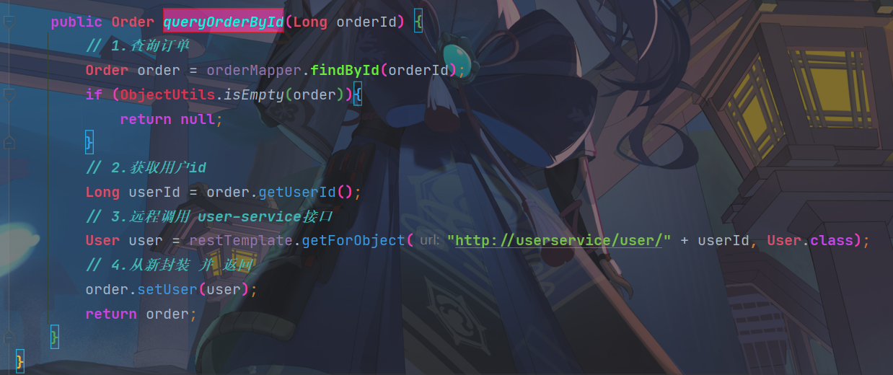

存在下面的问题：

•代码可读性差，编程体验不统一

•参数复杂URL难以维护


Feign是一个声明式的http客户端，官方地址：https://github.com/OpenFeign/feign

其作用就是帮助我们优雅的实现http请求的发送，解决上面提到的问题。

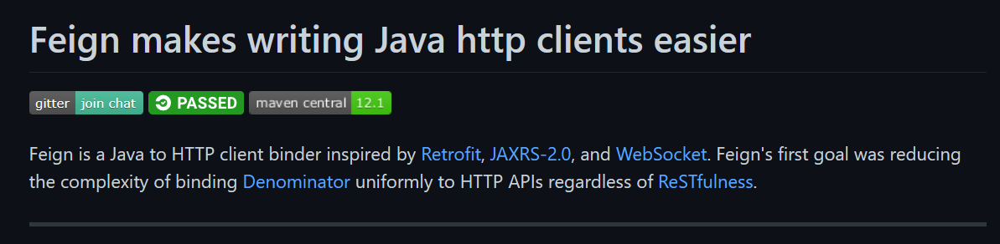


#### Feign替代RestTemplate

Fegin的使用步骤如下：

##### 引入依赖

我们在order-service服务的pom文件中引入feign的依赖：

```xml
<dependency>
    <groupId>org.springframework.cloud</groupId>
    <artifactId>spring-cloud-starter-openfeign</artifactId>
</dependency>
```


##### 添加注解

在order-service的启动类添加注解开启Feign的功能：

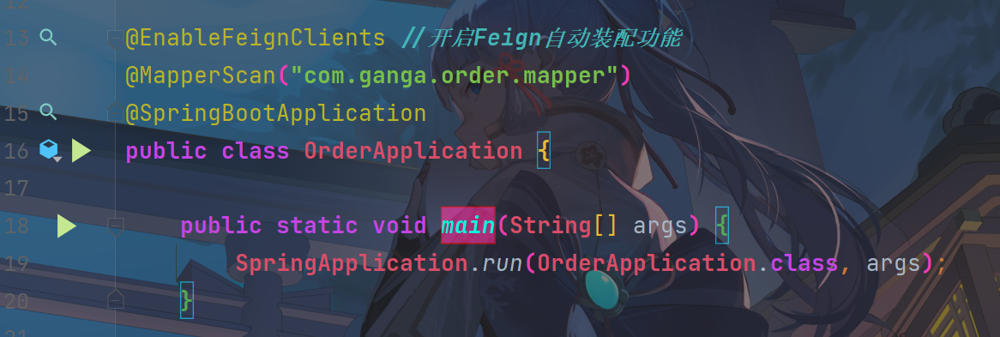


##### 编写Feign的客户端

在order-service中新建一个接口，内容如下：

```java
package com.ganga.order.clients;

import com.ganga.order.pojo.User;
import org.springframework.cloud.openfeign.FeignClient;
import org.springframework.web.bind.annotation.GetMapping;
import org.springframework.web.bind.annotation.PathVariable;

//指定远程调用的 服务名称
@FeignClient("userservice")
public interface FeigeClient {

    @GetMapping("user/{id}")
    User findById(@PathVariable("id") Long id);

}

```


这个客户端主要是基于SpringMVC的注解来声明远程调用的信息，比如：

- 服务名称：userservice
- 请求方式：GET
- 请求路径：/user/{id}
- 请求参数：Long id
- 返回值类型：User

这样，Feign就可以帮助我们发送http请求，无需自己使用RestTemplate来发送了。


##### 测试

修改order-service中的OrderService类中的queryOrderById方法，使用Feign客户端代替RestTemplate：

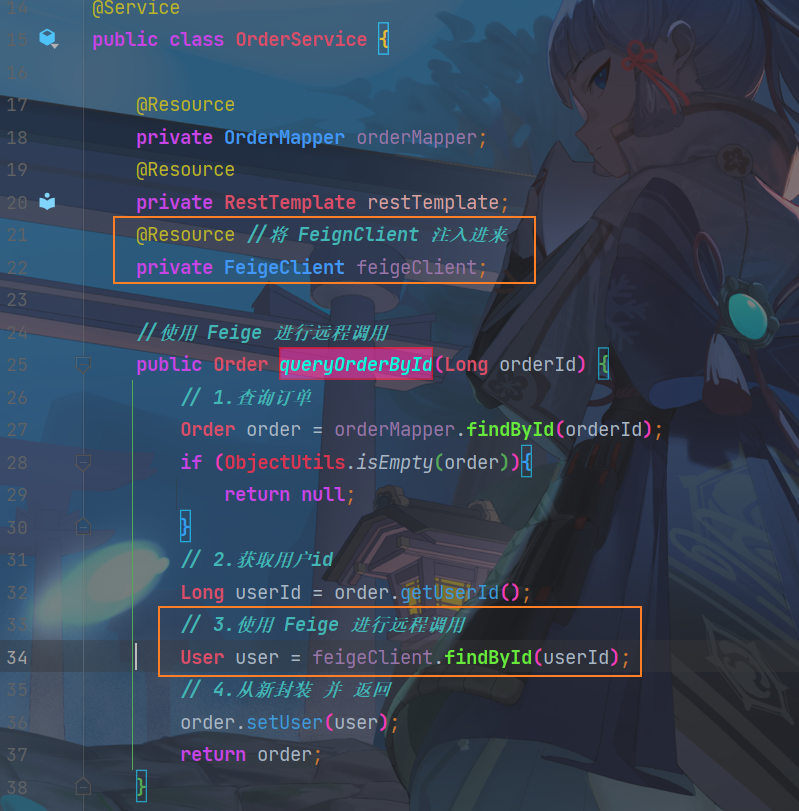

是不是看起来优雅多了。


##### 总结

使用Feign的步骤：

① 引入依赖

② 添加@EnableFeignClients注解

③ 编写FeignClient接口

④ 使用FeignClient中定义的方法代替RestTemplate


---


#### 自定义配置

Feign可以支持很多的自定义配置，如下表所示：

| 类型                   | 作用             | 说明                                                   |
| ---------------------- | ---------------- | ------------------------------------------------------ |
| **feign.Logger.Level** | 修改日志级别     | 包含四种不同的级别：NONE、BASIC、HEADERS、FULL         |
| feign.codec.Decoder    | 响应结果的解析器 | http远程调用的结果做解析，例如解析json字符串为java对象 |
| feign.codec.Encoder    | 请求参数编码     | 将请求参数编码，便于通过http请求发送                   |
| feign. Contract        | 支持的注解格式   | 默认是SpringMVC的注解                                  |
| feign. Retryer         | 失败重试机制     | 请求失败的重试机制，默认是没有，不过会使用Ribbon的重试 |

一般情况下，默认值就能满足我们使用，如果要自定义时，只需要创建自定义的@Bean覆盖默认Bean即可。


下面以日志为例来演示如何自定义配置。

##### 配置文件方式

基于配置文件修改feign的日志级别可以针对单个服务：

```yaml
feign:  
  client:
    config: 
      userservice: # 针对某个微服务的配置
        loggerLevel: FULL #  日志级别 
```

也可以针对所有服务：

```yaml
feign:  
  client:
    config: 
      default: # 这里用default就是全局配置，如果是写服务名称，则是针对某个微服务的配置
        loggerLevel: FULL #  日志级别 
```


而日志的级别分为四种：

- NONE：不记录任何日志信息，这是默认值。
- BASIC：仅记录请求的方法，URL以及响应状态码和执行时间
- HEADERS：在BASIC的基础上，额外记录了请求和响应的头信息
- FULL：记录所有请求和响应的明细，包括头信息、请求体、元数据。


##### Java代码方式

也可以基于Java代码来修改日志级别，先声明一个类，然后声明一个Logger.Level的对象：

```java
public class DefaultFeignConfiguration  {
    @Bean
    public Logger.Level feignLogLevel(){
        return Logger.Level.BASIC; // 日志级别为BASIC
    }
}
```


如果要**全局生效**，将其放到启动类的@EnableFeignClients这个注解中：

```java
@EnableFeignClients(defaultConfiguration = DefaultFeignConfiguration .class) 
```


如果是**局部生效**，则把它放到对应的@FeignClient这个注解中：

```java
@FeignClient(value = "userservice", configuration = DefaultFeignConfiguration .class) 
```


#### Feign使用优化

Feign底层发起http请求，依赖于其它的框架。其底层客户端实现包括：

•URLConnection：默认实现，不支持连接池

•Apache HttpClient ：支持连接池

•OKHttp：支持连接池


因此提高Feign的性能主要手段就是使用**连接池**代替默认的URLConnection。


这里我们用Apache的HttpClient来演示。

1）引入依赖

在order-service的pom文件中引入Apache的HttpClient依赖：

```xml
<!--httpClient的依赖 -->
<dependency>
    <groupId>io.github.openfeign</groupId>
    <artifactId>feign-httpclient</artifactId>
</dependency>
```


2）配置连接池

在order-service的application.yml中添加配置：

```yaml
feign:
  client:
    config:
      default: # default全局的配置
        loggerLevel: BASIC # 日志级别，BASIC就是基本的请求和响应信息
  httpclient:
    enabled: true # 开启feign对HttpClient的支持
    max-connections: 200 # 最大的连接数
    max-connections-per-route: 50 # 每个路径的最大连接数
```


接下来，在FeignClientFactoryBean中的loadBalance方法中打断点：


Debug方式启动order-service服务，可以看到这里的client，底层就是Apache HttpClient：


总结，Feign的优化：

1.日志级别尽量用basic

2.使用HttpClient或OKHttp代替URLConnection

①  引入feign-httpClient依赖

②  配置文件开启httpClient功能，设置连接池参数


#### 最佳实践

所谓最近实践，就是使用过程中总结的经验，最好的一种使用方式。

自习观察可以发现，Feign的客户端与服务提供者的controller代码非常相似：

feign客户端：

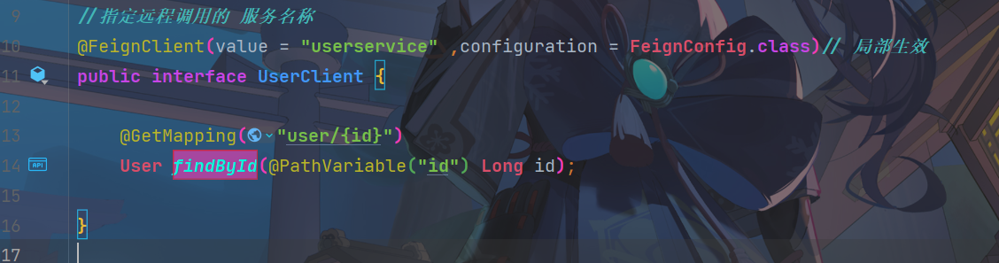

UserController：

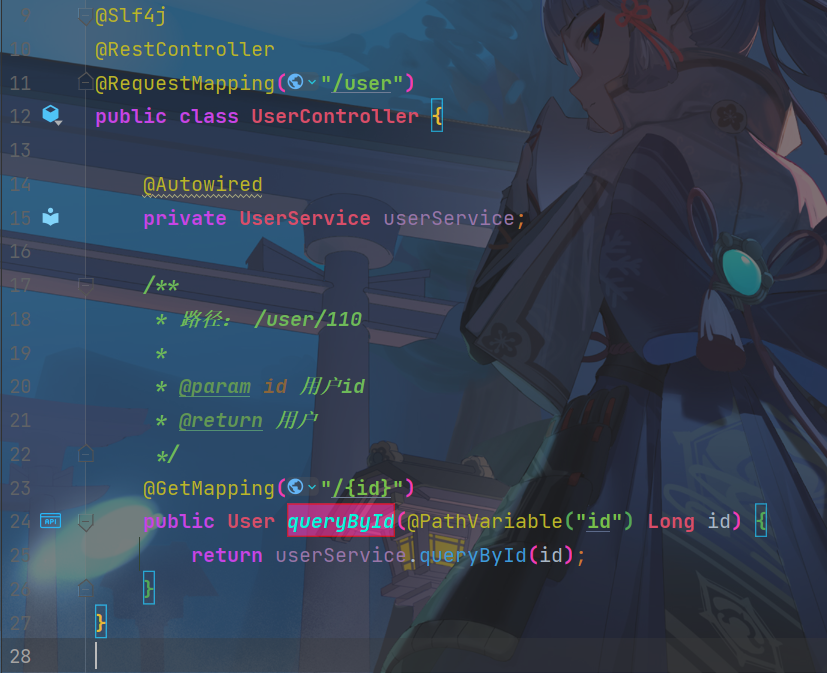


有没有一种办法简化这种重复的代码编写呢？


##### 继承方式

一样的代码可以通过继承来共享：

1）定义一个API接口，利用定义方法，并基于SpringMVC注解做声明。

2）Feign客户端和Controller都集成改接口


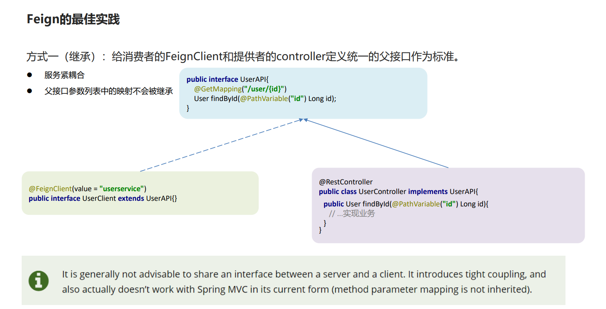


优点：

- 简单
- 实现了代码共享

缺点：

- 服务提供方、服务消费方紧耦合

- 参数列表中的注解映射并不会继承，因此Controller中必须再次声明方法、参数列表、注解


##### 抽取方式

将Feign的Client抽取为独立模块，并且把接口有关的POJO、默认的Feign配置都放到这个模块中，提供给所有消费者使用。

例如，将UserClient、User、Feign的默认配置都抽取到一个feign-api包中，所有微服务引用该依赖包，即可直接使用。

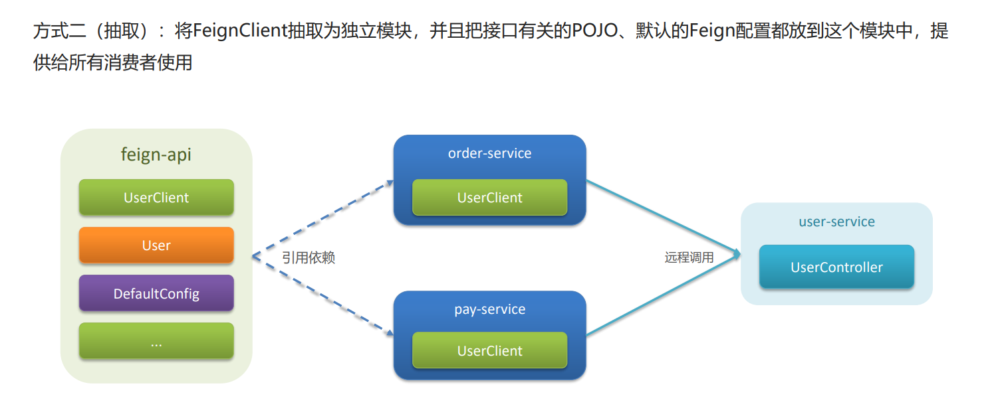


##### 实现基于抽取的最佳实践

###### 1.抽取

首先创建一个module，命名为feign-api：


项目结构：


在feign-api中然后引入feign的starter依赖

```xml
<dependency>
    <groupId>org.springframework.cloud</groupId>
    <artifactId>spring-cloud-starter-openfeign</artifactId>
</dependency>
```


然后，order-service中编写的UserClient、User、FeignConfig都复制到feign-api项目中


###### 2.在order-service中使用feign-api

首先，删除order-service中的UserClient、User、DefaultFeignConfiguration等类或接口。


在order-service的pom文件中中引入feign-api的依赖：

```xml
<!--引入同意api feign-api -->
<dependency>
	<groupId>com.ganga.A2-Feign-api</groupId>
	<artifactId>feign-api</artifactId>
	<version>1.0</version>
</dependency>
```


修改order-service中的所有与上述三个组件有关的导包部分，改成导入feign-api中的包


###### 3.重启测试

重启后，发现服务报错了：


这是因为UserClient现在在com.ganga.feign.clients包下，

而order-service的@EnableFeignClients注解是在com.ganga.order包下，不在同一个包，无法扫描到UserClient。


###### 4.解决扫描包问题

方式一：

指定Feign应该扫描的包：

```java
@EnableFeignClients(basePackages = "com.ganga.feign.clients")
```


方式二：

指定需要加载的Client接口：

```java
@EnableFeignClients(clients = {UserClient.class})
```


---

---


## 组件-同一网关


Spring Cloud Gateway 是 Spring Cloud 的一个全新项目，该项目是基于 Spring 5.0，Spring Boot 2.0 和 Project Reactor 等响应式编程和事件流技术开发的网关，它旨在为微服务架构提供一种简单有效的统一的 API 路由管理方式。


**为什么需要网关**

Gateway网关是我们服务的守门神，所有微服务的统一入口。

网关的**核心功能特性**：

- 请求路由
- 权限控制
- 限流

架构图：

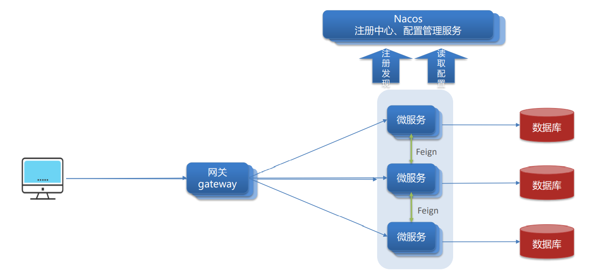


**权限控制**：网关作为微服务入口，需要校验用户是是否有请求资格，如果没有则进行拦截。

**路由和负载均衡**：一切请求都必须先经过gateway，但网关不处理业务，而是根据某种规则，把请求转发到某个微服务，这个过程叫做路由。当然路由的目标服务有多个时，还需要做负载均衡。

**限流**：当请求流量过高时，在网关中按照下流的微服务能够接受的速度来放行请求，避免服务压力过大。


在SpringCloud中网关的实现包括两种：

- gateway
- zuul

Zuul是基于Servlet的实现，属于阻塞式编程。而SpringCloudGateway则是基于Spring5中提供的WebFlux，属于响应式编程的实现，具备更好的性能。


### Gateway网关


#### gateway快速入门

下面，我们就演示下网关的基本路由功能。基本步骤如下：

1. 创建SpringBoot工程gateway，引入网关依赖
2. 编写启动类
3. 编写基础配置和路由规则
4. 启动网关服务进行测试


##### 引入依赖

创建服务：

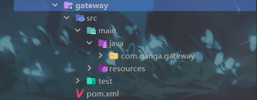

引入依赖：

```xml
<!--网关-->
<dependency>
    <groupId>org.springframework.cloud</groupId>
    <artifactId>spring-cloud-starter-gateway</artifactId>
</dependency>
<!--nacos服务发现依赖-->
<dependency>
    <groupId>com.alibaba.cloud</groupId>
    <artifactId>spring-cloud-starter-alibaba-nacos-discovery</artifactId>
</dependency>
```


##### 编写启动类

```java
package com.ganga.gateway;

import org.springframework.boot.SpringApplication;
import org.springframework.boot.autoconfigure.SpringBootApplication;

@SpringBootApplication
public class GatewayApplication {

	public static void main(String[] args) {
		SpringApplication.run(GatewayApplication.class, args);
	}
}
```


##### 编写基础配置和路由规则

创建application.yml文件，内容如下：

```yaml
server:
  port: 10010 # 网关端口
spring:
  application:
    name: gateway # 服务名称
  cloud:
    nacos:
      server-addr: localhost:8848 # nacos地址
    gateway:
      routes: # 网关路由配置
        - id: user-service # 路由id，自定义，只要唯一即可
          # uri: http://127.0.0.1:8081 # 路由的目标地址 http就是固定地址
          uri: lb://userservice # 路由的目标地址 lb就是负载均衡，后面跟服务名称
          predicates: # 路由断言，也就是判断请求是否符合路由规则的条件
            - Path=/user/** # 这个是按照路径匹配，只要以/user/开头就符合要求
```


我们将符合`Path` 规则的一切请求，都代理到 `uri`参数指定的地址。

本例中，我们将 `/user/**`开头的请求，代理到`lb://userservice`，lb是负载均衡，根据服务名拉取服务列表，实现负载均衡。


##### 重启测试

重启网关，访问http://localhost:10010/user/1时，符合`/user/**`规则，请求转发到uri：http://userservice/user/1，得到了结果


##### 网关路由的流程图

整个访问的流程如下：


##### 总结：

网关搭建步骤：

1. 创建项目，引入nacos服务发现和gateway依赖

2. 配置application.yml，包括服务基本信息、nacos地址、路由

路由配置包括：

1. 路由id：路由的唯一标示

2. 路由目标（uri）：路由的目标地址，http代表固定地址，lb代表根据服务名负载均衡

3. 路由断言（predicates）：判断路由的规则，

4. 路由过滤器（filters）：对请求或响应做处理


接下来，就重点来学习路由断言和路由过滤器的详细知识


#### 断言工厂

我们在配置文件中写的断言规则只是字符串，这些字符串会被Predicate Factory读取并处理，转变为路由判断的条件

例如Path=/user/**是按照路径匹配，这个规则是由

`org.springframework.cloud.gateway.handler.predicate.PathRoutePredicateFactory`类来

处理的，像这样的断言工厂在SpringCloudGateway还有十几个:

| **名称**   | **说明**                       | **示例**                                                     |
| ---------- | ------------------------------ | ------------------------------------------------------------ |
| After      | 是某个时间点后的请求           | -  After=2037-01-20T17:42:47.789-07:00[America/Denver]       |
| Before     | 是某个时间点之前的请求         | -  Before=2031-04-13T15:14:47.433+08:00[Asia/Shanghai]       |
| Between    | 是某两个时间点之前的请求       | -  Between=2037-01-20T17:42:47.789-07:00[America/Denver],  2037-01-21T17:42:47.789-07:00[America/Denver] |
| Cookie     | 请求必须包含某些cookie         | - Cookie=chocolate, ch.p                                     |
| Header     | 请求必须包含某些header         | - Header=X-Request-Id, \d+                                   |
| Host       | 请求必须是访问某个host（域名） | -  Host=**.somehost.org,**.anotherhost.org                   |
| Method     | 请求方式必须是指定方式         | - Method=GET,POST                                            |
| Path       | 请求路径必须符合指定规则       | - Path=/red/{segment},/blue/**                               |
| Query      | 请求参数必须包含指定参数       | - Query=name, Jack或者-  Query=name                          |
| RemoteAddr | 请求者的ip必须是指定范围       | - RemoteAddr=192.168.1.1/24                                  |
| Weight     | 权重处理                       |                                                              |

这里有官网模板：[Spring Cloud Gateway](https://docs.spring.io/spring-cloud-gateway/docs/current/reference/html/#the-after-route-predicate-factory)

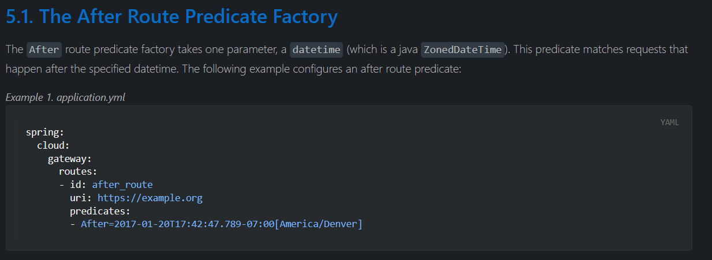


我们只需要掌握Path这种路由工程就可以了。


#### 过滤器工厂

GatewayFilter是网关中提供的一种过滤器，可以对进入网关的请求和微服务返回的响应做处理：

这里有官网模板：[Spring Cloud Gateway](https://docs.spring.io/spring-cloud-gateway/docs/current/reference/html/#gatewayfilter-factories)

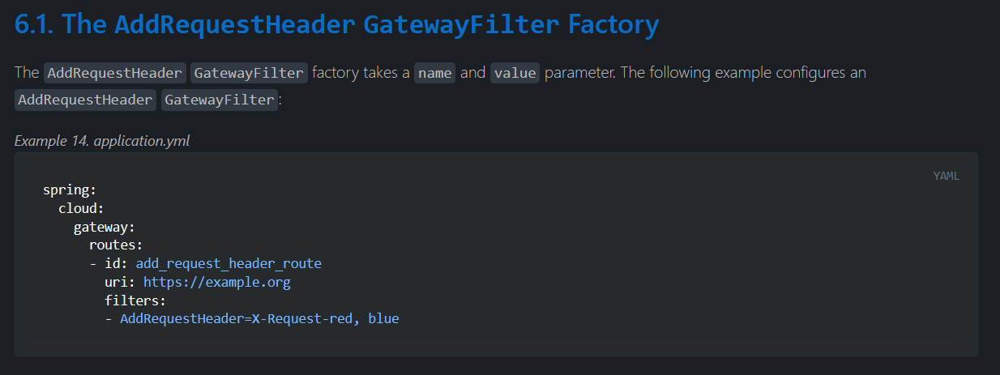


##### 路由过滤器的种类

Spring提供了31种不同的路由过滤器工厂。例如：

| **名称**             | **说明**                     |
| -------------------- | ---------------------------- |
| AddRequestHeader     | 给当前请求添加一个请求头     |
| RemoveRequestHeader  | 移除请求中的一个请求头       |
| AddResponseHeader    | 给响应结果中添加一个响应头   |
| RemoveResponseHeader | 从响应结果中移除有一个响应头 |
| RequestRateLimiter   | 限制请求的流量               |
| ...                  | ...                          |

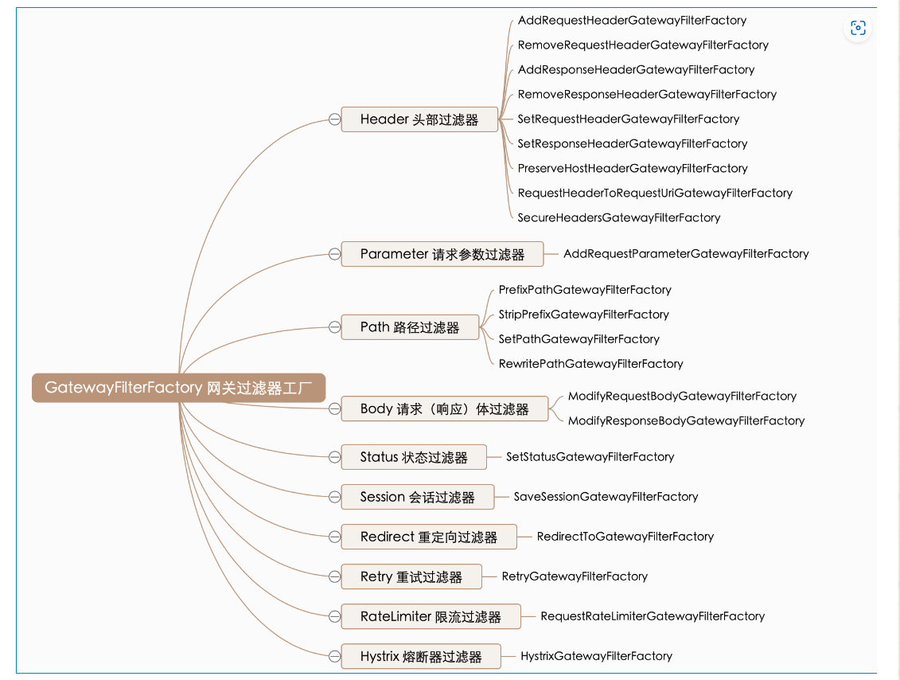


##### 请求头过滤器

下面我们以AddRequestHeader 为例来讲解。

> **需求**：给所有进入userservice的请求添加一个请求头：Truth=ganga is freaking awesome!


只需要修改gateway服务的application.yml文件，添加路由过滤即可：

```yaml
spring:
  cloud:
    gateway:
      routes:
      - id: user-service 
        uri: lb://userservice 
        predicates: 
        - Path=/user/** 
        filters: # 过滤器
        - AddRequestHeader=header-key, value! # 添加请求头
```

当前过滤器写在userservice路由下，因此仅仅对访问userservice的请求有效。


##### 默认过滤器

如果要对所有的路由都生效，则可以将过滤器工厂写到default下。格式如下：

```yaml
spring:
  cloud:
    gateway:
      routes:
      - id: user-service 
        uri: lb://userservice 
        predicates: 
        - Path=/user/**
      default-filters: # 默认过滤项
      - AddRequestHeader=Truth, ganga is freaking awesome! 
```


##### 总结

过滤器的作用是什么？

① 对路由的请求或响应做加工处理，比如添加请求头

② 配置在路由下的过滤器只对当前路由的请求生效

defaultFilters的作用是什么？

① 对所有路由都生效的过滤器


#### 全局过滤器

上一节学习的过滤器，网关提供了31种，但每一种过滤器的作用都是固定的。如果我们希望拦截请求，做自己的业务逻辑则没办法实现。

##### 全局过滤器作用

全局过滤器的作用也是处理一切进入网关的请求和微服务响应，与GatewayFilter的作用一样。区别在于GatewayFilter通过配置定义，处理逻辑是固定的；而GlobalFilter的逻辑需要自己写代码实现。

定义方式是实现GlobalFilter接口。

```java
public interface GlobalFilter {
    /**
     *  处理当前请求，有必要的话通过{@link GatewayFilterChain}将请求交给下一个过滤器处理
     *
     * @param exchange 请求上下文，里面可以获取Request、Response等信息
     * @param chain 用来把请求委托给下一个过滤器 
     * @return {@code Mono<Void>} 返回标示当前过滤器业务结束
     */
    Mono<Void> filter(ServerWebExchange exchange, GatewayFilterChain chain);
}
```


在filter中编写自定义逻辑，可以实现下列功能：

- 登录状态判断
- 权限校验
- 请求限流等


##### 自定义全局过滤器

需求：定义全局过滤器，拦截请求，判断请求的参数是否满足下面条件：

- 参数中是否有authorization，

- authorization参数值是否为admin

如果同时满足则放行，否则拦截


实现：

在gateway中定义一个过滤器：

```java
package com.ganga.gateway.filters;

import org.springframework.cloud.gateway.filter.GatewayFilterChain;
import org.springframework.cloud.gateway.filter.GlobalFilter;
import org.springframework.core.annotation.Order;
import org.springframework.http.HttpStatus;
import org.springframework.stereotype.Component;
import org.springframework.web.server.ServerWebExchange;
import reactor.core.publisher.Mono;

@Order(-1)
@Component
public class AuthorizeFilter implements GlobalFilter {
    @Override
    public Mono<Void> filter(ServerWebExchange exchange, GatewayFilterChain chain) {
        // 1.获取请求参数
        MultiValueMap<String, String> params = exchange.getRequest().getQueryParams();
        // 2.获取authorization参数
        String auth = params.getFirst("authorization");
        // 3.校验
        if ("admin".equals(auth)) {
            // 放行
            return chain.filter(exchange);
        }
        // 4.拦截
        // 4.1.禁止访问，设置状态码
        exchange.getResponse().setStatusCode(HttpStatus.FORBIDDEN);
        // 4.2.结束处理
        return exchange.getResponse().setComplete();
    }
}
```


##### 过滤器执行顺序

请求进入网关会碰到三类过滤器：当前路由的过滤器、DefaultFilter、GlobalFilter

请求路由后，会将当前路由过滤器和DefaultFilter、GlobalFilter，合并到一个过滤器链（集合）中，排序后依次执行每个过滤器：

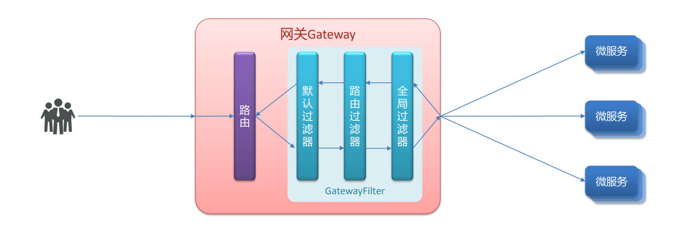


排序的规则是什么呢？

- 每一个过滤器都必须指定一个int类型的order值，**order值越小，优先级越高，执行顺序越靠前**。
- GlobalFilter通过实现Ordered接口，或者添加@Order注解来指定order值，由我们自己指定
- 路由过滤器和defaultFilter的order由Spring指定，默认是按照声明顺序从1递增。
- 当过滤器的order值一样时，会按照 **defaultFilter > 路由过滤器 > GlobalFilter **的顺序执行。


详细内容，可以查看源码：

`org.springframework.cloud.gateway.route.RouteDefinitionRouteLocator#getFilters()`方法是先加载defaultFilters，然后再加载某个route的filters，然后合并。


`org.springframework.cloud.gateway.handler.FilteringWebHandler#handle()`方法会加载全局过滤器，与前面的过滤器合并后根据order排序，组织过滤器链


#### 跨域问题


##### 什么是跨域问题

跨域：域名不一致就是跨域，主要包括：

- 域名不同： www.taobao.com 和 www.taobao.org 和 www.jd.com 和 miaosha.jd.com

- 域名相同，端口不同：localhost:8080和localhost8081

跨域问题：浏览器禁止请求的发起者与服务端发生跨域ajax请求，请求被浏览器拦截的问题


解决方案：CORS，这个以前应该学习过，这里不再赘述了。不知道的小伙伴可以查看https://www.ruanyifeng.com/blog/2016/04/cors.html


##### 模拟跨域问题


从localhost:8090访问localhost:10010，端口不同，显然是跨域的请求。


##### 解决跨域问题

在gateway服务的application.yml文件中，添加下面的配置：

```yaml
spring:
  cloud:
    gateway:
      # 。。。
      globalcors: # 全局的跨域处理
        add-to-simple-url-handler-mapping: true # 解决options请求被拦截问题
        corsConfigurations:
          '[/**]':
            allowedOrigins: # 允许哪些网站的跨域请求 
              - "http://localhost:8090"
            allowedMethods: # 允许的跨域ajax的请求方式
              - "GET"
              - "POST"
              - "DELETE"
              - "PUT"
              - "OPTIONS"
            allowedHeaders: "*" # 允许在请求中携带的头信息
            allowCredentials: true # 是否允许携带cookie
            maxAge: 360000 # 这次跨域检测的有效期
```


#### 配置文件


```yaml
server:
  port: 10010
spring:
  application:
    name: wateway
  cloud:
    nacos:
      server-addr: localhost:8848
    #配置gateway网关
    gateway:
      routes: # 配置网关路由 一组需要三个必要参数 id、uri、predicates 外加一个 filters
        - id: user-service # 路由id，自定义，只要唯一即可
          uri: lb://userservice # 路由的目标地址 lb是负载均衡 后面是服务名称
          predicates: # 路由断言，是判断请求是否符合路由规则的条件
            - Path=/user/**
          filters:
            - AddRequestHeader=header-key, value! # 添加请求头
        - id: order-service
          uri: lb://orderservice
          predicates:
            - Path=/order/**
          filters:
            - AddRequestHeader=Header-key, Filter!
      default-filters: # 默认过滤器 spring.cloud.gateway.default-filters
        - AddRequestHeader=Header-key, Filter!
      # 配置全局的跨域处理
      globalcors:
        add-to-simple-url-handler-mapping: true # 解决options请求被拦截问题
        cors-configurations:
          '[/**]':
            allowedOrigins: # 允许哪些网站的跨域请求
              - "http://localhost:8090"
              - "http://www.baidu.com"
            allowedMethods: # 允许的跨域ajax的请求方式
              - "GET"
              - "POST"
              - "DELETE"
              - "PUT"
              - "OPTIONS"
            allowedHeaders: "*" # 允许在请求中携带的头信息
            allowCredentials: true # 是否允许携带cookie
            maxAge: 360000 # 这次跨域检测的有效期
            
#文档: https://docs.spring.io/spring-cloud-gateway/docs/current/reference/html/#the-addrequestheader-gatewayfilter-factory

```


---


## ===========


---


## 消息队列MQ


### 初识MQ

---

#### 同步和异步通讯

微服务间通讯有同步和异步两种方式：

同步通讯：就像打电话，需要实时响应。

异步通讯：就像发邮件，不需要马上回复。

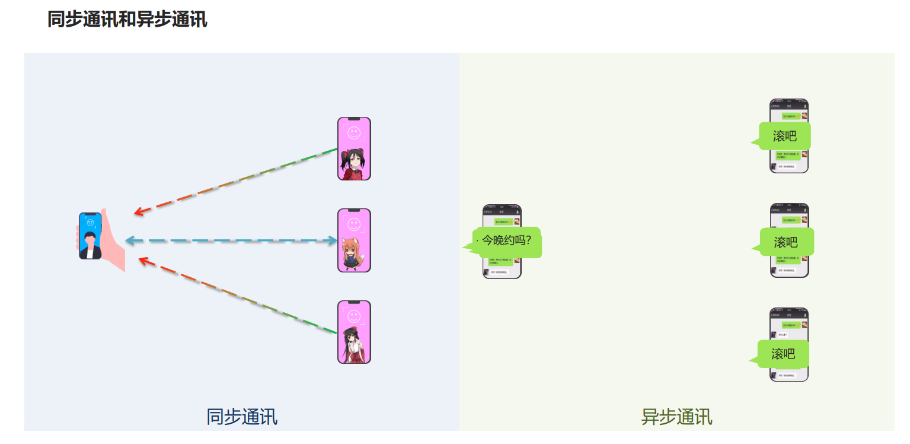

两种方式各有优劣，打电话可以立即得到响应，但是你却不能跟多个人同时通话。发送邮件可以同时与多个人收发邮件，但是往往响应会有延迟。


#### 同步通讯

我们之前学习的Feign调用就属于同步方式，虽然调用可以实时得到结果，但存在下面的问题：

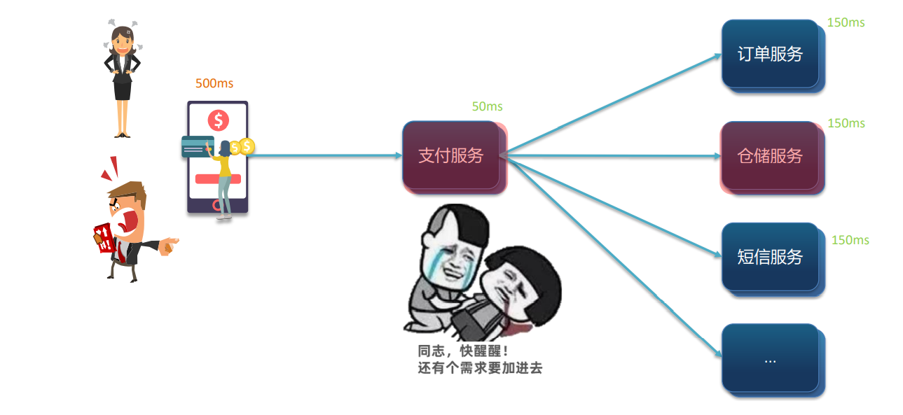

---

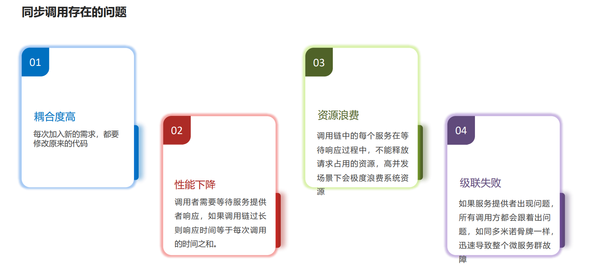

---

总结：

同步调用的优点：

- 时效性较强，可以立即得到结果

同步调用的问题：

- 耦合度高
- 性能和吞吐能力下降
- 有额外的资源消耗
- 有级联失败问题


#### 异步通讯

异步调用则可以避免上述问题：

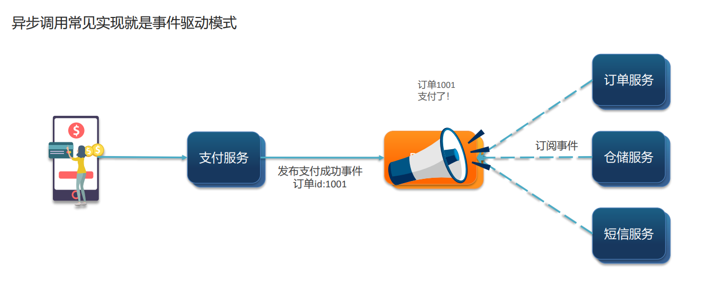

我们以购买商品为例，用户支付后需要调用订单服务完成订单状态修改，调用物流服务，从仓库分配响应的库存并准备发货。

在事件模式中，支付服务是事件发布者（publisher），在支付完成后只需要发布一个支付成功的事件（event），事件中带上订单id。

订单服务和物流服务是事件订阅者（Consumer），订阅支付成功的事件，监听到事件后完成自己业务即可。


为了解除事件发布者与订阅者之间的耦合，两者并不是直接通信，而是有一个中间人（Broker）。发布者发布事件到Broker，不关心谁来订阅事件。订阅者从Broker订阅事件，不关心谁发来的消息。

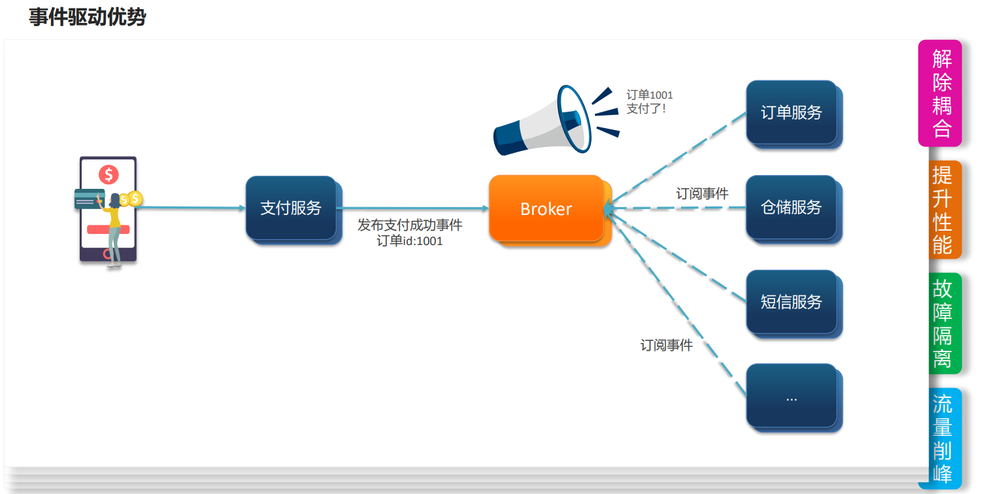

---

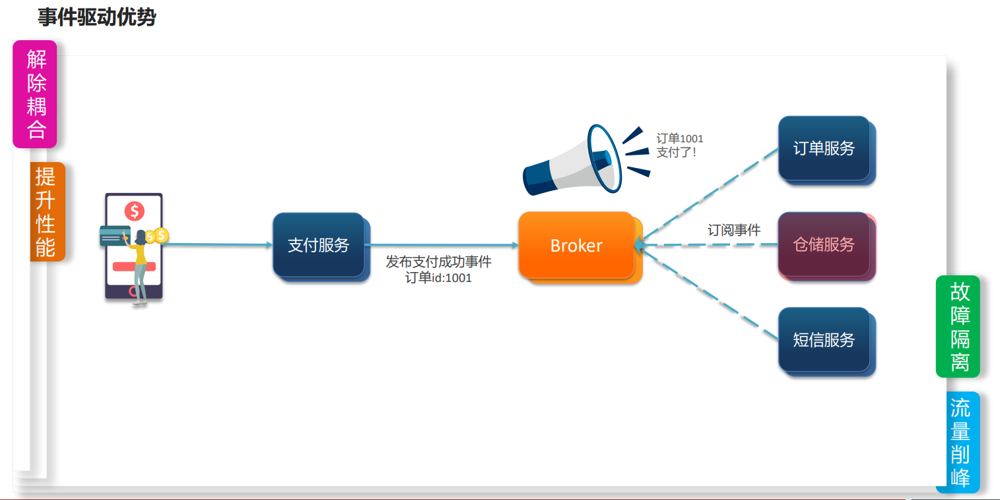

---

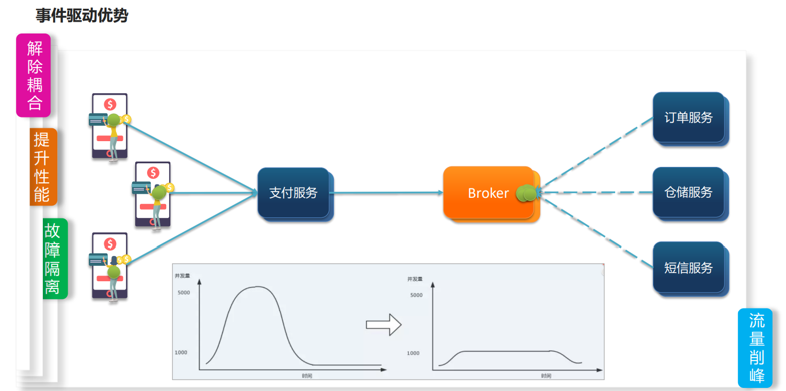

---


Broker 是一个像数据总线一样的东西，所有的服务要接收数据和发送数据都发到这个总线上，这个总线就像协议一样，让服务间的通讯变得标准和可控。


好处：

- 吞吐量提升：无需等待订阅者处理完成，响应更快速

- 故障隔离：服务没有直接调用，不存在级联失败问题
- 调用间没有阻塞，不会造成无效的资源占用
- 耦合度极低，每个服务都可以灵活插拔，可替换
- 流量削峰：不管发布事件的流量波动多大，都由Broker接收，订阅者可以按照自己的速度去处理事件


缺点：

- 架构复杂了，业务没有明显的流程线，不好管理
- 需要依赖于Broker的可靠、安全、性能


好在现在开源软件或云平台上 Broker 的软件是非常成熟的，比较常见的一种就是我们今天要学习的MQ技术。

---


#### 技术对比：

MQ，中文是消息队列（MessageQueue），字面来看就是存放消息的队列。也就是事件驱动架构中的Broker。

比较常见的MQ实现：

- ActiveMQ
- RabbitMQ
- RocketMQ
- Kafka


几种常见MQ的对比：

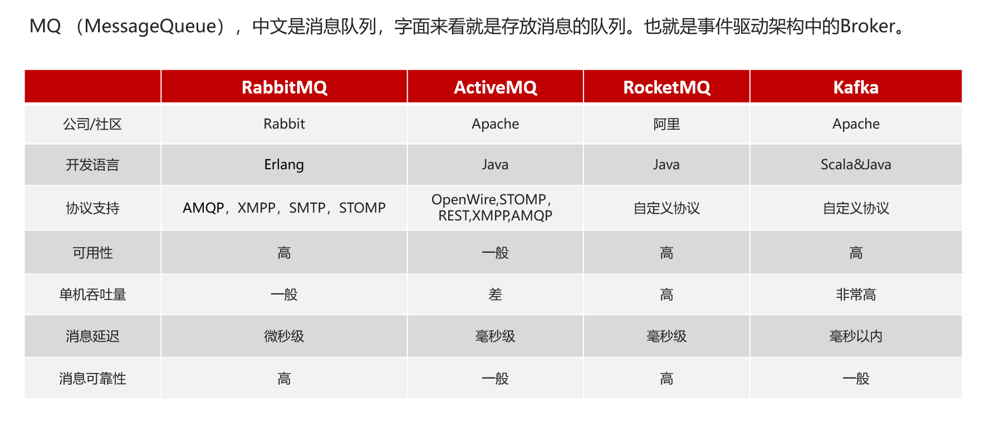

|            |      **RabbitMQ**       |          **ActiveMQ**          | **RocketMQ** | **Kafka**  |
| :--------: | :---------------------: | :----------------------------: | :----------: | :--------: |
| 公司/社区  |         Rabbit          |             Apache             |     阿里     |   Apache   |
|  开发语言  |         Erlang          |              Java              |     Java     | Scala&Java |
|  协议支持  | AMQP，XMPP，SMTP，STOMP | OpenWire,STOMP，REST,XMPP,AMQP |  自定义协议  | 自定义协议 |
|   可用性   |           高            |              一般              |      高      |     高     |
| 单机吞吐量 |          一般           |               差               |      高      |   非常高   |
|  消息延迟  |         微秒级          |             毫秒级             |    毫秒级    |  毫秒以内  |
| 消息可靠性 |           高            |              一般              |      高      |    一般    |


**追求可用性：Kafka、 RocketMQ 、RabbitMQ**

**追求可靠性：RabbitMQ、RocketMQ**

**追求吞吐能力：RocketMQ、Kafka**

**追求消息低延迟：RabbitMQ、Kafka**


---

---


### RabbitMQ

---

RabbitMQ是基于Erlang语言开发的开源消息通信中间件，官网地址：https://www.rabbitmq.com/

RabbitMQ的结构和概念：


RabbitMQ中的一些角色：

- publisher：生产者
- consumer：消费者
- exchange个：交换机，负责消息路由
- queue：队列，存储消息
- virtualHost：虚拟主机，隔离不同租户的exchange、queue、消息的隔离


#### 部署RebbitMQ

##### 单机部署

拉取镜像

``` sh
docker pull rabbitmq:3-management
```

安装 执行下面的命令来运行MQ容器：

```sh
docker run \
 -e RABBITMQ_DEFAULT_USER=用户名 \
 -e RABBITMQ_DEFAULT_PASS=密码 \
 --name mq \
 --hostname mq1 \
 -p 15672:15672 \
 -p 5672:5672 \
 -d \
 rabbitmq:3-management
```


##### 集群部署

安装RabbitMQ的集群。


##### 集群分类

在RabbitMQ的官方文档中，讲述了两种集群的配置方式：

- 普通模式：普通模式集群不进行数据同步，每个MQ都有自己的队列、数据信息（其它元数据信息如交换机等会同步）。例如我们有2个MQ：mq1，和mq2，如果你的消息在mq1，而你连接到了mq2，那么mq2会去mq1拉取消息，然后返回给你。如果mq1宕机，消息就会丢失。
- 镜像模式：与普通模式不同，队列会在各个mq的镜像节点之间同步，因此你连接到任何一个镜像节点，均可获取到消息。而且如果一个节点宕机，并不会导致数据丢失。不过，这种方式增加了数据同步的带宽消耗。


我们先来看普通模式集群。

##### 设置网络

首先，我们需要让3台MQ互相知道对方的存在。

分别在3台机器中，设置 /etc/hosts文件，添加如下内容：

```
192.168.150.101 mq1
192.168.150.102 mq2
192.168.150.103 mq3
```

并在每台机器上测试，是否可以ping通对方：


#### 常见消息模型

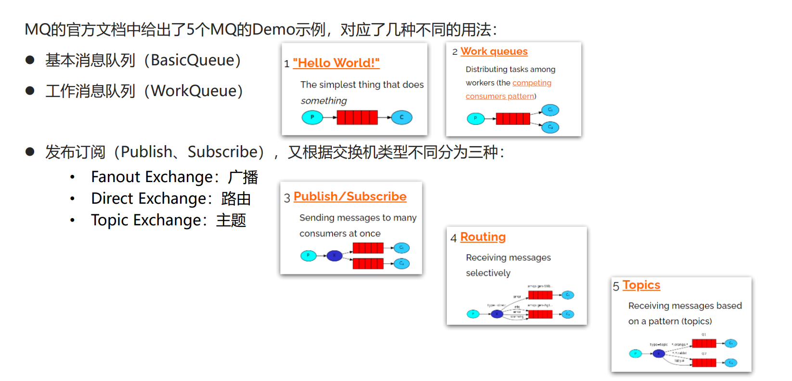


##### 基本消息队列

官方的HelloWorld是基于最基础的消息队列模型来实现的，只包括三个角色：

- publisher：消息发布者，将消息发送到队列queue
- queue：消息队列，负责接受并缓存消息
- consumer：订阅队列，处理队列中的消息


publisher实现

```java
package com.ganga.mq.helloworld;

import com.rabbitmq.client.Channel;
import com.rabbitmq.client.Connection;
import com.rabbitmq.client.ConnectionFactory;
import org.junit.Test;

import java.io.IOException;
import java.util.concurrent.TimeoutException;

public class PublisherTest {
    @Test
    public void testSendMessage() throws IOException, TimeoutException {
        // 1.建立连接
        ConnectionFactory factory = new ConnectionFactory();
        // 1.1.设置连接参数，分别是：主机名、端口号、vhost、用户名、密码
        factory.setHost("192.168.150.101");
        factory.setPort(5672);
        factory.setVirtualHost("/");
        factory.setUsername("user");
        factory.setPassword("pass");
        // 1.2.建立连接
        Connection connection = factory.newConnection();

        // 2.创建通道Channel
        Channel channel = connection.createChannel();

        // 3.创建队列
        String queueName = "simple.queue";
        channel.queueDeclare(queueName, false, false, false, null);

        // 4.发送消息
        String message = "hello, rabbitmq!";
        channel.basicPublish("", queueName, null, message.getBytes());
        System.out.println("发送消息成功：【" + message + "】");

        // 5.关闭通道和连接
        channel.close();
        connection.close();

    }
}
```

consumer实现

```java
package com.ganga.mq.helloworld;

import com.rabbitmq.client.*;

import java.io.IOException;
import java.util.concurrent.TimeoutException;

public class ConsumerTest {

    public static void main(String[] args) throws IOException, TimeoutException {
        // 1.建立连接
        ConnectionFactory factory = new ConnectionFactory();
        // 1.1.设置连接参数，分别是：主机名、端口号、vhost、用户名、密码
        factory.setHost("192.168.150.101");
        factory.setPort(5672);
        factory.setVirtualHost("/");
        factory.setUsername("user");
        factory.setPassword("pass");
        // 1.2.建立连接
        Connection connection = factory.newConnection();

        // 2.创建通道Channel
        Channel channel = connection.createChannel();

        // 3.创建队列
        String queueName = "simple.queue";
        channel.queueDeclare(queueName, false, false, false, null);

        // 4.订阅消息
        channel.basicConsume(queueName, true, new DefaultConsumer(channel){
            @Override
            public void handleDelivery(String consumerTag, Envelope envelope,
                                       AMQP.BasicProperties properties, byte[] body) throws IOException {
                // 5.处理消息
                String message = new String(body);
                System.out.println("接收到消息：【" + message + "】");
            }
        });
        System.out.println("等待接收消息。。。。");
    }
}
```


**基本消息队列**的消息发送流程：

1. 建立connection

2. 创建channel

3. 利用channel声明队列

4. 利用channel向队列发送消息


**基本消息队列**的消息接收流程：

1. 建立connection

2. 创建channel

3. 利用channel声明队列

4. 定义consumer的消费行为handleDelivery()

5. 利用channel将消费者与队列绑定


### SpringAMQP

SpringAMQP是基于RabbitMQ封装的一套模板，并且还利用SpringBoot对其实现了自动装配，使用起来非常方便。

SpringAmqp的官方地址：https://spring.io/projects/spring-amqp

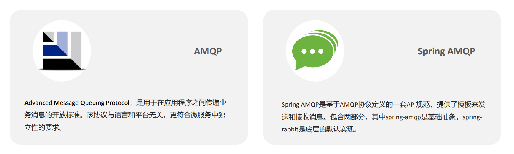


SpringAMQP提供了三个功能：

- 自动声明队列、交换机及其绑定关系
- 基于注解的监听器模式，异步接收消息
- 封装了RabbitTemplate工具，用于发送消息


#### 依赖坐标

```xml
<!--AMQP依赖，包含RabbitMQ-->
<dependency>
    <groupId>org.springframework.boot</groupId>
    <artifactId>spring-boot-starter-amqp</artifactId>
</dependency>
```

```yaml
spring:
  rabbitmq:
    host: 192.168.150.101 # 主机名
    port: 5672 # 端口
    virtual-host: / # 虚拟主机
    username: ganga # 用户名
    password: 123321 # 密码
```


#### 常见消息模型


##### 常见消息模型分类：


BasicQueue简单消息队列

WorkQueue工作消息队列

FanoutExchange广播消息队列

DirectExchange路由消息队列

TopicExchange主题消息队列

---


其中：

---

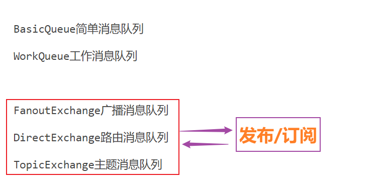

---


##### BasicQueue简单队列


###### 消息发送

首先配置MQ地址，在publisher服务的application.yml中添加配置：

```yaml
spring:
  rabbitmq:
    host: 192.168.150.101 # 主机名
    port: 5672 # 端口
    virtual-host: / # 虚拟主机
    username: user # 用户名
    password: passw # 密码
```


然后在publisher服务中编写测试类SpringAmqpTest，并利用RabbitTemplate实现消息发送：

```java
package com.ganga.mq.spring;

import org.junit.Test;
import org.junit.runner.RunWith;
import org.springframework.amqp.rabbit.core.RabbitTemplate;
import org.springframework.beans.factory.annotation.Autowired;
import org.springframework.boot.test.context.SpringBootTest;
import org.springframework.test.context.junit4.SpringRunner;

@RunWith(SpringRunner.class)
@SpringBootTest
public class SpringAmqpTest {

    @Autowired
    private RabbitTemplate rabbitTemplate;

    @Test
    public void testSimpleQueue() {
        // 队列名称
        String queueName = "simple.queue";
        // 消息
        String message = "hello, spring amqp!";
        // 发送消息
        rabbitTemplate.convertAndSend(queueName, message);
    }
}
```


###### 消息接收

首先配置MQ地址，在consumer服务的application.yml中添加配置：

```yaml
spring:
  rabbitmq:
    host: 192.168.150.101 # 主机名
    port: 5672 # 端口
    virtual-host: / # 虚拟主机
    username: ganga # 用户名
    password: 123321 # 密码
```


然后在consumer服务的`com.ganga.mq.listener`包中新建一个类SpringRabbitListener，代码如下：

```java
package com.ganga.mq.listener;

import org.springframework.amqp.rabbit.annotation.RabbitListener;
import org.springframework.stereotype.Component;

@Component
public class SpringRabbitListener {

    @RabbitListener(queues = "simple.queue")
    public void listenSimpleQueueMessage(String msg) throws InterruptedException {
        System.out.println("spring 消费者接收到消息：【" + msg + "】");
    }
}
```


###### 测试

启动consumer服务，然后在publisher服务中运行测试代码，发送MQ消息


---

---


##### WorkQueue工作队列


###### 概述：

Work queues，也被称为（Task queues），任务模型。

简单来说就是**让多个消费者绑定到一个队列，共同消费队列中的消息**。


当消息处理比较耗时的时候，可能生产消息的速度会远远大于消息的消费速度。长此以往，消息就会堆积越来越多，无法及时处理。

此时就可以使用work 模型，多个消费者共同处理消息处理，速度就能大大提高了。


###### 消息发送

模拟大量消息堆积现象。

在publisher服务中的SpringAmqpTest类中添加一个测试方法：

```java
/**
     * workQueue
     * 向队列中不停发送消息，模拟消息堆积。
     */
@Test
public void testWorkQueue() throws InterruptedException {
    // 队列名称
    String queueName = "simple.queue";
    // 消息
    String message = "hello, message_";
    for (int i = 0; i < 50; i++) {
        // 发送消息
        rabbitTemplate.convertAndSend(queueName, message + i);
        Thread.sleep(20);
    }
}
```


###### 消息接收

要模拟多个消费者绑定同一个队列，我们在consumer服务的SpringRabbitListener中添加2个新的方法：

```java
@Component
public class WorkMQListener {

    @RabbitListener(queues = "work.queue")
    public void listenWorkQueue01(String message) throws InterruptedException {
        System.out.println("消费者[1]接收到：" + message + "  " + LocalTime.now());
        Thread.sleep(20);
    }

    @RabbitListener(queues = "work.queue")
    public void listenWorkQueue02(String message) throws InterruptedException {
        System.err.println("消费者[2]接收到：" + message + "  " + LocalTime.now());
        Thread.sleep(200);
    }

}
```

注意到这个消费者sleep了1000秒，模拟任务耗时。


###### 测试

启动ConsumerApplication后，在执行publisher服务中刚刚编写的发送测试方法testWorkQueue。

可以看到消费者1很快完成了自己的25条消息。消费者2却在缓慢的处理自己的25条消息。


也就是说消息是平均分配给每个消费者，并没有考虑到消费者的处理能力。这样显然是有问题的。


###### 预取机制

在spring中有一个简单的配置，可以解决这个问题。我们修改consumer服务的application.yml文件，添加配置：

```yaml
spring:
  rabbitmq:
    listener:
      simple:
        prefetch: 1 # 每次只能获取一条消息，处理完成才能获取下一个消息
```


###### 总结

Work模型的使用：

- 多个消费者绑定到一个队列，同一条消息只会被一个消费者处理
- 通过设置prefetch来控制消费者预取的消息数量


---


##### 发布/订阅 模式

发布订阅的模型如图：

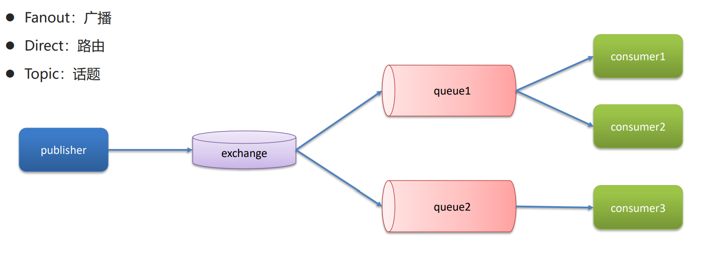


---

可以看到，在订阅模型中，多了一个exchange角色，而且过程略有变化：

- Publisher：生产者，也就是要发送消息的程序，但是不再发送到队列中，而是发给X（交换机）
- Exchange：交换机，图中的X。一方面，接收生产者发送的消息。另一方面，知道如何处理消息，例如递交给某个特别队列、递交给所有队列、或是将消息丢弃。到底如何操作，取决于Exchange的类型。Exchange有以下3种类型：
  - Fanout：广播，将消息交给所有绑定到交换机的队列
  - Direct：定向，把消息交给符合指定routing key 的队列
  - Topic：通配符，把消息交给符合routing pattern（路由模式） 的队列
- Consumer：消费者，与以前一样，订阅队列，没有变化
- Queue：消息队列也与以前一样，接收消息、缓存消息。


**Exchange（交换机）只负责转发消息，不具备存储消息的能力**，因此如果没有任何队列与Exchange绑定，或者没有符合路由规则的队列，那么消息会丢失！


---


##### FanoutExchange广播

Fanout，英文翻译是扇出，我觉得在MQ中叫广播更合适。

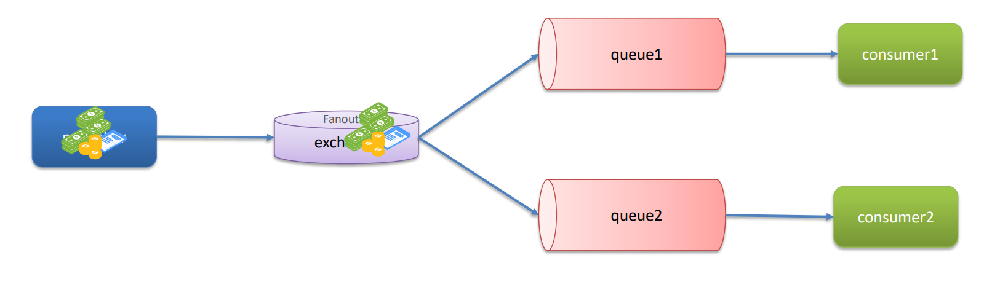

---

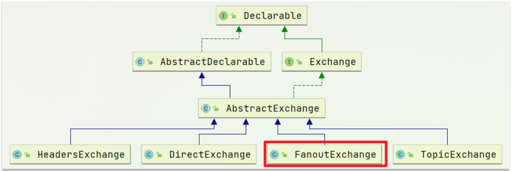

---

在广播模式下，消息发送流程是这样的：

- 1）  可以有多个队列
- 2）  每个队列都要绑定到Exchange（交换机）
- 3）  生产者发送的消息，只能发送到交换机，交换机来决定要发给哪个队列，生产者无法决定
- 4）  交换机把消息发送给绑定过的所有队列
- 5）  订阅队列的消费者都能拿到消息


###### 案例要求

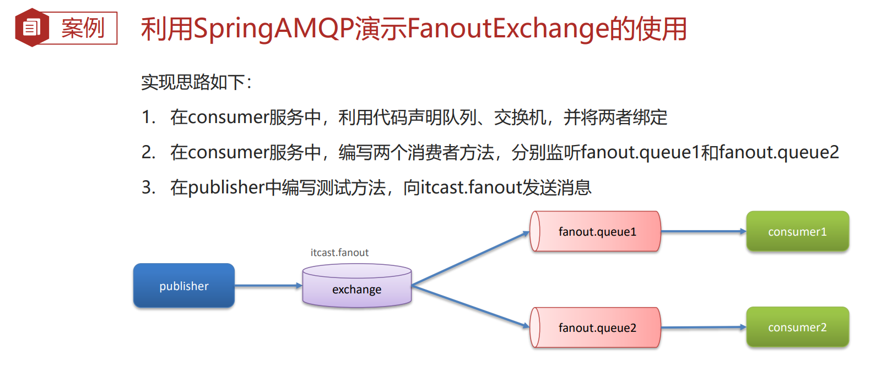


###### 声明队列和交换机

Spring提供了一个接口Exchange，来表示所有不同类型的交换机：

在consumer中创建一个类，声明队列和交换机

```java
@Configuration
public class FanoutMQConfig {

    @Bean //声明 FanoutExchange 广播交换机
    public FanoutExchange fanoutExchange(){
        return new FanoutExchange("fanoutName");
    }

    @Bean //声明消息队列
    public Queue newQueue01(){
        return new Queue("fanout.queue01");
    }

    @Bean //将 消息队列 与 广播交换机 进行绑定
    public Binding fanoutBindingQueue01(){
        //使用 BindingBuilder 构建绑定关系
        return BindingBuilder.bind(newQueue01()).to(fanoutExchange());
    }

    //==================================================================

    @Bean //声明消息队列
    public Queue newQueue02(){
        return new Queue("fanout.queue02");
    }

    @Bean //将 消息队列 与 广播交换机 进行绑定
    public Binding fanoutBindingQueue02(){
        //使用 BindingBuilder 构建绑定关系
        return BindingBuilder.bind(newQueue02()).to(fanoutExchange());
    }

}
```


###### 消息发送

在publisher服务的SpringAmqpTest类中添加测试方法：

```java
@RunWith(SpringRunner.class)
@SpringBootTest(classes = PublisherApp.class)
public class FanoutExchange {

    @Autowired
    private RabbitTemplate rabbitTemplate;

    @Test
    public void testFanoutExchangeQueue(){
        String exchangeName = "fanoutName";
        String key = "";
        String message = "消息xxx";
        //在对交换机发送消息时 交换机要提前声明！！！
        //参数第一个是 交换机名称 而不是 消息队列名称！！！
        //因为发送到交换机中 由交换机 进行发送到队列 订阅者绑定的消息队列中进行获取消息
        rabbitTemplate.convertAndSend(exchangeName,key,message);
    }

}
```


###### 消息接收

在consumer服务的SpringRabbitListener中添加两个方法，作为消费者：

```java
package com.ganga.listener.exchange;

import org.springframework.amqp.rabbit.annotation.RabbitListener;
import org.springframework.stereotype.Component;

@Component
public class FanoutMQListener {

    @RabbitListener(queues = "fanout.queue01")
    public void listenFanoutQueue01(String msg){
        System.out.println("queue [01] 队列获取消息: " + msg);
    }

    @RabbitListener(queues = "fanout.queue02")
    public void listenFanoutQueue02(String msg){
        System.out.println("queue [02] 队列获取消息: " + msg);
    }
}
```


###### 注意事项


交换机的作用是什么？

- 接收publisher发送的消息
- 将消息按照规则路由到与之绑定的队列
- 不能缓存消息，路由失败，消息丢失
- FanoutExchange的会将消息路由到每个绑定的队列

声明队列、交换机、绑定关系的Bean是什么？

- Queue
- FanoutExchange
- Binding

```java
@Test
public void testFanoutExchangeQueue(){
    String exchangeName = "fanoutName";
    String key = "";
    String message = "消息xxx";
    //在对交换机发送消息时 交换机要提前声明！！！
    //参数第一个是 交换机名称 而不是 消息队列名称！！！
    //因为发送到交换机中 由交换机 进行发送到队列 订阅者绑定的消息队列中进行获取消息
    rabbitTemplate.convertAndSend(exchangeName,key,message);
}
```


---


##### DirectExchange路由

在Fanout模式中，一条消息，会被所有订阅的队列都消费。但是，在某些场景下，我们希望不同的消息被不同的队列消费。这时就要用到Direct类型的Exchange。


在Direct模型下：

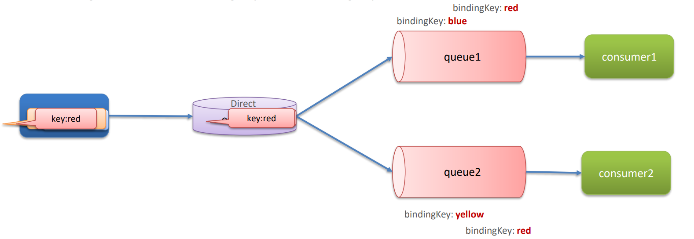

- 队列与交换机的绑定，不能是任意绑定了，而是要指定一个`RoutingKey`（路由key）
- 消息的发送方在 向 Exchange发送消息时，也必须指定消息的 `RoutingKey`。
- Exchange不再把消息交给每一个绑定的队列，而是根据消息的`Routing Key`进行判断，只有队列的`Routingkey`与消息的 `Routing key`完全一致，才会接收到消息


###### 案例要求

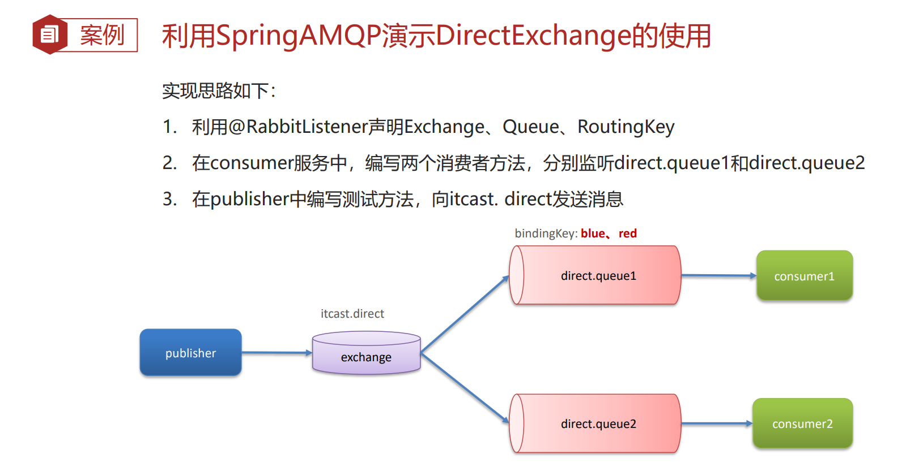


###### 基于注解声明队列和交换机


基于@Bean的方式声明队列和交换机比较麻烦，Spring还提供了基于注解方式来声明。

在consumer的SpringRabbitListener中添加两个消费者，同时基于注解来声明队列和交换机：

```java
@Component
public class DirectMQListener {

    // 基于注解声明队列和交换机
    @RabbitListener(bindings = @QueueBinding(
            value = @Queue(name = "direct.queue01"),
            exchange = @Exchange(name = "directName",type = ExchangeTypes.DIRECT),
            key = {"jk"}
    ))
    public void listenDirectExchangeQueue01(String msg) {
        System.out.println("喜欢 [jk] 的狗接收到消息: " + msg);
    }

    // 基于注解声明队列和交换机
    @RabbitListener(bindings = @QueueBinding(
            value = @Queue(name = "direct.queue02"),
            exchange = @Exchange(name = "directName",type = ExchangeTypes.DIRECT),
            key = {"loli"} //要监听建为 jk 和 loli 的消息
    ))
    public void listenDirectExchangeQueue02(String msg) {
        System.out.println("喜欢 [loli] 的狗接收到消息: " + msg);
    }

    // 基于注解声明队列和交换机
    @RabbitListener(bindings = @QueueBinding(
            value = @Queue(name = "direct.queue03"),
            exchange = @Exchange(name = "directName",type = ExchangeTypes.DIRECT),
            key = {"jk","loli"} //要监听建为 jk 和 loli 的消息
    ))
    public void listenDirectExchangeQueue03(String msg) {
        System.err.println("既喜欢 [jk] 又喜欢 [loli] 的畜牲接收到消息: " + msg);
    }
}
```


###### 消息发送

在publisher服务的SpringAmqpTest类中添加测试方法：

```java
@RunWith(SpringRunner.class)
@SpringBootTest(classes = PublisherApp.class)
public class DirectExchange {

    @Autowired
    private RabbitTemplate rabbitTemplate;

    @Test
    public void testDirectExchangeQueue01(){
        //向 交换机 上发送消息
        String exchangeName = "directName";
        String key = "jk";
        rabbitTemplate.convertAndSend(exchangeName,key,"jk: 放学后要做些什么呢？♥~");
    }

    @Test
    public void testDirectExchangeQueue02(){
        //向 交换机 上发送消息
        String exchangeName = "directName";
        String key = "loli";
        rabbitTemplate.convertAndSend(exchangeName,key,"loli: 欧尼酱陪我玩！♥~");
    }
}
```


###### 总结

描述下Direct交换机与Fanout交换机的差异？

- Fanout交换机将消息路由给每一个与之绑定的队列
- Direct交换机根据RoutingKey判断路由给哪个队列
- 如果多个队列具有相同的RoutingKey，则与Fanout功能类似

基于@RabbitListener注解声明队列和交换机有哪些常见注解？

- @Queue
- @Exchange


```java
@RabbitListener(bindings = @QueueBinding(
            value = @Queue(name = "direct.queue01"),
            exchange = @Exchange(name = "directName",type = ExchangeTypes.DIRECT),
            key = {"key1"}
))
public void listenQueue(String msg) {}
```


---

---


##### TopicExchange主题


###### 说明

`Topic`类型的`Exchange`与`Direct`相比，都是可以根据`RoutingKey`把消息路由到不同的队列。只不过`Topic`类型`Exchange`可以让队列在绑定`Routing key` 的时候使用通配符！


`Routingkey` 一般都是有一个或多个单词组成，多个单词之间以”.”分割

通配符规则：

`#`：匹配一个或多个词

`*`：匹配不多不少恰好1个词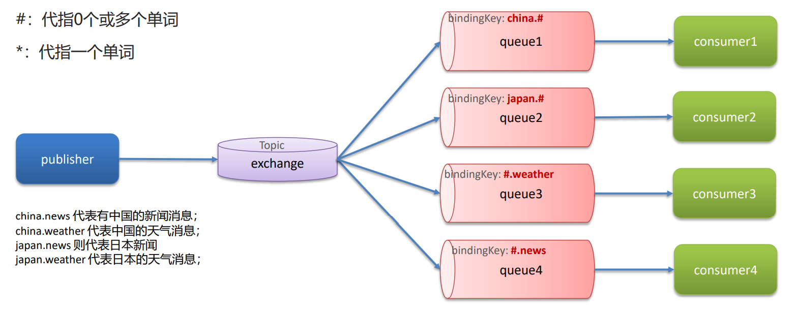


举例：

`ganga.#`：能够匹配`ganga.spu.xyz` 或者 `ganga.spu`

`ai.*`：只能匹配`ai.spu`

​

图示：

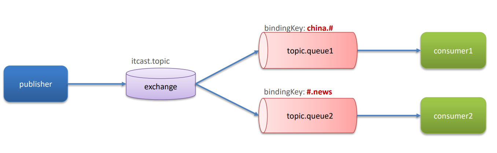

解释：

- Queue1：绑定的是`china.#` ，因此凡是以 `china.`开头的`routing key` 都会被匹配到。包括china.news和china.weather
- Queue2：绑定的是`#.news` ，因此凡是以 `.news`结尾的 `routing key` 都会被匹配。包括china.news和japan.news


---

###### 案例要求

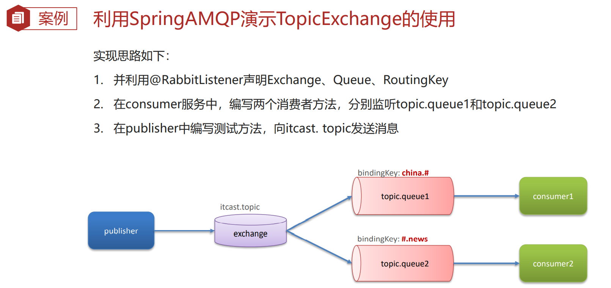


###### 消息发送

在publisher服务的SpringAmqpTest类中添加测试方法：

```java
package com.ganga.mq.spring.PubSub;

@RunWith(SpringRunner.class)
@SpringBootTest(classes = PublisherApp.class)
public class TopicExchange {

    @Autowired
    private RabbitTemplate rabbitTemplate;

    // queue01  -->  #.loli
    // queue02  -->  *.yvjie
    // queue03  -->  jk.#
    // queue04  -->  cos.*
    // queue05  -->  loli.#

    @Test
    public void sendTopicExchangeQueue01() {
        String exchangeName = "topicName";
        String key = "jk.loli";
        rabbitTemplate.convertAndSend(exchangeName, key, "一个穿着 [jk] 的 小[loli] ...");
    }
    // Queue[03]  key为: [ "jk.#" ] 接收到的消息是：一个穿着 [jk] 的 小[loli] ...
    // Queue[01]  key为: [ "#.loli" ] 接收到的消息是：一个穿着 [jk] 的 小[loli] ...

    @Test
    public void sendTopicExchangeQueue02() {
        String exchangeName = "topicName";
        String key = "jk.yvjie";
        rabbitTemplate.convertAndSend(exchangeName, key, "一个穿着 [jk] 的 [yvjie] ...");
    }
    // Queue[03]  key为: [ "jk.#" ] 接收到的消息是：一个穿着 [jk] 的 [yvjie] ...
    // Queue[04]  key为: [ "cos.*" ] 接收到的消息是：一个穿着 [jk] 的 [yvjie] ...
    // Queue[02]  key为: [ "*.yvjie" ] 接收到的消息是：一个穿着 [jk] 的 [yvjie] ...


    @Test
    public void sendTopicExchangeQueue03() {
        String exchangeName = "topicName";
        String key = "cos.loli";
        rabbitTemplate.convertAndSend(exchangeName, key, "一个穿着 [cos] 的 [loli] ...");
    }
    // Queue[03]  key为: [ "jk.#" ] 接收到的消息是：一个穿着 [cos] 的 [loli] ...
    // Queue[04]  key为: [ "cos.*" ] 接收到的消息是：一个穿着 [cos] 的 [loli] ...
    // Queue[01]  key为: [ "#.loli" ] 接收到的消息是：一个穿着 [cos] 的 [loli] ...

    @Test
    public void sendTopicExchangeQueue04() {
        String exchangeName = "topicName";
        String key = "cos.yvjie";
        rabbitTemplate.convertAndSend(exchangeName, key, "一个穿着 [cos] 的 [yvjie] ...");
    }
    // Queue[04]  key为: [ "cos.*" ] 接收到的消息是：一个穿着 [cos] 的 [yvjie] ...
    // Queue[03]  key为: [ "jk.#" ] 接收到的消息是：一个穿着 [cos] 的 [yvjie] ...
    // Queue[02]  key为: [ "*.yvjie" ] 接收到的消息是：一个穿着 [cos] 的 [yvjie] ..
}
```


###### 消息接收

在consumer服务的SpringRabbitListener中添加方法：

```java
package com.ganga.listener.exchange;

import org.springframework.amqp.core.ExchangeTypes;
import org.springframework.amqp.rabbit.annotation.Exchange;
import org.springframework.amqp.rabbit.annotation.Queue;
import org.springframework.amqp.rabbit.annotation.QueueBinding;
import org.springframework.amqp.rabbit.annotation.RabbitListener;
import org.springframework.stereotype.Component;

// #.loli
// *.yvjie
// jk.#
// cos.*
// loli.#
@Component
public class TopicMQListener {

    // #.loli
    @RabbitListener(bindings = @QueueBinding(
            value = @Queue(name = "topic.queue01"),
            exchange = @Exchange(name = "topicName", type = ExchangeTypes.TOPIC),
            key = {"#.loli"}
    ))
    public void listenTopicExchangeQueue01(String msg) {
        System.out.println("Queue[01]  key为: [ \"#.loli\" ] 接收到的消息是：" + msg);
    }

    // *.yvjie
    @RabbitListener(bindings = @QueueBinding(
            value = @Queue(name = "topic.queue02"),
            exchange = @Exchange(name = "topicName", type = ExchangeTypes.TOPIC),
            key = {"*.yvjie"}
    ))
    public void listenTopicExchangeQueue02(String msg) {
        System.out.println("Queue[02]  key为: [ \"*.yvjie\" ] 接收到的消息是：" + msg);
    }

    // jk.#
    @RabbitListener(bindings = @QueueBinding(
            value = @Queue(name = "topic.queue03"),
            exchange = @Exchange(name = "topicName", type = ExchangeTypes.TOPIC),
            key = {"jk.#"}
    ))
    public void listenTopicExchangeQueue03(String msg) {
        System.out.println("Queue[03]  key为: [ \"jk.#\" ] 接收到的消息是：" + msg);
    }

    // cos.*
    @RabbitListener(bindings = @QueueBinding(
            value = @Queue(name = "topic.queue04"),
            exchange = @Exchange(name = "topicName", type = ExchangeTypes.TOPIC),
            key = {"cos.*"}
    ))
    public void listenTopicExchangeQueue04(String msg) {
        System.out.println("Queue[04]  key为: [ \"cos.*\" ] 接收到的消息是：" + msg);
    }

    // loli.#
    @RabbitListener(bindings = @QueueBinding(
            value = @Queue(name = "topic.queue05"),
            exchange = @Exchange(name = "topicName", type = ExchangeTypes.TOPIC),
            key = {"loli.#"}
    ))
    public void listenTopicExchangeQueue05(String msg) {
        System.out.println("Queue[05]  key为: [ \"loli.#\" ] 接收到的消息是：" + msg);
    }
}
```


###### 总结

描述下Direct交换机与Topic交换机的差异？

- Topic交换机接收的消息RoutingKey必须是多个单词，以 `**.**` 分割
- Topic交换机与队列绑定时的bindingKey可以指定通配符
- `#`：代表0个或多个词
- `*`：代表1个词


##### 消息转换器

之前说过，Spring会把你发送的消息序列化为字节发送给MQ，接收消息的时候，还会把字节反序列化为Java对象。

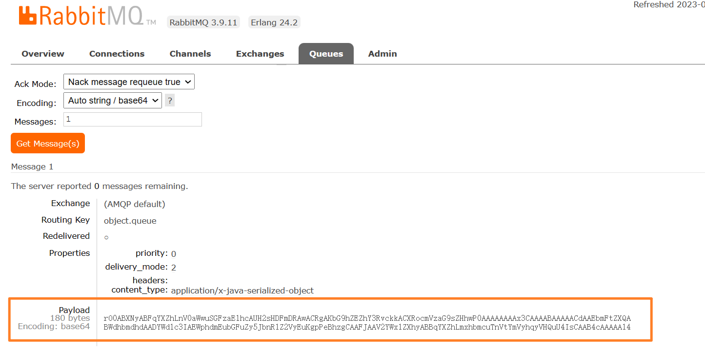

只不过，默认情况下Spring采用的序列化方式是JDK序列化。众所周知，JDK序列化存在下列问题：

- 数据体积过大
- 有安全漏洞
- 可读性差

我们来测试一下。


###### 测试默认转换器


我们修改消息发送的代码，发送一个Map对象：

```java
@Test
public void testSendMap() throws InterruptedException {
    // 准备消息
    Map<String,Object> msg = new HashMap<>();
    msg.put("name", "Jack");
    msg.put("age", 21);
    // 发送消息
    rabbitTemplate.convertAndSend("simple.queue","", msg);
}
```


停止consumer服务


发送消息后查看控制台：


###### 配置JSON转换器

显然，JDK序列化方式并不合适。我们希望消息体的体积更小、可读性更高，因此可以使用JSON方式来做序列化和反序列化。

在publisher和consumer两个服务中都引入依赖：

```xml
<dependency>
	<groupId>com.fasterxml.jackson.core</groupId>
	<artifactId>jackson-databind</artifactId>
</dependency>

<!--或者-->

<dependency>
    <groupId>com.fasterxml.jackson.dataformat</groupId>
    <artifactId>jackson-dataformat-xml</artifactId>
    <version>2.9.10</version>
</dependency>
```

配置消息转换器。

在启动类中添加一个Bean即可：

```java
@Bean
public MessageConverter jsonMessageConverter(){
    return new Jackson2JsonMessageConverter();
}
```


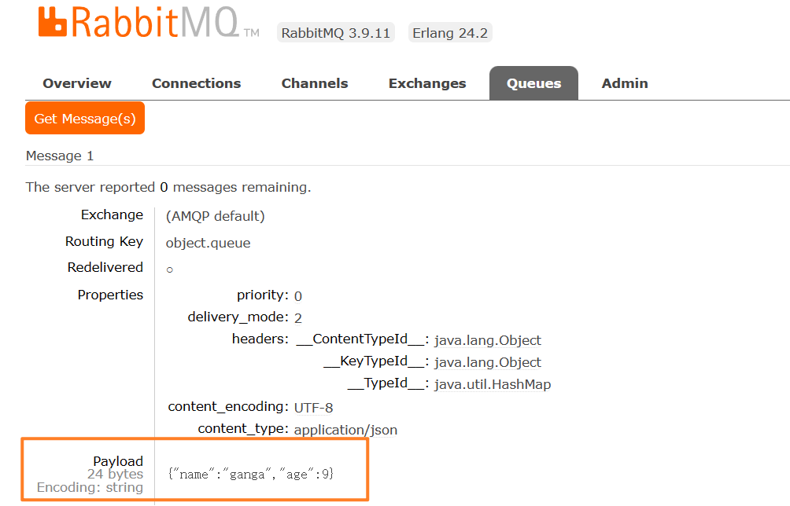


---

---


## 高级搜索ES


### 简单介绍


#### 什么是elasticsearch

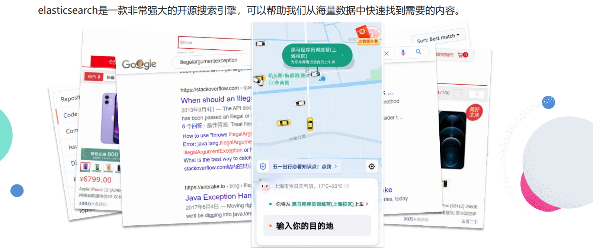

---

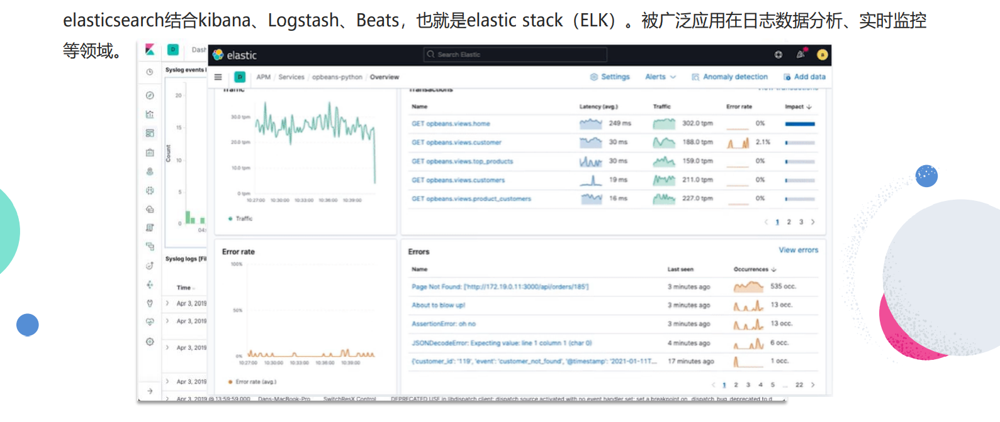

---

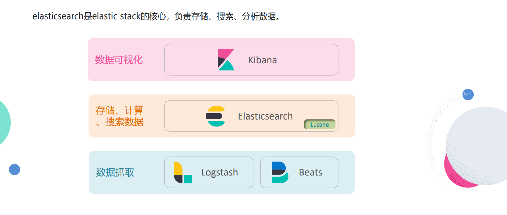


**elasticsearch的发展 **

Lucene是一个Java语言的搜索引擎类库，是Apache公司的顶级项目，由DougCutting于1999年研发 。

官网地址：https://lucene.apache.org/

Lucene的优势：

- 易扩展
- 高性能（基于倒排索引）

Lucene的缺点：

- 只限于Java语言开发
- 学习曲线陡峭
- 不支持水平扩展

2004年Shay Banon基于Lucene开发了Compass

2010年Shay Banon 重写了Compass，取名为Elasticsearch。

官网地址: https://www.elastic.co/cn/

目前最新的版本是：7.12.1 相比与lucene，elasticsearch具备下列优势：

- 支持分布式，可水平扩展
- 提供Restful接口，可被任何语言调用


---


#### 倒排索引


传统数据库（如MySQL）采用正向索引，例如给下表（tb_goods）中的id创建索引：

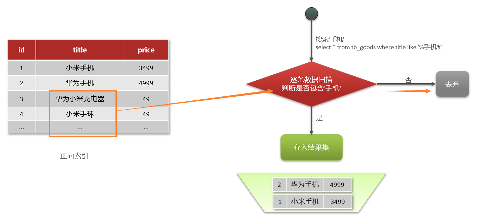


---


elasticsearch采用倒排索引：

- 文档（document）：每条数据就是一个文档
- 词条（term）：文档按照语义分成的词语

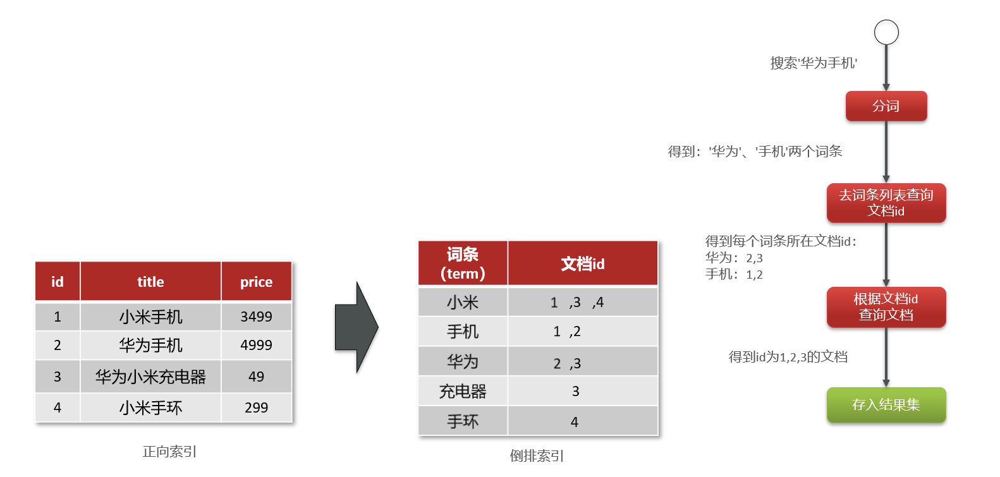


---


#### ES与MySQL


Elasticsearch与mysql的概念对比：

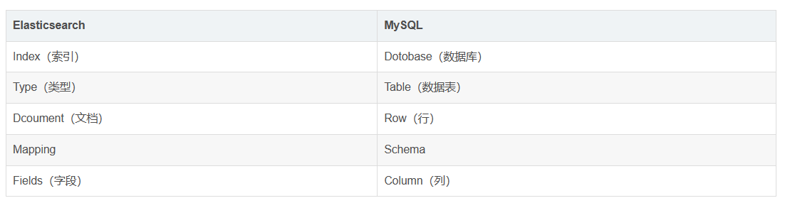


#### 架构


Mysql：擅长事务类型操作，可以确保数据的安全和一致性

Elasticsearch：擅长海量数据的搜索、分析、计算

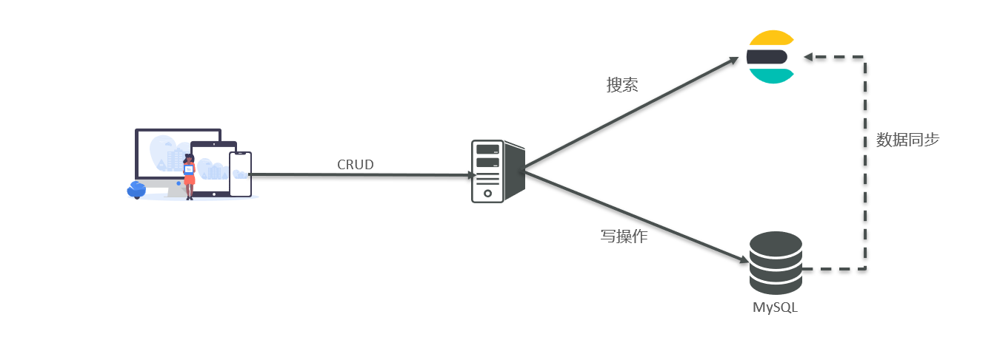

---

---


### 安装部署


#### 单机部署


**创建网络**

因为我们还需要部署kibana容器，因此需要让es和kibana容器互联。这里先创建一个网络：

```sh
docker network create es-net
```


**加载镜像**

```sh
docker pull elasticsearch:7.12.1
```


**创建容器并运行**

运行docker命令，部署单点es：

```sh
docker run -d \
	--name es7 \
    -e "ES_JAVA_OPTS=-Xms512m -Xmx512m" \
    -e "discovery.type=single-node" \
    -v es-data:/usr/share/elasticsearch/data \
    -v es-plugins:/usr/share/elasticsearch/plugins \
    --privileged \
    --network es-net \
    -p 9200:9200 \
    -p 9300:9300 \
elasticsearch:7.12.1
```

命令解释：

- `-e "cluster.name=es-docker-cluster"`：设置集群名称
- `-e "http.host=0.0.0.0"`：监听的地址，可以外网访问
- `-e "ES_JAVA_OPTS=-Xms512m -Xmx512m"`：内存大小
- `-e "discovery.type=single-node"`：非集群模式
- `-v es-data:/usr/share/elasticsearch/data`：挂载逻辑卷，绑定es的数据目录
- `-v es-logs:/usr/share/elasticsearch/logs`：挂载逻辑卷，绑定es的日志目录
- `-v es-plugins:/usr/share/elasticsearch/plugins`：挂载逻辑卷，绑定es的插件目录
- `--privileged`：授予逻辑卷访问权
- `--network es-net` ：加入一个名为es-net的网络中
- `-p 9200:9200`：端口映射配置


设置密码：

```yml
# 先进入容器，编写 config/elasticsearch.yml
# docker exec -it elasticsearch bash


# 此处开启xpack
http.cors.enabled: true
http.cors.allow-origin: "*"
http.cors.allow-headers: Authorization
xpack.security.enabled: true
xpack.security.transport.ssl.enabled: true


# 推出容器 重启容器 进入容器 运行命令后设置密码
# exit
# docker restart es
# docker exec -it elasticsearch bash
# elasticsearch-setup-passwords interactive
```

[设密码参考](https://blog.csdn.net/IT_road_qxc/article/details/121858843)


在浏览器中输入：http://ip:9200 即可看到elasticsearch的响应结果。


---


#### 部署kibana

kibana可以给我们提供一个elasticsearch的可视化界面，便于我们学习。


**部署**

运行docker命令，部署kibana

```sh
docker run -d \
--name kibana \
-e ELASTICSEARCH_HOSTS=http://es7:9200 \
--network=es-net \
-p 5601:5601  \
kibana:7.12.1
```

- `--network es-net` ：加入一个名为es-net的网络中，与elasticsearch在同一个网络中
- `-e ELASTICSEARCH_HOSTS=http://es:9200"`：设置elasticsearch的地址，因为kibana已经与elasticsearch在一个网络，因此可以用容器名直接访问elasticsearch
- `-p 5601:5601`：端口映射配置


设置密码：

```yaml
#
# ** THIS IS AN AUTO-GENERATED FILE **
#

# Default Kibana configuration for docker target
server.host: "0"
server.shutdownTimeout: "5s"
elasticsearch.hosts: [ "http://172.0.0.1:9200" ]
monitoring.ui.container.elasticsearch.enabled: true
i18n.locale: "zh-CN"
# 此处设置elastic的用户名和密码
elasticsearch.username: elastic
elasticsearch.password: elastic
```


kibana启动一般比较慢，需要多等待一会，可以通过命令：

```sh
docker logs -f kibana
```

查看运行日志，当查看到下面的日志，说明成功：


此时，在浏览器输入地址访问：http://192.168.150.101:5601，即可看到结果


**DevTools**

kibana中提供了一个DevTools界面：


这个界面中可以编写DSL来操作elasticsearch。并且对DSL语句有自动补全功能。


---


#### 安装IK分词器


**在线安装ik插件**

```shell
# 进入容器内部
docker exec -it elasticsearch /bin/bash

# 在线下载并安装
./bin/elasticsearch-plugin  install https://github.com/medcl/elasticsearch-analysis-ik/releases/download/v7.12.1/elasticsearch-analysis-ik-7.12.1.zip

#退出
exit
#重启容器
docker restart elasticsearch
```


**离线安装ik插件**


查看数据卷目录

安装插件需要知道elasticsearch的plugins目录位置，而我们用了数据卷挂载，因此需要查看elasticsearch的数据卷目录，通过下面命令查看:

```sh
docker volume inspect es-plugins
```

显示结果：

```json
[
    {
        "CreatedAt": "2022-05-06T10:06:34+08:00",
        "Driver": "local",
        "Labels": null,
        "Mountpoint": "/var/lib/docker/volumes/es-plugins/_data",
        "Name": "es-plugins",
        "Options": null,
        "Scope": "local"
    }
]
```

说明plugins目录被挂载到了：`/var/lib/docker/volumes/es-plugins/_data `这个目录中。


解压缩分词器安装包

下面我们需要把课前资料中的ik分词器解压缩，重命名为ik


传到es容器的插件数据卷中

也就是`/var/lib/docker/volumes/es-plugins/_data `：


重启容器

```shell
# 4、重启容器
docker restart es
```

```sh
# 查看es日志
docker logs -f es
```


---

---


#### 部署es集群

部署es集群可以直接使用docker-compose来完成，不过要求你的Linux虚拟机至少有**4G**的内存空间


首先编写一个docker-compose文件，内容如下：

```sh
version: '2.2'
services:
  es01:
    image: docker.elastic.co/elasticsearch/elasticsearch:7.12.1
    container_name: es01
    environment:
      - node.name=es01
      - cluster.name=es-docker-cluster
      - discovery.seed_hosts=es02,es03
      - cluster.initial_master_nodes=es01,es02,es03
      - bootstrap.memory_lock=true
      - "ES_JAVA_OPTS=-Xms512m -Xmx512m"
    ulimits:
      memlock:
        soft: -1
        hard: -1
    volumes:
      - data01:/usr/share/elasticsearch/data
    ports:
      - 9200:9200
    networks:
      - elastic
  es02:
    image: docker.elastic.co/elasticsearch/elasticsearch:7.12.1
    container_name: es02
    environment:
      - node.name=es02
      - cluster.name=es-docker-cluster
      - discovery.seed_hosts=es01,es03
      - cluster.initial_master_nodes=es01,es02,es03
      - bootstrap.memory_lock=true
      - "ES_JAVA_OPTS=-Xms512m -Xmx512m"
    ulimits:
      memlock:
        soft: -1
        hard: -1
    volumes:
      - data02:/usr/share/elasticsearch/data
    networks:
      - elastic
  es03:
    image: docker.elastic.co/elasticsearch/elasticsearch:7.12.1
    container_name: es03
    environment:
      - node.name=es03
      - cluster.name=es-docker-cluster
      - discovery.seed_hosts=es01,es02
      - cluster.initial_master_nodes=es01,es02,es03
      - bootstrap.memory_lock=true
      - "ES_JAVA_OPTS=-Xms512m -Xmx512m"
    ulimits:
      memlock:
        soft: -1
        hard: -1
    volumes:
      - data03:/usr/share/elasticsearch/data
    networks:
      - elastic

volumes:
  data01:
    driver: local
  data02:
    driver: local
  data03:
    driver: local

networks:
  elastic:
    driver: bridge
```


Run `docker-compose` to bring up the cluster:

```sh
docker-compose up
```


---

---


### IK分词器


#### IK分模式

IK分词器包含两种模式：

* `ik_smart`：最少切分

* `ik_max_word`：最细切分


```json
GET /_analyze
{
  "analyzer": "ik_max_word",
  "text": "黑马程序员学习java太棒了"
}
```

结果：

```json
{
  "tokens" : [
    {
      "token" : "黑马",
      "start_offset" : 0,
      "end_offset" : 2,
      "type" : "CN_WORD",
      "position" : 0
    },
    {
      "token" : "程序员",
      "start_offset" : 2,
      "end_offset" : 5,
      "type" : "CN_WORD",
      "position" : 1
    },
    {
      "token" : "程序",
      "start_offset" : 2,
      "end_offset" : 4,
      "type" : "CN_WORD",
      "position" : 2
    },
    {
      "token" : "员",
      "start_offset" : 4,
      "end_offset" : 5,
      "type" : "CN_CHAR",
      "position" : 3
    },
    {
      "token" : "学习",
      "start_offset" : 5,
      "end_offset" : 7,
      "type" : "CN_WORD",
      "position" : 4
    },
    {
      "token" : "java",
      "start_offset" : 7,
      "end_offset" : 11,
      "type" : "ENGLISH",
      "position" : 5
    },
    {
      "token" : "太棒了",
      "start_offset" : 11,
      "end_offset" : 14,
      "type" : "CN_WORD",
      "position" : 6
    },
    {
      "token" : "太棒",
      "start_offset" : 11,
      "end_offset" : 13,
      "type" : "CN_WORD",
      "position" : 7
    },
    {
      "token" : "了",
      "start_offset" : 13,
      "end_offset" : 14,
      "type" : "CN_CHAR",
      "position" : 8
    }
  ]
}
```


#### 扩展词词典

随着互联网的发展，“造词运动”也越发的频繁。出现了很多新的词语，在原有的词汇列表中并不存在。比如：“奥力给”，“传智播客” 等。

所以我们的词汇也需要不断的更新，IK分词器提供了扩展词汇的功能。

1）打开IK分词器config目录： /var/lib/docker/volumes/es-plugins/_data


2）在IKAnalyzer.cfg.xml配置文件内容添加：

```xml
<?xml version="1.0" encoding="UTF-8"?>
<!DOCTYPE properties SYSTEM "http://java.sun.com/dtd/properties.dtd">
<properties>
        <comment>IK Analyzer 扩展配置</comment>
        <!--用户可以在这里配置自己的扩展字典 *** 添加扩展词典-->
        <entry key="ext_dict">ext.dic</entry>
</properties>
```

3）新建一个 ext.dic，可以参考config目录下复制一个配置文件进行修改

```properties
传智播客
奥力给
```

4）重启elasticsearch

```sh
docker restart es

# 查看 日志
docker logs -f elasticsearch
```


日志中已经成功加载ext.dic配置文件

5）测试效果：

```json
GET /_analyze
{
  "analyzer": "ik_max_word",
  "text": "传智播客Java就业超过90%,奥力给！"
}
```

> 注意当前文件的编码必须是 UTF-8 格式，严禁使用Windows记事本编辑


#### 停用词词典

在互联网项目中，在网络间传输的速度很快，所以很多语言是不允许在网络上传递的，如：关于宗教、政治等敏感词语，那么我们在搜索时也应该忽略当前词汇。

IK分词器也提供了强大的停用词功能，让我们在索引时就直接忽略当前的停用词汇表中的内容。

1）IKAnalyzer.cfg.xml配置文件内容添加：

```xml
<?xml version="1.0" encoding="UTF-8"?>
<!DOCTYPE properties SYSTEM "http://java.sun.com/dtd/properties.dtd">
<properties>
        <comment>IK Analyzer 扩展配置</comment>
        <!--用户可以在这里配置自己的扩展字典-->
        <entry key="ext_dict">ext.dic</entry>
         <!--用户可以在这里配置自己的扩展停止词字典  *** 添加停用词词典-->
        <entry key="ext_stopwords">stopword.dic</entry>
</properties>
```

3）在 stopword.dic 添加停用词

```properties
的
吗
嘤
```

4）重启elasticsearch

```sh
# 重启服务
docker restart elasticsearch
docker restart kibana

# 查看 日志
docker logs -f elasticsearch
```

日志中已经成功加载stopword.dic配置文件

5）测试效果：

```json
GET /_analyze
{
  "analyzer": "ik_max_word",
  "text": "传智播客Java就业率超过95%,习大大都点赞,奥力给！"
}
```

> 注意当前文件的编码必须是 UTF-8 格式，严禁使用Windows记事本编辑


---

---


### API-Index


**mapping属性**

mapping是对索引库中文档的约束，常见的mapping属性包括：

- `type`：字段数据类型，常见的简单类型有：
  - 字符串：`text`（可分词的文本）、`keyword`（精确值，例如：品牌、国家、ip地址）
  - 数值：`long`、`integer`、`short`、`byte`、`double`、`float`、
  - 布尔：`boolean `
  - 日期：`date `
  - 对象：`object`
- `index`：是否创建索引，默认为true
- `analyzer`：使用哪种分词器
- `properties`：该字段的子字段


#### **创建索引库和映射**

```json
PUT /索引库名称
{
  "mappings": {
    "properties": {
      "字段名":{
        "type": "text",
        "analyzer": "ik_smart"
      },
      "字段名2":{
        "type": "keyword",
        "index": "false"
      },
      "字段名3":{
        "properties": {
          "子字段": {
            "type": "keyword"
          }
        }
      }
      // ...略
    }
  }
}
```

示例：

```sh
PUT /heima
{
  "mappings": {
    "properties": {
      "info":{
        "type": "text",
        "analyzer": "ik_smart"
      },
      "email":{
        "type": "keyword",
        "index": "falsae"
      },
      "name":{
        "properties": {
          "firstName": {
            "type": "keyword"
          }
        }
      },
      // ... 略
    }
  }
}
```


#### **查询文档**

```json
GET /index #### 
```


#### **删除文档**

```json
DELETE /index
```


#### **修改文档--添加新映射**

```json
PUT /incex/_mapping

PUT /ganga/_mapping
{
  "properties":{
    "新字段":{
      "type": "integer"
    }
  }
}
```


### API-document


#### **添加文档 - POST**

方式一:

```json
POST /ganga/_doc/1
{
  "info": "尴尬酱万岁！奥里给！",
  "email": "2282514478@qq.com",
  "age": 9,
  "name": {
    "first": "尬酱",
    "last": "尴"
  },
  "newField": "666"
}
```

方式二：

```json
POST /ganga/_create/1
{
  "info": "尴尬酱万岁！奥里给！",
  "email": "2282514478@qq.com",
  "age": 9,
  "name": {
    "first": "尬酱",
    "last": "尴"
  },
  "newField": "666"
}
```


#### **根据ID查询文档 - GET**

```json
GET /ganga/_doc/1
```


#### **根据ID删除文档 - DELETE**

```json
DELETE /ganga/_doc/1
```


#### **根据ID全量修改 - PUT**

```json
PUT /ganga/_doc/1
{
  "info": "尴尬酱万岁！奥里给！嘤",
  "email": "2282514478@qq.com",
  "age": 9,
  "name": {
    "first": "尬酱",
    "last": "尴"
  },
  "newField": "666666"
}

PUT /ganga/_doc/1
{
  "info": "如果其他字段不写或写错了，都会被修改掉",
  "newField": "6"
}
```


#### **根据ID增量修改 - POST**

```json
POST /ganga/_update/1

{
	"doc": {
        "info": "尴尬酱万岁",
        "newField": "6"
    }
}
```


---


### API-Search

Elasticsearch提供了基于JSON的DSL（[Domain Specific Language](https://www.elastic.co/guide/en/elasticsearch/reference/current/query-dsl.html)）来定义查询。常见的查询类型包括：

- **查询所有**：查询出所有数据，一般测试用。例如：match_all

- **全文检索（full text）查询**：利用分词器对用户输入内容分词，然后去倒排索引库中匹配。例如：
  - match_query
  - multi_match_query
- **精确查询**：根据精确词条值查找数据，一般是查找keyword、数值、日期、boolean等类型字段。例如：
  - ids
  - range
  - term
- **地理（geo）查询**：根据经纬度查询。例如：
  - geo_distance
  - geo_bounding_box
- **复合（compound）查询**：复合查询可以将上述各种查询条件组合起来，合并查询条件。例如：
  - bool
  - function_score


#### **查询所有文档-match_all**

```json
GET /hotel/_search
{
  "query": {
    "match_all": {
    }
  }
}
```


#### **全文检索查询-match**

```json
# 全文检索查询 match
GET /hotel/_search
{
  "query": {
    "match":{
      "all": "上海"
    }
  }
}

```


#### **全文检索查询-multi_match**

```json

# 全文检索查询 multi_match
# 这种方式相对与match 结果相同 但是性能会很差 match利用copy_to复制到了all字段中
GET /hotel/_search
{
  "query": {
    "multi_match": {
      "query": "上海",
      "fields": ["name","brand","city"]
    }
  }
}
```


#### **精确查找-term**

```json
# 精确查找 term
GET /hotel/_search
{
  "query": {
    "term": {
      "starName": {
        "value": "五钻" //不进行分词的字段查询
      }
    }
  }
}
```


#### **精确查找-range**

```json
# 精确查找 range
GET /hotel/_search
{
  "query": {
    "range":{
      "price": {
        "gte": 1000, // "gte"大于等于 "gt"大于
        "lte": 1302  // "lte"小于等于 "lt"小于
      }
    }
  }
}
```


#### **地理坐标查询-geo_distance**

```json
# 地理坐标查询
# 附近查询，也叫做距离查询（geo_distance）俗称:"方圆内"
GET /hotel/_search
{
  "query": {
    "geo_distance":{
      "distance": "10km",
      "location": "31.21, 121.5"
    }
  }
}
GET /hotel/_search
{
  "query": {
    "geo_distance":{
      "distance": "5km",
      "location": "31.21, 121.5"
    }
  }
}
```


#### **复合查询-算分函数**

function score 查询中包含四部分内容：

- **原始查询**条件：query部分，基于这个条件搜索文档，并且基于BM25算法给文档打分，**原始算分**（query score)
- **过滤条件**：filter部分，符合该条件的文档才会重新算分
- **算分函数**：符合filter条件的文档要根据这个函数做运算，得到的**函数算分**（function score），有四种函数
  - weight：函数结果是常量
  - field_value_factor：以文档中的某个字段值作为函数结果
  - random_score：以随机数作为函数结果
  - script_score：自定义算分函数算法
- **运算模式**：算分函数的结果、原始查询的相关性算分，两者之间的运算方式，包括：
  - multiply：相乘
  - replace：用function score替换query score
  - 其它，例如：sum、avg、max、min


function score的运行流程如下：

- 1）根据**原始条件**查询搜索文档，并且计算相关性算分，称为**原始算分**（query score）
- 2）根据**过滤条件**，过滤文档
- 3）符合**过滤条件**的文档，基于**算分函数**运算，得到**函数算分**（function score）
- 4）将**原始算分**（query score）和**函数算分**（function score）基于**运算模式**做运算，得到最终结果，作为相关性算分。


因此，其中的关键点是：

- 过滤条件：决定哪些文档的算分被修改
- 算分函数：决定函数算分的算法
- 运算模式：决定最终算分结果


```json
# 复合查询 fuction score 算分函数查询，可以控制文档相关性算分，控制文档排名
# 早期使用的打分算法是TF-IDF算法
# 在后来的5.1版本升级中，elasticsearch将算法改进为BM25算法
GET /hotel/_search
GET /hotel/_search
{
  "query": {
    "function_score": {
      "query": {  .... }, // 原始查询，可以是任意条件
      "functions": [ // 算分函数
        {
          "filter": { // 满足的条件，品牌必须是如家
            "term": {
              "brand": "如家"
            }
          },
          "weight": 2 // 算分权重为2
        }
      ],
      "boost_mode": "sum" // 加权模式，求和
    }
  }
}
```


#### **复合查询-布尔查询**

布尔查询是一个或多个查询子句的组合，每一个子句就是一个**子查询**。子查询的组合方式有：

- must：必须匹配每个子查询，类似“与”
- should：选择性匹配子查询，类似“或”
- must_not：必须不匹配，**不参与算分**，类似“非”
- filter：必须匹配，**不参与算分**

```json
GET /ganga/_search
{
  "query": {
    "bool": {
      "must": [
        {"term": {"city": "上海" }}
      ],
      "should": [
        {"term": {"brand": "皇冠假日" }},
        {"term": {"brand": "华美达" }}
      ],
      "must_not": [
        { "range": { "price": { "lte": 500 } }}
      ],
      "filter": [
        { "range": {"score": { "gte": 45 } }}
      ]
    }
  }
}
```


---


### API-聚合函数


#### TODO:


---


### 搜索结果处理

搜索的结果可以按照用户指定的方式去处理或展示。


#### 排序

elasticsearch默认是根据相关度算分（_score）来排序，但是也支持自定义方式对搜索[结果排序](https://www.elastic.co/guide/en/elasticsearch/reference/current/sort-search-results.html)。可以排序字段类型有：keyword类型、数值类型、地理坐标类型、日期类型等。


**普通字段排序**

keyword、数值、日期类型排序的语法基本一致。

```json
GET /indexName/_search
{
  "query": {
    "match_all": {}
  },
  "sort": [
    {
      "FIELD": "desc"  // 排序字段、排序方式ASC、DESC
    }
  ]
}
```


**地理坐标排序**

地理坐标排序略有不同。

```json
GET /indexName/_search
{
  "query": {
    "match_all": {}
  },
  "sort": [
    {
      "_geo_distance" : {
          "FIELD" : "纬度，经度", // 文档中geo_point类型的字段名、目标坐标点
          "order" : "asc", // 排序方式
          "unit" : "km" // 排序的距离单位
      }
    }
  ]
}
```

这个查询的含义是：

- 指定一个坐标，作为目标点
- 计算每一个文档中，指定字段（必须是geo_point类型）的坐标 到目标点的距离是多少
- 根据距离排序


需求描述：实现对酒店数据按照到你的位置坐标的距离升序排序

获取你的位置的经纬度的方式：https://lbs.amap.com/demo/jsapi-v2/example/map/click-to-get-lnglat/

假设我的位置是：31.034661，121.612282，寻找我周围距离最近的酒店。


---


#### 分页

elasticsearch 默认情况下只返回top10的数据。而如果要查询更多数据就需要修改分页参数了。elasticsearch中通过修改from、size参数来控制要返回的分页结果：

- from：从第几个文档开始
- size：总共查询几个文档

类似于mysql中的`limit ?, ?`


分页的基本语法如下：

```json
GET /hotel/_search
{
  "query": {
    "match_all": {}
  },
  "from": 0, // 分页开始的位置，默认为0
  "size": 10, // 期望获取的文档总数
  "sort": [
    {"price": "asc"}
  ]
}
```


**深度分页问题**

现在，我要查询990~1000的数据，查询逻辑要这么写：

```json
GET /hotel/_search
{
  "query": {
    "match_all": {}
  },
  "from": 990, // 分页开始的位置，默认为0
  "size": 10, // 期望获取的文档总数
  "sort": [
    {"price": "asc"}
  ]
}
```

这里是查询990开始的数据，也就是 第990~第1000条 数据。

不过，elasticsearch内部分页时，必须先查询 0~1000条，然后截取其中的990 ~ 1000的这10条：


查询TOP1000，如果es是单点模式，这并无太大影响。

但是elasticsearch将来一定是集群，例如我集群有5个节点，我要查询TOP1000的数据，并不是每个节点查询200条就可以了。

因为节点A的TOP200，在另一个节点可能排到10000名以外了。

因此要想获取整个集群的TOP1000，必须先查询出每个节点的TOP1000，汇总结果后，重新排名，重新截取TOP1000。


那如果我要查询9900~10000的数据呢？是不是要先查询TOP10000呢？那每个节点都要查询10000条？汇总到内存中？


当查询分页深度较大时，汇总数据过多，对内存和CPU会产生非常大的压力，因此elasticsearch会禁止from+ size 超过10000的请求。


针对深度分页，ES提供了两种解决方案，[官方文档](https://www.elastic.co/guide/en/elasticsearch/reference/current/paginate-search-results.html)：

- search after：分页时需要排序，原理是从上一次的排序值开始，查询下一页数据。官方推荐使用的方式。
- scroll：原理将排序后的文档id形成快照，保存在内存。官方已经不推荐使用。


**小结**

分页查询的常见实现方案以及优缺点：

- `from + size`：
  - 优点：支持随机翻页
  - 缺点：深度分页问题，默认查询上限（from + size）是10000
  - 场景：百度、京东、谷歌、淘宝这样的随机翻页搜索
- `after search`：
  - 优点：没有查询上限（单次查询的size不超过10000）
  - 缺点：只能向后逐页查询，不支持随机翻页
  - 场景：没有随机翻页需求的搜索，例如手机向下滚动翻页

- `scroll`：
  - 优点：没有查询上限（单次查询的size不超过10000）
  - 缺点：会有额外内存消耗，并且搜索结果是非实时的
  - 场景：海量数据的获取和迁移。从ES7.1开始不推荐，建议用 after search方案。


---


#### 高亮


**高亮的语法**：

```json
GET /hotel/_search
{
  "query": {
    "match": {
      "FIELD": "TEXT" // 查询条件，高亮一定要使用全文检索查询
    }
  },
  "highlight": {
    "fields": { // 指定要高亮的字段
      "FIELD": {
        "pre_tags": "<em>",  // 用来标记高亮字段的前置标签
        "post_tags": "</em>" // 用来标记高亮字段的后置标签
      }
    }
  }
}
```


**注意：**

- 高亮是对关键字高亮，因此**搜索条件必须带有关键字**，而不能是范围这样的查询。
- 默认情况下，**高亮的字段，必须与搜索指定的字段一致**，否则无法高亮
- 如果要对非搜索字段高亮，则需要添加一个属性：required_field_match=false


**示例**：


---


#### **总结**

查询的DSL是一个大的JSON对象，包含下列属性：

- query：查询条件
- from和size：分页条件
- sort：排序条件
- highlight：高亮条件


-

---

---


### RestClient

---


#### 酒店数据索引库分析

这是表结构：


**分析索引**

**分析逻辑：**
1. 字段的索引类型
2. 如果是字符串，是否需要分词
3. 不分词用keyword
4. 分词用test，分词器analyzer是什么?`ik_max_word`/`ik_smart`/`...`
5. 该字段是进行搜索，默认搜索，不搜索：`"index": false`


数据库
```sql
CREATE TABLE `tb_hotel` (
  `id` bigint(20) NOT NULL COMMENT '酒店id',    
  `name` varchar(255) NOT NULL COMMENT '酒店名称',
  `address` varchar(255) NOT NULL COMMENT '酒店地址',
  `price` int(10) NOT NULL COMMENT '酒店价格',
  `score` int(2) NOT NULL COMMENT '酒店评分',
  `brand` varchar(32) NOT NULL COMMENT '酒店品牌',
  `city` varchar(32) NOT NULL COMMENT '所在城市',
  `star_name` varchar(16) DEFAULT NULL COMMENT '酒店星级，1星到5星，1钻到5钻',
  `business` varchar(255) DEFAULT NULL COMMENT '商圈',
  `latitude` varchar(32) NOT NULL COMMENT '纬度',
  `longitude` varchar(32) NOT NULL COMMENT '经度',
  `pic` varchar(255) DEFAULT NULL COMMENT '酒店图片',
  PRIMARY KEY (`id`) USING BTREE
) ENGINE=InnoDB DEFAULT CHARSET=utf8mb4 ROW_FORMAT=COMPACT;
```

---

索引映射
```json
{
  "mappings": {
    "properties": {
      "id": {
        "type": "keyword"
      },
      "name": {
        "type": "text",
        "analyzer": "ik_max_word",
        "copy_to": "all"
      },
      "address": {
        "type": "keyword",
        "index": false
      },
      "price": {
        "type": "integer"
      },
      "score": {
        "type": "integer"
      },
      "brand": {
        "type": "keyword",
        "copy_to": "all"
      },
      "city": {
        "type": "keyword",
        "copy_to": "all"
      },
      "starName": {
        "type": "keyword"
      },
      "business": {
        "type": "keyword"
      },
      "location": {
        "type": "geo_point"
      },
      "pic": {
        "type": "keyword",
        "index": false
      },
      "all": {
        "type": "text",
        "analyzer": "ik_max_word"
      }
    }
  }
}
```
---


#### RestClient初始化配置

pom.xml

```xml
<properties>
	<java.version>1.8</java.version>
	<!--由于springboot管理了es 这里要指定es的版本 与 es服务段版本一致-->
	<elasticsearch.version>7.12.1</elasticsearch.version>
</properties>

<dependencies>
<!--es-high依赖 - RestAPI-->
	<dependency>
    	<groupId>org.elasticsearch.client</groupId>
    	<artifactId>elasticsearch-rest-high-level-client</artifactId>
	</dependency>
</dependencies>
```


```java
@SpringBootTest(classes = HotelDemoApplication.class)
public class IndexDSLTest {	
    
	private RestHighLevelClient restClient;
    
    @BeforeEach //创建 RestClient
    public void initRest() {
        CredentialsProvider credentialsProvider = new BasicCredentialsProvider();
        credentialsProvider.setCredentials(AuthScope.ANY,
                new UsernamePasswordCredentials("user", "password"));
        this.restClient = new RestHighLevelClient(
                RestClient.builder(
                    new HttpHost("ayaka520", 9200, "http"))
                        .setHttpClientConfigCallback(new RestClientBuilder.HttpClientConfigCallback() {
                        public HttpAsyncClientBuilder customizeHttpClient(HttpAsyncClientBuilder httpClientBuilder) {
                            httpClientBuilder.disableAuthCaching();
                            return httpClientBuilder.setDefaultCredentialsProvider(credentialsProvider);
                    }
                })
        );
    }

    @AfterEach //清除客户端
    public void closeRest() throws IOException {
        restClient.close();
    }
    
    //Test
    
}
```


---


#### 实体类的转换

MySQL

```java
package com.ganga.hotel.pojo;

import com.baomidou.mybatisplus.annotation.IdType;
import com.baomidou.mybatisplus.annotation.TableId;
import com.baomidou.mybatisplus.annotation.TableName;
import lombok.Data;

@Data
@TableName("tb_hotel")
public class Hotel {
    @TableId(type = IdType.INPUT)
    private Long id;
    private String name;
    private String address;
    private Integer price;
    private Integer score;
    private String brand;
    private String city;
    private String starName;
    private String business;
    private String longitude;
    private String latitude;
    private String pic;
}
```

ES实体类

```java
package com.ganga.hotel.pojo;

import lombok.Data;
import lombok.NoArgsConstructor;

@Data
@NoArgsConstructor
public class HotelDoc {
    private Long id;
    private String name;
    private String address;
    private Integer price;
    private Integer score;
    private String brand;
    private String city;
    private String starName;
    private String business;
    private String location;
    private String pic;

    public HotelDoc(Hotel hotel) {
        this.id = hotel.getId();
        this.name = hotel.getName();
        this.address = hotel.getAddress();
        this.price = hotel.getPrice();
        this.score = hotel.getScore();
        this.brand = hotel.getBrand();
        this.city = hotel.getCity();
        this.starName = hotel.getStarName();
        this.business = hotel.getBusiness();
        this.location = hotel.getLatitude() + ", " + hotel.getLongitude();
        this.pic = hotel.getPic();
    }
}
```


---

#### 对索引库-DSL


##### **添加索引库**


```java
/**
 * 添加索引库
 * @throws IOException
 */
@Test
public void createIndexTest() throws IOException {
    //1.设置Request对象，声明请求方式和路径 : GET /hotel
    CreateIndexRequest request = new CreateIndexRequest("hotel");
    //2.设置请求参数，也就是DSL语句。
    request.source(CREATE_INDEX_HOTEL, XContentType.JSON);
    //3.发起请求
    restClient.indices().create(request, RequestOptions.DEFAULT);
}
```


##### **删除索引库**

```java
/**
 * 删除索引
 * @throws IOException
 */
@Test
public void deleteIndexTest() throws IOException {
    //1.设置Request对象，声明请求方式和路径 : DELETE /hotel
    DeleteIndexRequest request = new DeleteIndexRequest("hotel");
    //2.设置请求参数，也就是DSL语句。 无参数
    //3.发起请求
    restClient.indices().delete(request, RequestOptions.DEFAULT);
}
```


##### ****查询索引是否存在****

```java
/**
 * 查询索引是否存在
 * @throws IOException
 */
@Test
public void getIndexTest() throws IOException {
    //1.设置Request对象，声明请求方式和路径 : GET /hotel
    GetIndexRequest request = new GetIndexRequest("hotel");
    //2.设置请求参数，也就是DSL语句。 无参数
    //3.发起请求
    boolean exists = restClient.indices().exists(request, RequestOptions.DEFAULT);
    System.out.println(exists);
}
```


---


---


#### 对文档的-DSL


##### **根据id添加文档**

```java
/**
 * 根据 id 添加文档
 *
 * @throws IOException
 */
@Test
public void addDocumentTest() throws IOException {
    //1.从数据库中查询店铺
    Hotel hotel = hotelService.getById(id);
    //2.转换为 HotelDoc 类型
    HotelDoc hotelDoc = new HotelDoc(hotel);
    //3.序列化为 JSON
    String jsonString = JSON.toJSONString(hotelDoc);
    //1.创建request对象
    IndexRequest request = new IndexRequest("hotel").id(id.toString());//注意要加上.id()
    //2.准备DSL语句
    request.source(jsonString, XContentType.JSON);
    //3.发起请求
    restClient.index(request, RequestOptions.DEFAULT);
}
```


##### **根据id查询文档**

```java
/**
 * 根据 id 查询文档
 *
 * @throws IOException
 */
@Test
public void getDocumentById() throws IOException {
    //1.创建request对象
    GetRequest request = new GetRequest("hotel").id(id.toString());
    //2.准备DSL语句
    //request.id("197488318");
    //3.发起请求
    GetResponse response = restClient.get(request, RequestOptions.DEFAULT);
    //4.反序列化
    String json = response.getSourceAsString();
    HotelDoc hotelDoc = JSON.parseObject(json, HotelDoc.class);
    System.out.println(hotelDoc);
}


```


##### **根据id修改文档**

```java
/**
 * 根据id 修改文档
 *
 * @throws IOException
 */
@Test
public void updateDocumentById() throws IOException {
    //这是增量修改！！！
    restClient.update( //坑: 两个参数 一个是 index 一个是id 而不是链式..... 坑:
            new UpdateRequest("hotel", id.toString()).doc(
                    "name", "神里绫华--第二字段",
                    "address", "神里绫华--第二字段"
            ),
            RequestOptions.DEFAULT
    );
}
```


##### **根据id删除文档**

```java
/**
 * 根据 id 删除文档
 *
 * @throws IOException
 */
@Test
public void deleteDocumentById() throws IOException {
    restClient.delete(
            new DeleteRequest("hotel").id(id.toString()),
            RequestOptions.DEFAULT
    );
}
```


##### **根据id批量导入文档**

```java
/**
 * 根据id 批量导入文档
 */
@Test
public void bulkAddDocById() throws IOException {
    //从 MySql中获取所有数据
    List<Hotel> hotels = hotelService.list();
    //创建 BulkRequest对象
    BulkRequest request = new BulkRequest("hotel");
    hotels.forEach(hotel -> {
        //转换为 HotelDoc 并 序列化为 JSON
        String json = JSON.toJSONString(new HotelDoc(hotel));
        //使用 add() 方法添加 单个 request方法  //坑：别忘了加 .id()
        request.add(new IndexRequest("hotel").id(hotel.getId().toString()).source(json, XContentType.JSON));
    });
    //这里使用 restClient.bulk()
    restClient.bulk(request, RequestOptions.DEFAULT);
}
```


---


#### 文档搜索-Search


##### **查询所有**

```java
/**
 * match_all 查询所有
 *
 * @throws IOException
 */
@Test
public void matchAllQueryTest() throws IOException {
    //1.准备request请求
    SearchRequest request = new SearchRequest("hotel");
    //2.准备DSL语句
    request.source().query(QueryBuilders.matchAllQuery());
    //3.发起请求
    SearchResponse response = restClient.search(request, RequestOptions.DEFAULT);
    
    
    //解析相应结果 应封装为一个函数 下面有
    SearchHits hits = response.getHits();
    long total = hits.getTotalHits().value;
    System.out.println("共搜索到" + total + "条数据");
    //解析数据
    for (SearchHit hit : hits.getHits()) {
        String json = hit.getSourceAsString();
        //反序列化
        HotelDoc hotelDoc = JSON.parseObject(json, HotelDoc.class);
        System.out.println(hotelDoc + "\n");
    }
}
// ##### 解析结果 👇
```


##### **检索查询**

```java
/**
 * 检索查询
 *
 * @throws IOException
 */
@Test
public void matchQueryTest() throws IOException {
    //发起请求
    SearchRequest request = new SearchRequest("hotel");
    request.source().query(
            QueryBuilders.matchQuery("all", "如家")
    );
    SearchResponse response = restClient.search(request, RequestOptions.DEFAULT);
    //解析结果
    handleResponse(response);
}
```


##### **复合查询**

##### **精确查询**

```java
/**
 * 复合查询 (布尔查询)
 * 精确查询 (term、range)
 *
 * @throws IOException
 */
@Test
public void boolQueryTest() throws IOException {
    SearchRequest request = new SearchRequest("hotel");
    request.source().query(
            //先构建一个 boolQuery() 布尔查询
            QueryBuilders.boolQuery()
                    .must(QueryBuilders.matchQuery("name", "和颐")) //match 检索查询
                    .must(QueryBuilders.rangeQuery("price").gte(100).lte(300)) //range 数值查询
                    .mustNot(QueryBuilders.termQuery("starName", "一钻")) //term 精确查询
                    .mustNot(QueryBuilders.termQuery("starName", "二钻"))
                    //.must(QueryBuilders.)    // 必须匹配
                    //.should(QueryBuilders.)  // 选择性匹配
                    //.mustNot(QueryBuilders.) // 必须不匹配 不参与算分
                    //.filter(QueryBuilders.)  // 必须匹配   不参与算分
    );
    SearchResponse response = restClient.search(request, RequestOptions.DEFAULT);
    // 解析结果
    handleResponse(response);
}
```


##### **分页查询**

##### **排序查询**

```java
/**
 * 分页查询
 * 排序查询
 * @throws IOException
 */
@Test
public void OrderPageQueryTest() throws IOException {
    // 接收分页参数
    int page = 2, size = 5; // 查第二页 每页5条
    // 创建 request
    SearchRequest request = new SearchRequest("hotel");
    // source 相当于 json数据的 { }  query,from,size,...都在其内部
    SearchSourceBuilder source = request.source();
    // 查询条件
    source.query(QueryBuilders.matchQuery("all", "如家"));
    // 分页
    source.from((page - 1) * size).size(size); // 以后 page 会变得 第一页就为 0
    // 排序
    source.sort("price", SortOrder.ASC);
    // 发送
    SearchResponse response = restClient.search(request, RequestOptions.DEFAULT);
    // 结果处理
    handleResponse(response);
}
```


##### **高亮查询**

```java
/**
 * 高亮查询
 * 高亮数据解析 this.handleResponse(response)
 * @throws IOException
 */
@Test
public void addHighlightQueryTest() throws IOException {
    // 接收分页参数
    int page = 2, size = 5; // 查第二页 每页5条
    // 创建 request
    SearchRequest request = new SearchRequest("hotel");
    // source 相当于 json数据的 { }  query,from,size,...都在其内部
    SearchSourceBuilder source = request.source();
    // 查询条件
    source.query(QueryBuilders.matchQuery("all", "如家"));
    // 分页
    source.from((page - 1) * size).size(size); // 以后 page 会变得 第一页就为 0
    // 排序
    source.sort("price", SortOrder.ASC);
    // 高亮
    source.highlighter(
            new HighlightBuilder() // 这是要 new 一个 HighlightBuilder()
                    .field("name")      // field 指定高亮的字段
                    .requireFieldMatch(false) // false 对非搜索字段高亮，默认为 true 不对非搜索字段高亮
    );
    // 发送
    SearchResponse response = restClient.search(request, RequestOptions.DEFAULT);
    // 结果处理
    handleResponse(response);
    // 为了实现高亮 还需要对结果解析进行 继续 处理
}

```


##### **解析结果**

```java
/**
 * 解析结果
 *
 * @param response
 */
private static void handleResponse(SearchResponse response) {
    //解析结果
    long total = response.getHits().getTotalHits().value;
    System.out.println("共搜索到" + total + "条数据");
    for (SearchHit hit : response.getHits().getHits()) {
        // 获取查询数据
        String json = hit.getSourceAsString();
        HotelDoc hotelDoc = JSON.parseObject(json, HotelDoc.class);
        // 获取高亮数据
        Map<String, HighlightField> highlightFields = hit.getHighlightFields();
        if (!CollectionUtils.isEmpty(highlightFields)){
            // 获取高亮字段
            HighlightField field = highlightFields.get("name");
            if (field != null){
                String name = field.getFragments()[0].string();
                //替换原有数据
                hotelDoc.setName(name);
            }
        }
        System.out.println(hotelDoc + "\n");
    }
}
```


---


##### 对文档的-聚合


TODO:


---

---


### 酒店案例 - 搜索


#### 客户端

```java
@Configuration
public class RestClientConfig {

    @Bean
    public RestHighLevelClient restClient() {
        // Http 地址端口 及 用户认证
        CredentialsProvider credentialsProvider = new BasicCredentialsProvider();
        credentialsProvider.setCredentials(
                AuthScope.ANY,
                new UsernamePasswordCredentials("elastic", "password"));

        //构建RestHighLevelClient对象
        return new RestHighLevelClient(
                org.elasticsearch.client.RestClient.builder(
                                new HttpHost("ayaka520", 9200, "http"))
                        .setHttpClientConfigCallback(new RestClientBuilder.HttpClientConfigCallback() {
                            public HttpAsyncClientBuilder customizeHttpClient(HttpAsyncClientBuilder httpClientBuilder) {
                                httpClientBuilder.disableAuthCaching();
                                return httpClientBuilder.setDefaultCredentialsProvider(credentialsProvider);
                            }
                        })
        );
    }
}
```


#### 实体类

Hotel : 接收 MySQL 数据

```java
@Data
@TableName("tb_hotel")
public class Hotel {
    @TableId(type = IdType.INPUT)
    private Long id;
    private String name;
    private String address;
    private Integer price;
    private Integer score;
    private String brand;
    private String city;
    private String starName;
    private String business;
    private String longitude;
    private String latitude;
    private String pic;
}
```

HotelDoc : 用来接收 ES 数据

```java
@Data
@NoArgsConstructor
public class HotelDoc {
    private Long id;
    private String name;
    private String address;
    private Integer price;
    private Integer score;
    private String brand;
    private String city;
    private String starName;
    private String business;
    private String location;
    private String pic;
    //用户相对距离值 非映射
    private Object distance;
    //是否开通了广告 true->开通
    private Boolean isAD;

    public HotelDoc(Hotel hotel) {
        this.id = hotel.getId();
        this.name = hotel.getName();
        this.address = hotel.getAddress();
        this.price = hotel.getPrice();
        this.score = hotel.getScore();
        this.brand = hotel.getBrand();
        this.city = hotel.getCity();
        this.starName = hotel.getStarName();
        this.business = hotel.getBusiness();
        this.location = hotel.getLatitude() + ", " + hotel.getLongitude();
        this.pic = hotel.getPic();
    }
}
```

RequestParams : 接收前端数据

```java
@Data
public class RequestParams {

    private String key;
    private Integer page;
    private Integer size;
    private String sortBy;

    private String brand;
    private String city;
    private String starName;
    private Integer minPrice;
    private Integer maxPrice;
    private String location;

}
```

PageResult : 用来返回前端数据

```java
@Data
public class PageResult {

    private Long total;
    private List<HotelDoc> hotels;

    public PageResult() {
    }

    public PageResult(Long total, List<HotelDoc> hotels) {
        this.total = total;
        this.hotels = hotels;
    }
}
```


#### 模拟

模拟开通广告

```java
@Autowired
private RestHighLevelClient restClient;
/**
 * 给几个hotel添加广告
 * @throws IOException
 */
@Test
public void addADTest() throws IOException {
    BulkRequest request = new BulkRequest("hotel");
    request.add(new UpdateRequest("hotel",ADD_AD_TEST_01_ID).doc("isAD",true));
    request.add(new UpdateRequest("hotel",ADD_AD_TEST_02_ID).doc("isAD",true));
    request.add(new UpdateRequest("hotel",ADD_AD_TEST_03_ID).doc("isAD",true));
    restClient.bulk(request, RequestOptions.DEFAULT);
}
```


#### 接口

Post请求 /hotel/list

```java
@RestController()
@RequestMapping("/hotel")
public class HotelController {

    @Autowired
    private HotelService hotelService;

    @PostMapping("/list")
    public PageResult queryList(@RequestBody RequestParams requestParams){
        return hotelService.searchList(requestParams);
    }
}
```


#### 业务实现

```java
@Service
public class HotelService extends ServiceImpl<HotelMapper, Hotel> implements IHotelService {

    @Autowired
    private RestHighLevelClient restClient;

    @Override
    public PageResult searchList(RequestParams requestParams) {

        try {
            // 解析参数
            String key = requestParams.getKey();
            int page = requestParams.getPage();
            int size = requestParams.getSize();
            // 创建请求
            SearchRequest request = new SearchRequest("hotel");
            SearchSourceBuilder source = request.source();
            // 布尔查询 - 原始查询
            BoolQueryBuilder boolQuery = new BoolQueryBuilder();
            if (ObjectUtils.isEmpty(key)) {
                // 无搜索内容
                boolQuery.must(QueryBuilders.matchAllQuery());
            } else {
                // 有搜索内容
                boolQuery.must(QueryBuilders.matchQuery("all", key));
            }
            // 条件搜索 brand 精确查询
            if (ObjectUtils.isNotEmpty(requestParams.getBrand())) {
                boolQuery.filter(QueryBuilders.termQuery("brand", requestParams.getBrand()));
            }
            // 条件搜索 city 精确查询
            if (ObjectUtils.isNotEmpty(requestParams.getCity())) {
                boolQuery.filter(QueryBuilders.termQuery("city", requestParams.getCity()));
            }
            // 条件搜索 starName 精确查询
            if (ObjectUtils.isNotEmpty(requestParams.getStarName())) {
                boolQuery.filter(QueryBuilders.termQuery("starName", requestParams.getStarName()));
            }
            // 条件查询 min/maxPrice 范围查询
            if (ObjectUtils.isNotEmpty(requestParams.getMinPrice()) && ObjectUtils.isNotEmpty(requestParams.getMaxPrice())) {
                boolQuery.filter(QueryBuilders.rangeQuery("price")
                        .gte(requestParams.getMinPrice())
                        .lte(requestParams.getMaxPrice()));
            }
            // 排序 算分函数 广告优先
            FunctionScoreQueryBuilder functionScore = QueryBuilders.functionScoreQuery(
                    // 原始查询，相关性算分的查询
                    boolQuery,
                    // function score的数组
                    new FunctionScoreQueryBuilder.FilterFunctionBuilder[]{
                            // 其中的一个function score 元素
                            new FunctionScoreQueryBuilder.FilterFunctionBuilder(
                                    // 过滤条件
                                    QueryBuilders.termQuery("isAD", true),
                                    // 算分函数
                                    ScoreFunctionBuilders.weightFactorFunction(10)
                            )
                    });
            // source 内的 query 内的 functionScoreQuery 内的 boolQuery
            // 原始查询boolQuery放入functionScore functionScore放入query query放入source
            source.query(functionScore);


            // 排序 位置
            if (ObjectUtils.isNotEmpty(requestParams.getLocation())) {
                source.sort(SortBuilders.geoDistanceSort("location", new GeoPoint(requestParams.getLocation()))
                        .order(SortOrder.ASC)
                        .unit(DistanceUnit.KILOMETERS)
                );
            }
            // 分页
            source.from((page - 1) * size).size(size);
            // 高亮
            source.highlighter(new HighlightBuilder().field("name").requireFieldMatch(false));
            // 发送请求
            SearchResponse response = restClient.search(request, RequestOptions.DEFAULT);
            // 请求结果处理
            return this.handleResponse(response);
        } catch (IOException e) {
            throw new RuntimeException(e);
        }

    }

    
    /**
     * 解析 封装数据
     *
     * @param response es查询全部数据
     * @return PageResult 数据
     */
    private PageResult handleResponse(SearchResponse response) {
        // 解析查询条数
        long total = response.getHits().getTotalHits().value;
        // 解析酒店数据
        ArrayList<HotelDoc> hotels = new ArrayList<>();
        for (SearchHit hit : response.getHits().getHits()) {
            String json = hit.getSourceAsString();
            HotelDoc hotel = JSON.parseObject(json, HotelDoc.class);
            //解析排序字段 --> 距离
            Object[] sorts = hit.getSortValues();
            if (ObjectUtils.isNotEmpty(sorts)) {
                Object sort = sorts[0];
                hotel.setDistance(sort);
            }
            //高亮
            Map<String, HighlightField> highlights = hit.getHighlightFields();
            if (ObjectUtils.isNotEmpty(highlights)) {
                HighlightField field = highlights.get("name");
                if (ObjectUtils.isNotEmpty(field)) {
                    hotel.setName(field.getFragments()[0].string());
                }
            }
            //添加到集合
            hotels.add(hotel);
        }
        // 封装 返回
        return new PageResult(total, hotels);
    }
}
```


---

---

---


### 酒店数据 - 同步


#### 思路分析

elasticsearch中的酒店数据来自于mysql数据库，因此mysql数据发生改变时，elasticsearch也必须跟着改变，这个就是elasticsearch与mysql之间的**数据同步**。


**思路分析**

常见的数据同步方案有三种：

- 同步调用
- 异步通知
- 监听binlog


**方案一：同步调用**


基本步骤如下：

- hotel-demo对外提供接口，用来修改elasticsearch中的数据
- 酒店管理服务在完成数据库操作后，直接调用hotel-demo提供的接口，


**方案二：异步通知**


流程如下：

- hotel-admin对mysql数据库数据完成增、删、改后，发送MQ消息
- hotel-demo监听MQ，接收到消息后完成elasticsearch数据修改


**方案三：监听binlog**


流程如下：

- 给mysql开启binlog功能
- mysql完成增、删、改操作都会记录在binlog中
- hotel-demo基于canal监听binlog变化，实时更新elasticsearch中的内容


**选择: **

方式一：同步调用

- 优点：实现简单，粗暴
- 缺点：业务耦合度高

方式二：异步通知

- 优点：低耦合，实现难度一般
- 缺点：依赖mq的可靠性

方式三：监听binlog

- 优点：完全解除服务间耦合
- 缺点：开启binlog增加数据库负担、实现复杂度高


---

---


#### 依赖 / 配置

**增删改 - 发送方**

pom.xml

```xml
<dependency>
	<groupId>org.springframework.boot</groupId>
	<artifactId>spring-boot-starter-amqp</artifactId>
</dependency>
```

application.yaml

```yaml
spring:
  rabbitmq:
    host: xxx
    username: xxx
    password: xxx
    virtual-host: /
```


**消息接收方**

pom.xml

```xml
<properties>
    <java.version>1.8</java.version>
    <!--由于springboot管理了es 这里要指定es的版本 与 es服务段版本一致-->
    <elasticsearch.version>7.12.1</elasticsearch.version>
</properties>

<dependencies>
    
    <!--es-high依赖 - RestAPI-->
    <dependency>
        <groupId>org.elasticsearch.client</groupId>
        <artifactId>elasticsearch-rest-high-level-client</artifactId>
    </dependency>
    
</dependencies>
</properties>
```


注入RestClient

```java
package com.ganga.hotel.clients;

import org.apache.http.HttpHost;
import org.apache.http.auth.AuthScope;
import org.apache.http.auth.UsernamePasswordCredentials;
import org.apache.http.client.CredentialsProvider;
import org.apache.http.impl.client.BasicCredentialsProvider;
import org.apache.http.impl.nio.client.HttpAsyncClientBuilder;
import org.elasticsearch.client.RestClientBuilder;
import org.elasticsearch.client.RestHighLevelClient;
import org.springframework.context.annotation.Bean;
import org.springframework.context.annotation.Configuration;

@Configuration
public class RestClientConfig {

    @Bean
    public RestHighLevelClient restClient() {
        // Http 地址端口 及 用户认证
        CredentialsProvider credentialsProvider = new BasicCredentialsProvider();
        credentialsProvider.setCredentials(
                AuthScope.ANY,
                new UsernamePasswordCredentials("username", "password"));

        //构建RestHighLevelClient对象
        return new RestHighLevelClient(
                org.elasticsearch.client.RestClient.builder(
                                new HttpHost("xxx", 9200, "http"))
                        .setHttpClientConfigCallback(new RestClientBuilder.HttpClientConfigCallback() {
                            public HttpAsyncClientBuilder customizeHttpClient(HttpAsyncClientBuilder httpClientBuilder) {
                                httpClientBuilder.disableAuthCaching();
                                return httpClientBuilder.setDefaultCredentialsProvider(credentialsProvider);
                            }
                        })
        );
    }

}
```


#### MqConstant常量

```java
package com.ganga.hotel.constant;

public class MqConstant {

    /**
     * 交换机
     */
    public static final String HOTEL_EXCHANGE = "hotel.exchange";

    /**
     * 消息队列
     */
    public static final String HOTEL_INSERT_QUEUE = "hotel.insert.queue";
    public static final String HOTEL_DELETE_QUEUE = "hotel.delete.queue";


    /**
     * 新增 或 修改 的 RoutingKey
     */
    public static final String HOTEL_INSERT_KEY = "hotel.insert";
    public static final String HOTEL_DELETE_KEY = "hotel.delete";
}
```


#### MqConfig配置

```java
package com.ganga.hotel.config;

import com.ganga.hotel.constant.MqConstant;
import org.springframework.amqp.core.Binding;
import org.springframework.amqp.core.BindingBuilder;
import org.springframework.amqp.core.Queue;
import org.springframework.amqp.core.TopicExchange;
import org.springframework.amqp.support.converter.Jackson2JsonMessageConverter;
import org.springframework.amqp.support.converter.MessageConverter;
import org.springframework.context.annotation.Bean;
import org.springframework.context.annotation.Configuration;

@Configuration
public class MqConfig {

    /**
     * 自定义 消息转换器
     * @return new Jackson2JsonMessageConverter()
     */
    @Bean
    public MessageConverter jsonMessageConverter(){
        return new Jackson2JsonMessageConverter();
    }

    /**
     *
     * @return Topic交换机
     */
    @Bean
    public TopicExchange topicExchange() {
        return new TopicExchange(MqConstant.HOTEL_EXCHANGE, true, false);
    }

    /**
     *
     * @return 新增 / 修改 的消息队列
     */
    @Bean
    public Queue insertQueue() {
        return new Queue(MqConstant.HOTEL_INSERT_QUEUE, true);
    }

    /**
     * 删除 的消息队列
     * @return
     */
    @Bean
    public Queue deleteQueue() {
        return new Queue(MqConstant.HOTEL_DELETE_QUEUE, true);
    }

    /**
     * 消息队列 与 交换机 绑定
     * 注意：别忘了加上 RoutingKey ！！！
     * @return Binding
     */
    @Bean
    public Binding bindingInsertQueue() {
        return BindingBuilder.bind(insertQueue()).to(topicExchange()).with(MqConstant.HOTEL_INSERT_KEY);
    }

    @Bean
    public Binding bindingDeleteQueue(){
        return BindingBuilder.bind(deleteQueue()).to(topicExchange()).with(MqConstant.HOTEL_DELETE_KEY);
    }

}
```


#### HotelController 发送消息

```java
package com.ganga.hotel.web;

import com.ganga.hotel.pojo.Hotel;
import com.ganga.hotel.pojo.PageResult;
import com.ganga.hotel.service.IHotelService;
import com.baomidou.mybatisplus.extension.plugins.pagination.Page;
import org.springframework.amqp.rabbit.core.RabbitTemplate;
import org.springframework.beans.factory.annotation.Autowired;
import org.springframework.web.bind.annotation.*;

import java.security.InvalidParameterException;

import static com.ganga.hotel.constant.MqConstant.*;

@RestController
@RequestMapping("hotel")
public class HotelController {

    @Autowired
    private IHotelService hotelService;
	
    //注入 RabbitTemplate
    @Autowired
    private RabbitTemplate rabbitTemplate;

    @GetMapping("/{id}")
    public Hotel queryById(@PathVariable("id") Long id) {
        return hotelService.getById(id);
    }

    @GetMapping("/list")
    public PageResult hotelList(
            @RequestParam(value = "page", defaultValue = "1") Integer page,
            @RequestParam(value = "size", defaultValue = "1") Integer size
    ) {
        Page<Hotel> result = hotelService.page(new Page<>(page, size));

        return new PageResult(result.getTotal(), result.getRecords());
    }

    /**
     * 新增
     *
     * @param hotel
     */
    @PostMapping
    public void saveHotel(@RequestBody Hotel hotel) {

        //数据库新增数据
        boolean isSuccess = hotelService.save(hotel);
        System.out.println(hotel.getId());
        //发送消息 更新索引
        if (isSuccess) {
            // HOTEL_EXCHANGE 交换机, KEY , 数据 -> 为了减小消息体积 只发个id就行
            rabbitTemplate.convertAndSend(HOTEL_EXCHANGE, HOTEL_INSERT_KEY, hotel.getId());
        }
    }

    /**
     * 修改
     *
     * @param hotel
     */
    @PutMapping()
    public void updateById(@RequestBody Hotel hotel) {
        if (hotel.getId() == null) {
            throw new InvalidParameterException("id不能为空");
        }
        boolean isSuccess = hotelService.updateById(hotel);
        if (isSuccess) {
            // 发送消息
            rabbitTemplate.convertAndSend(HOTEL_EXCHANGE, HOTEL_INSERT_KEY, hotel.getId());
        }
    }

    /**
     * 删除
     *
     * @param id
     */
    @DeleteMapping("/{id}")
    public void deleteById(@PathVariable("id") Long id) {
        boolean isSuccess = hotelService.removeById(id);
        if (isSuccess) {
            // 发送消息
            rabbitTemplate.convertAndSend(HOTEL_EXCHANGE, HOTEL_DELETE_KEY, id);
        }
    }
}
```


#### MqListener-监听消息

```java
package com.ganga.hotel.mq;

import com.alibaba.fastjson.JSON;
import com.baomidou.mybatisplus.core.toolkit.ObjectUtils;
import com.ganga.hotel.constant.MqConstant;
import com.ganga.hotel.pojo.Hotel;
import com.ganga.hotel.pojo.HotelDoc;
import com.ganga.hotel.service.impl.HotelService;
import org.elasticsearch.action.delete.DeleteRequest;
import org.elasticsearch.action.index.IndexRequest;
import org.elasticsearch.action.update.UpdateRequest;
import org.elasticsearch.client.RequestOptions;
import org.elasticsearch.client.RestClient;
import org.elasticsearch.client.RestHighLevelClient;
import org.elasticsearch.common.xcontent.XContentType;
import org.springframework.amqp.rabbit.annotation.RabbitListener;
import org.springframework.amqp.rabbit.annotation.RabbitListeners;
import org.springframework.beans.factory.annotation.Autowired;
import org.springframework.stereotype.Component;

import java.io.IOException;

@Component
public class MqListener {

    @Autowired
    private HotelService hotelService;
    @Autowired
    private RestHighLevelClient restClient;

    @RabbitListener(queues = MqConstant.HOTEL_INSERT_QUEUE)
    public void insertOrUpdateQueue(Long id) {
        //根据队列中的 id 查询数据库
        Hotel hotel = hotelService.getById(id);
        HotelDoc hotelDoc = new HotelDoc(hotel);
        System.err.println(JSON.toJSONString(hotelDoc));
        try {
            //更新 ES 文档
            IndexRequest request = new IndexRequest("hotel").id(id.toString());
            request.source(JSON.toJSONString(hotelDoc), XContentType.JSON);
            restClient.index(request, RequestOptions.DEFAULT);
        } catch (IOException e) {
            throw new RuntimeException(e);
        }

    }

    @RabbitListener(queues = MqConstant.HOTEL_DELETE_QUEUE)
    public void deleteQueue(String id) {
        System.err.println(id);
        try {
            // 根据 id 删除 ES 中的文档
            DeleteRequest request = new DeleteRequest("hotel").id(id);
            restClient.delete(request, RequestOptions.DEFAULT);
        } catch (IOException e) {
            throw new RuntimeException(e);
        }
    }

}
```


---

---


---


## ===========


---


## 微服务保护 TODO:


雪崩问题及解决方案


### 雪崩问题


微服务中，服务间调用关系错综复杂，一个微服务往往依赖于多个其它微服务。


如图，如果服务提供者I发生了故障，当前的应用的部分业务因为依赖于服务I，因此也会被阻塞。此时，其它不依赖于服务I的业务似乎不受影响。


但是，依赖服务I的业务请求被阻塞，用户不会得到响应，则tomcat的这个线程不会释放，于是越来越多的用户请求到来，越来越多的线程会阻塞：


服务器支持的线程和并发数有限，请求一直阻塞，会导致服务器资源耗尽，从而导致所有其它服务都不可用，那么当前服务也就不可用了。

那么，依赖于当前服务的其它服务随着时间的推移，最终也都会变的不可用，形成级联失败，雪崩就发生了：


---


#### 解决方案:


**解决雪崩问题的常见方式有四种：**

- 超时处理
- 仓璧模式
- 断路器
- 限流


#### 一、超时处理


•超时处理：设定超时时间，请求超过一定时间没有响应就返回错误信息，不会无休止等待


#### 二、仓壁模式

方案2：仓壁模式

仓壁模式来源于船舱的设计：


船舱都会被隔板分离为多个独立空间，当船体破损时，只会导致部分空间进入，将故障控制在一定范围内，避免整个船体都被淹没。


于此类似，我们可以限定每个业务能使用的线程数，避免耗尽整个tomcat的资源，因此也叫线程隔离。


#### 三、断路器

断路器模式：由**断路器**统计业务执行的异常比例，如果超出阈值则会**熔断**该业务，拦截访问该业务的一切请求。

断路器会统计访问某个服务的请求数量，异常比例：


当发现访问服务D的请求异常比例过高时，认为服务D有导致雪崩的风险，会拦截访问服务D的一切请求，形成熔断：


#### 四、限流

**流量控制**：限制业务访问的QPS，避免服务因流量的突增而故障。


---


#### 总结

什么是雪崩问题？

- 微服务之间相互调用，因为调用链中的一个服务故障，引起整个链路都无法访问的情况。


可以认为：

**限流**是对服务的保护，避免因瞬间高并发流量而导致服务故障，进而避免雪崩。是一种**预防**措施。

**超时处理、线程隔离、降级熔断**是在部分服务故障时，将故障控制在一定范围，避免雪崩。是一种**补救**措施。


### 服务保护技术对比

在SpringCloud当中支持多种服务保护技术：

- [Netfix Hystrix](https://github.com/Netflix/Hystrix)
- [Sentinel](https://github.com/alibaba/Sentinel)
- [Resilience4J](https://github.com/resilience4j/resilience4j)

早期比较流行的是Hystrix框架，但目前国内实用最广泛的还是阿里巴巴的Sentinel框架，这里我们做下对比：

|                | **Sentinel**                                   | **Hystrix**                   |
| -------------- | ---------------------------------------------- | ----------------------------- |
| 隔离策略       | 信号量隔离                                     | 线程池隔离/信号量隔离         |
| 熔断降级策略   | 基于慢调用比例或异常比例                       | 基于失败比率                  |
| 实时指标实现   | 滑动窗口                                       | 滑动窗口（基于 RxJava）       |
| 规则配置       | 支持多种数据源                                 | 支持多种数据源                |
| 扩展性         | 多个扩展点                                     | 插件的形式                    |
| 基于注解的支持 | 支持                                           | 支持                          |
| 限流           | 基于 QPS，支持基于调用关系的限流               | 有限的支持                    |
| 流量整形       | 支持慢启动、匀速排队模式                       | 不支持                        |
| 系统自适应保护 | 支持                                           | 不支持                        |
| 控制台         | 开箱即用，可配置规则、查看秒级监控、机器发现等 | 不完善                        |
| 常见框架的适配 | Servlet、Spring Cloud、Dubbo、gRPC  等         | Servlet、Spring Cloud Netflix |


---

---


### Sentinel


Sentinel是阿里巴巴开源的一款微服务流量控制组件。官网地址：https://sentinelguard.io/zh-cn/index.html

Sentinel 具有以下特征:

•**丰富的应用场景**：Sentinel 承接了阿里巴巴近 10 年的双十一大促流量的核心场景，例如秒杀（即突发流量控制在系统容量可以承受的范围）、消息削峰填谷、集群流量控制、实时熔断下游不可用应用等。

•**完备的实时监控**：Sentinel 同时提供实时的监控功能。您可以在控制台中看到接入应用的单台机器秒级数据，甚至 500 台以下规模的集群的汇总运行情况。

•**广泛的开源生态**：Sentinel 提供开箱即用的与其它开源框架/库的整合模块，例如与 Spring Cloud、Dubbo、gRPC 的整合。您只需要引入相应的依赖并进行简单的配置即可快速地接入 Sentinel。

•**完善的** **SPI** **扩展点**：Sentinel 提供简单易用、完善的 SPI 扩展接口。您可以通过实现扩展接口来快速地定制逻辑。例如定制规则管理、适配动态数据源等。


---


#### 安装运行


下载

sentinel官方提供了UI控制台，方便我们对系统做限流设置。在[GitHub](https://github.com/alibaba/Sentinel/releases)下载。

下载好的jar包：


运行

将jar包放到任意非中文目录，执行命令：

```sh
java -jar sentinel-dashboard-1.8.1.jar
```

如果要修改Sentinel的默认端口、账户、密码，可以通过下列配置：

| **配置项**                       | **默认值** | **说明**   |
| -------------------------------- | ---------- | ---------- |
| server.port                      | 8080       | 服务端口   |
| sentinel.dashboard.auth.username | sentinel   | 默认用户名 |
| sentinel.dashboard.auth.password | sentinel   | 默认密码   |

例如，修改端口：

```sh
java -jar sentinel-dashboard-1.8.1.jar --server.port=8090
```


访问

访问http://localhost:8080页面，就可以看到sentinel的控制台了：


需要输入账号和密码，默认都是：sentinel


登录后，发现一片空白，什么都没有：


这是因为我们还没有与微服务整合。


---


#### 微服务整合Sentinel


我们在order-service中整合sentinel，并连接sentinel的控制台，步骤如下：

一、引入sentinel依赖

```xml
<!--sentinel-->
<dependency>
    <groupId>com.alibaba.cloud</groupId> 
    <artifactId>spring-cloud-starter-alibaba-sentinel</artifactId>
</dependency>
```


配置控制台

二、修改application.yaml文件，添加下面内容：

```yaml
server:
  port: 8088
spring:
  cloud: 
    sentinel:
      transport:
        dashboard: localhost:8080
```


三、访问order-service的任意端点

打开浏览器，访问http://localhost:8088/order/101，这样才能触发sentinel的监控。

然后再访问sentinel的控制台，查看效果：


---


#### 簇点链路

​	当请求进入微服务时，首先会访问DispatcherServlet，然后进入Controller、Service、Mapper，这样的一个调用链就叫做**簇点链路**。簇点链路中被监控的每一个接口就是一个**资源**。

默认情况下sentinel会监控SpringMVC的每一个端点（Endpoint，也就是controller中的方法），

因此SpringMVC的每一个端点（Endpoint）就是调用链路中的一个资源。

例如，我们刚才访问的`order-service`中的`OrderController`中的端点：`/order/{orderId}`


**流控**、**熔断** 等 都是针对簇点链路中的资源来设置的，因此我们可以点击对应资源后面的按钮来设置规则：

- 流控：流量控制
- 降级：降级熔断
- 热点：热点参数限流，是限流的一种
- 授权：请求的权限控制


---


#### 流量控制


基本操作：

点击资源/order/{orderId}后面的流控按钮，就可以弹出表单。

表单中可以填写限流规则，如下：


其含义是限制 /order/{orderId}这个资源的单机QPS为1，即每秒只允许1次请求，超出的请求会被拦截并报错。


##### 流控模式

在添加限流规则时，点击高级选项，可以选择三种**流控模式**：

- 直接：统计当前资源的请求，触发阈值时对当前资源直接限流，也是默认的模式
- 关联：统计与当前资源相关的另一个资源，触发阈值时，对当前资源限流
- 链路：统计从指定链路访问到本资源的请求，触发阈值时，对指定链路限流

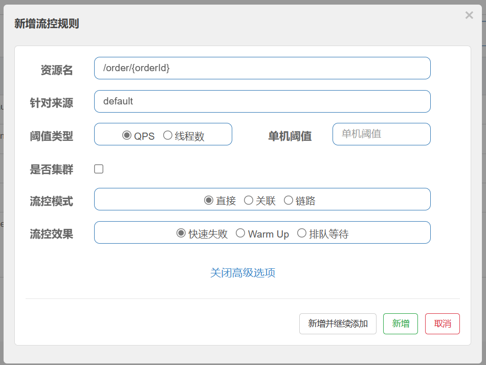


###### **直连模式**

统计当前资源的请求，触发阈值时对当前资源直接限流，也是默认的模式


###### **关联模式**

统计与当前资源相关的另一个资源，触发阈值时，对当前资源限流

**配置规则**：


**语法说明**：当/write资源访问量触发阈值时，就会对/read资源限流，避免影响/write资源。


**使用场景**：比如用户支付时需要修改订单状态，同时用户要查询订单。查询和修改操作会争抢数据库锁，产生竞争。业务需求是优先支付和更新订单的业务，因此当修改订单业务触发阈值时，需要对查询订单业务限流。


**需求说明**：

- 在OrderController新建两个端点：/order/query和/order/update，无需实现业务

- 配置流控规则，当/order/ update资源被访问的QPS超过5时，对/order/query请求限流


1）定义/order/query端点，模拟订单查询

```java
@GetMapping("/query")
public String queryOrder() {
    return "查询订单成功";
}
```

2）定义/order/update端点，模拟订单更新

```java
@GetMapping("/update")
public String updateOrder() {
    return "更新订单成功";
}
```

重启服务，查看sentinel控制台的簇点链路：


**配置流控规则**

对哪个端点限流，就点击哪个端点后面的按钮。我们是对订单查询/order/query限流，因此点击它后面的按钮：


在表单中填写流控规则：


**在Jmeter测试**

选择《流控模式-关联》：


可以看到1000个用户，100秒，因此QPS为10，超过了我们设定的阈值：5

查看http请求：


请求的目标是/order/update，这样这个断点就会触发阈值。

但限流的目标是/order/query，我们在浏览器访问，可以发现：


确实被限流了。


**总结**


###### **链路模式**

**链路模式**：只针对从指定链路访问到本资源的请求做统计，判断是否超过阈值。

**配置示例**：

例如有两条请求链路：

- /test1 --> /common

- /test2 --> /common

如果只希望统计从/test2进入到/common的请求，则可以这样配置：


**实战案例**

需求：有查询订单和创建订单业务，两者都需要查询商品。针对从查询订单进入到查询商品的请求统计，并设置限流。

步骤：

1. 在OrderService中添加一个queryGoods方法，不用实现业务

2. 在OrderController中，改造/order/query端点，调用OrderService中的queryGoods方法

3. 在OrderController中添加一个/order/save的端点，调用OrderService的queryGoods方法

4. 给queryGoods设置限流规则，从/order/query进入queryGoods的方法限制QPS必须小于2


**实现：**

**添加查询商品方法**

在order-service服务中，给OrderService类添加一个queryGoods方法：

```java
public void queryGoods(){
    System.err.println("查询商品");
}
```


**查询订单时，查询商品**

在order-service的OrderController中，修改/order/query端点的业务逻辑：

```java
@GetMapping("/query")
public String queryOrder() {
    // 查询商品
    orderService.queryGoods();
    // 查询订单
    System.out.println("查询订单");
    return "查询订单成功";
}
```


**新增订单，查询商品**

在order-service的OrderController中，修改/order/save端点，模拟新增订单：

```java
@GetMapping("/save")
public String saveOrder() {
    // 查询商品
    orderService.queryGoods();
    // 查询订单
    System.err.println("新增订单");
    return "新增订单成功";
}
```


**给查询商品添加资源标记**

默认情况下，OrderService中的方法是不被Sentinel监控的，需要我们自己通过注解来标记要监控的方法。

给OrderService的queryGoods方法添加@SentinelResource注解：

```java
@SentinelResource("goods")
public void queryGoods(){
    System.err.println("查询商品");
}
```


链路模式中，是对不同来源的两个链路做监控。但是sentinel默认会给进入SpringMVC的所有请求设置同一个root资源，会导致链路模式失效。

我们需要关闭这种对SpringMVC的资源聚合，修改order-service服务的application.yml文件：

```yaml
spring:
  cloud:
    sentinel:
      web-context-unify: false # 关闭context整合
```

重启服务，访问/order/query和/order/save，可以查看到sentinel的簇点链路规则中，出现了新的资源：


**添加流控规则**

点击goods资源后面的流控按钮，在弹出的表单中填写下面信息：


只统计从/order/query进入/goods的资源，QPS阈值为2，超出则被限流。


**Jmeter测试**

选择《流控模式-链路》：


可以看到这里200个用户，50秒内发完，QPS为4，超过了我们设定的阈值2

一个http请求是访问/order/save：


运行的结果：


完全不受影响。


另一个是访问/order/query：


运行结果：


每次只有2个通过。


**总结**

流控模式有哪些？

•直接：对当前资源限流

•关联：高优先级资源触发阈值，对低优先级资源限流。

•链路：阈值统计时，只统计从指定资源进入当前资源的请求，是对请求来源的限流


---


##### 流控效果

在流控的高级选项中，还有一个流控效果选项：


流控效果是指请求达到流控阈值时应该采取的措施，包括三种：

- **快速失败**：达到阈值后，新的请求会被立即拒绝并抛出FlowException异常。是默认的处理方式。

- **warm up**：预热模式，对超出阈值的请求同样是拒绝并抛出异常。但这种模式阈值会动态变化，从一个较小值逐渐增加到最大阈值。

- **排队等待**：让所有的请求按照先后次序排队执行，两个请求的间隔不能小于指定时长


###### **快速失败**

达到阈值后，新的请求会被立即拒绝并抛出FlowException异常。是默认的处理方式。


###### **warm up**

​	阈值一般是一个微服务能承担的最大QPS，但是一个服务刚刚启动时，一切资源尚未初始化（**冷启动**），如果直接将QPS跑到最大值，可能导致服务瞬间宕机。

​	warm up也叫**预热模式**，是应对服务冷启动的一种方案。请求阈值初始值是 maxThreshold / coldFactor，持续指定时长后，逐渐提高到maxThreshold值。而coldFactor的默认值是3.

例如，我设置QPS的maxThreshold为10，预热时间为5秒，那么初始阈值就是 10 / 3 ，也就是3，然后在5秒后逐渐增长到10.


**案例**

需求：给/order/{orderId}这个资源设置限流，最大QPS为10，利用warm up效果，预热时长为5秒


**配置流控规则**：


**Jmeter测试**

选择《流控效果，warm up》：


QPS为10.

刚刚启动时，大部分请求失败，成功的只有3个，说明QPS被限定在3：


随着时间推移，成功比例越来越高：


到Sentinel控制台查看实时监控：


一段时间后：


###### **排队等待**

​	当请求超过QPS阈值时，快速失败和warm up 会拒绝新的请求并抛出异常。

​	而排队等待则是让所有请求进入一个队列中，然后按照阈值允许的时间间隔依次执行。后来的请求必须等待前面执行完成，如果请求预期的等待时间超出最大时长，则会被拒绝。

**工作原理**：

​	例如：QPS = 5，意味着每200ms处理一个队列中的请求；timeout = 2000，意味着**预期等待时长**超过2000ms的请求会被拒绝并抛出异常。

那什么叫做预期等待时长呢？

比如现在一下子来了12 个请求，因为每200ms执行一个请求，那么：

- 第6个请求的**预期等待时长** =  200 * （6 - 1） = 1000ms
- 第12个请求的预期等待时长 = 200 * （12-1） = 2200ms


现在，第1秒同时接收到10个请求，但第2秒只有1个请求，此时QPS的曲线这样的：


如果使用队列模式做流控，所有进入的请求都要排队，以固定的200ms的间隔执行，QPS会变的很平滑：


平滑的QPS曲线，对于服务器来说是更友好的。


**案例**

需求：给/order/{orderId}这个资源设置限流，最大QPS为10，利用排队的流控效果，超时时长设置为5s


**添加流控规则**


**Jmeter测试**

选择《流控效果，队列》：


QPS为15，已经超过了我们设定的10。

如果是之前的 快速失败、warmup模式，超出的请求应该会直接报错。

但是我们看看队列模式的运行结果：


全部都通过了。

再去sentinel查看实时监控的QPS曲线：


QPS非常平滑，一致保持在10，但是超出的请求没有被拒绝，而是放入队列。因此**响应时间**（等待时间）会越来越长。

当队列满了以后，才会有部分请求失败：


###### **总结**

流控效果有哪些？

- 快速失败：QPS超过阈值时，拒绝新的请求

- warm up： QPS超过阈值时，拒绝新的请求；QPS阈值是逐渐提升的，可以避免冷启动时高并发导致服务宕机。

- 排队等待：请求会进入队列，按照阈值允许的时间间隔依次执行请求；如果请求预期等待时长大于超时时间，直接拒绝


---

---


##### 热点参数限流

之前的限流是统计访问某个资源的所有请求，判断是否超过QPS阈值。而热点参数限流是**分别统计参数值相同的请求**，判断是否超过QPS阈值。


###### 全局参数限流

例如，一个根据id查询商品的接口：


访问/goods/{id}的请求中，id参数值会有变化，热点参数限流会根据参数值分别统计QPS，统计结果：


当id=1的请求触发阈值被限流时，id值不为1的请求不受影响。


配置示例：


代表的含义是：对hot这个资源的0号参数（第一个参数）做统计，每1秒**相同参数值**的请求数不能超过5


###### 热点参数限流

刚才的配置中，对查询商品这个接口的所有商品一视同仁，QPS都限定为5.

而在实际开发中，可能部分商品是热点商品，例如秒杀商品，我们希望这部分商品的QPS限制与其它商品不一样，高一些。那就需要配置热点参数限流的高级选项了：


结合上一个配置，这里的含义是对0号的long类型参数限流，每1秒相同参数的QPS不能超过5，有两个例外：

•如果参数值是100，则每1秒允许的QPS为10

•如果参数值是101，则每1秒允许的QPS为15


**案例**

**案例需求**：给/order/{orderId}这个资源添加热点参数限流，规则如下：

•默认的热点参数规则是每1秒请求量不超过2

•给102这个参数设置例外：每1秒请求量不超过4

•给103这个参数设置例外：每1秒请求量不超过10


**注意事项**：热点参数限流对默认的SpringMVC资源无效，需要利用@SentinelResource注解标记资源


**标记资源**

给order-service中的OrderController中的/order/{orderId}资源添加注解：


**热点参数限流规则**

访问该接口，可以看到我们标记的hot资源出现了：


这里不要点击hot后面的按钮，页面有BUG


点击左侧菜单中**热点规则**菜单：


点击新增，填写表单：


**Jmeter测试**

选择《热点参数限流 QPS1》：


这里发起请求的QPS为5.

包含3个http请求：

普通参数，QPS阈值为2


运行结果：


例外项，QPS阈值为4


运行结果：


例外项，QPS阈值为10


运行结果：


---

---

---


#### 隔离和降级

​	限流是一种预防措施，虽然限流可以尽量避免因高并发而引起的服务故障，但服务还会因为其它原因而故障。

而要将这些故障控制在一定范围，避免雪崩，就要靠**线程隔离**（舱壁模式）和**熔断降级**手段了。


**线程隔离**之前讲到过：调用者在调用服务提供者时，给每个调用的请求分配独立线程池，出现故障时，最多消耗这个线程池内资源，避免把调用者的所有资源耗尽。


**熔断降级**：是在调用方这边加入断路器，统计对服务提供者的调用，如果调用的失败比例过高，则熔断该业务，不允许访问该服务的提供者了。


可以看到，不管是线程隔离还是熔断降级，都是对**客户端**（调用方）的保护。需要在**调用方** 发起远程调用时做线程隔离、或者服务熔断。

而我们的微服务远程调用都是基于Feign来完成的，因此我们需要将Feign与Sentinel整合，在Feign里面实现线程隔离和服务熔断。


##### FeignClient整合Sentinel


SpringCloud中，微服务调用都是通过Feign来实现的，因此做客户端保护必须整合Feign和Sentinel。


**修改配置，开启sentinel功能**

修改OrderService的application.yml文件，开启Feign的Sentinel功能：

```yaml
feign:
  sentinel:
    enabled: true # 开启feign对sentinel的支持
```


##### **编写失败降级逻辑**

业务失败后，不能直接报错，而应该返回用户一个友好提示或者默认结果，这个就是失败降级逻辑。

给FeignClient编写失败后的降级逻辑

①方式一：FallbackClass，无法对远程调用的异常做处理

②方式二：FallbackFactory，可以对远程调用的异常做处理，我们选择这种


这里我们演示方式二的失败降级处理。

**步骤一**：在feing-api项目中定义类，实现FallbackFactory：


代码：

```java
package cn.itcast.feign.clients.fallback;

import cn.itcast.feign.clients.UserClient;
import cn.itcast.feign.pojo.User;
import feign.hystrix.FallbackFactory;
import lombok.extern.slf4j.Slf4j;

@Slf4j
public class UserClientFallbackFactory implements FallbackFactory<UserClient> {
    @Override
    public UserClient create(Throwable throwable) {
        return new UserClient() {
            @Override
            public User findById(Long id) {
                log.error("查询用户异常", throwable);
                return new User();
            }
        };
    }
}

```


**步骤二**：在feing-api项目中的DefaultFeignConfiguration类中将UserClientFallbackFactory注册为一个Bean：

```java
@Bean
public UserClientFallbackFactory userClientFallbackFactory(){
    return new UserClientFallbackFactory();
}
```

**步骤三**：在feing-api项目中的UserClient接口中使用UserClientFallbackFactory：

```java
import cn.itcast.feign.clients.fallback.UserClientFallbackFactory;
import cn.itcast.feign.pojo.User;
import org.springframework.cloud.openfeign.FeignClient;
import org.springframework.web.bind.annotation.GetMapping;
import org.springframework.web.bind.annotation.PathVariable;

@FeignClient(value = "userservice", fallbackFactory = UserClientFallbackFactory.class)
public interface UserClient {

    @GetMapping("/user/{id}")
    User findById(@PathVariable("id") Long id);
}
```


重启后，访问一次订单查询业务，然后查看sentinel控制台，可以看到新的簇点链路：


**总结**

Sentinel支持的雪崩解决方案：

- 线程隔离（仓壁模式）
- 降级熔断

Feign整合Sentinel的步骤：

- 在application.yml中配置：feign.sentienl.enable=true
- 给FeignClient编写FallbackFactory并注册为Bean
- 将FallbackFactory配置到FeignClient


---


##### 线程隔离（舱壁模式）


**线程隔离的实现方式**

线程隔离有两种方式实现：

- **线程池隔离**

- **信号量隔离（Sentinel默认采用）**

如图：


**线程池隔离**：给每个服务调用业务分配一个线程池，利用线程池本身实现隔离效果

**信号量隔离**：不创建线程池，而是计数器模式，记录业务使用的线程数量，达到信号量上限时，禁止新的请求。


两者的优缺点：


**sentinel的线程隔离**

**用法说明**：

在添加限流规则时，可以选择两种阈值类型：


- QPS：就是每秒的请求数，在快速入门中已经演示过

- 线程数：是该资源能使用用的tomcat线程数的最大值。也就是通过限制线程数量，实现**线程隔离**（舱壁模式）。


**案例需求**：给 order-service服务中的UserClient的查询用户接口设置流控规则，线程数不能超过 2。然后利用jemeter测试。


**配置隔离规则**

选择feign接口后面的流控按钮：


填写表单：


**Jmeter测试**

选择《阈值类型-线程数<2》：


一次发生10个请求，有较大概率并发线程数超过2，而超出的请求会走之前定义的失败降级逻辑。


查看运行结果：


发现虽然结果都是通过了，不过部分请求得到的响应是降级返回的null信息。


**总结**

线程隔离的两种手段是？

- 信号量隔离

- 线程池隔离

信号量隔离的特点是？

- 基于计数器模式，简单，开销小

线程池隔离的特点是？

- 基于线程池模式，有额外开销，但隔离控制更强


##### 熔断降级

​	熔断降级是解决雪崩问题的重要手段。其思路是由**断路器**统计服务调用的异常比例、慢请求比例，如果超出阈值则会**熔断**该服务。即拦截访问该服务的一切请求；而当服务恢复时，断路器会放行访问该服务的请求。

断路器控制熔断和放行是通过状态机来完成的：


状态机包括三个状态：

- closed：关闭状态，断路器放行所有请求，并开始统计异常比例、慢请求比例。超过阈值则切换到open状态
- open：打开状态，服务调用被**熔断**，访问被熔断服务的请求会被拒绝，快速失败，直接走降级逻辑。Open状态5秒后会进入half-open状态
- half-open：半开状态，放行一次请求，根据执行结果来判断接下来的操作。
  - 请求成功：则切换到closed状态
  - 请求失败：则切换到open状态


断路器熔断策略有三种：慢调用、异常比例、异常数


###### 慢调用

**慢调用**：业务的响应时长（RT）大于指定时长的请求认定为慢调用请求。在指定时间内，如果请求数量超过设定的最小数量，慢调用比例大于设定的阈值，则触发熔断。

例如：


解读：RT超过500ms的调用是慢调用，统计最近10000ms内的请求，如果请求量超过10次，并且慢调用比例不低于0.5，则触发熔断，熔断时长为5秒。然后进入half-open状态，放行一次请求做测试。


**案例**

需求：给 UserClient的查询用户接口设置降级规则，慢调用的RT阈值为50ms，统计时间为1秒，最小请求数量为5，失败阈值比例为0.4，熔断时长为5


**设置慢调用**

修改user-service中的/user/{id}这个接口的业务。通过休眠模拟一个延迟时间：


此时，orderId=101的订单，关联的是id为1的用户，调用时长为60ms：


orderId=102的订单，关联的是id为2的用户，调用时长为非常短；


**设置熔断规则**

下面，给feign接口设置降级规则：


规则：


超过50ms的请求都会被认为是慢请求


**测试**

在浏览器访问：http://localhost:8088/order/101，快速刷新5次，可以发现：


触发了熔断，请求时长缩短至5ms，快速失败了，并且走降级逻辑，返回的null


在浏览器访问：http://localhost:8088/order/102，竟然也被熔断了：


###### 异常比例、异常数

**异常比例或异常数**：统计指定时间内的调用，如果调用次数超过指定请求数，并且出现异常的比例达到设定的比例阈值（或超过指定异常数），则触发熔断。

例如，一个异常比例设置：


解读：统计最近1000ms内的请求，如果请求量超过10次，并且异常比例不低于0.4，则触发熔断。

一个异常数设置：


解读：统计最近1000ms内的请求，如果请求量超过10次，并且异常比例不低于2次，则触发熔断。


**案例**

需求：给 UserClient的查询用户接口设置降级规则，统计时间为1秒，最小请求数量为5，失败阈值比例为0.4，熔断时长为5s


**设置异常请求**

首先，修改user-service中的/user/{id}这个接口的业务。手动抛出异常，以触发异常比例的熔断：


也就是说，id 为 2时，就会触发异常


**设置熔断规则**

下面，给feign接口设置降级规则：


规则：


在5次请求中，只要异常比例超过0.4，也就是有2次以上的异常，就会触发熔断。


**测试**

在浏览器快速访问：http://localhost:8088/order/102，快速刷新5次，触发熔断：


此时，我们去访问本来应该正常的103：


---

---

---


#### 授权规则

授权规则可以对请求方来源做判断和控制。


##### 基本规则

授权规则可以对调用方的来源做控制，有白名单和黑名单两种方式。

- 白名单：来源（origin）在白名单内的调用者允许访问

- 黑名单：来源（origin）在黑名单内的调用者不允许访问

点击左侧菜单的授权，可以看到授权规则：


- 资源名：就是受保护的资源，例如/order/{orderId}

- 流控应用：是来源者的名单，
  - 如果是勾选白名单，则名单中的来源被许可访问。
  - 如果是勾选黑名单，则名单中的来源被禁止访问。

比如：


我们允许请求从gateway到order-service，不允许浏览器访问order-service，那么白名单中就要填写**网关的来源名称（origin）**。


##### **如何获取origin**

Sentinel是通过RequestOriginParser这个接口的parseOrigin来获取请求的来源的。

```java
public interface RequestOriginParser {
    /**
     * 从请求request对象中获取origin，获取方式自定义
     */
    String parseOrigin(HttpServletRequest request);
}
```

这个方法的作用就是从request对象中，获取请求者的origin值并返回。

默认情况下，sentinel不管请求者从哪里来，返回值永远是default，也就是说一切请求的来源都被认为是一样的值default。


因此，我们需要自定义这个接口的实现，让**不同的请求，返回不同的origin**。


例如order-service服务中，我们定义一个RequestOriginParser的实现类：

```java
package cn.itcast.order.sentinel;

import com.alibaba.csp.sentinel.adapter.spring.webmvc.callback.RequestOriginParser;
import org.springframework.stereotype.Component;
import org.springframework.util.StringUtils;

import javax.servlet.http.HttpServletRequest;

@Component
public class HeaderOriginParser implements RequestOriginParser {
    @Override
    public String parseOrigin(HttpServletRequest request) {
        // 1.获取请求头
        String origin = request.getHeader("origin");
        // 2.非空判断
        if (StringUtils.isEmpty(origin)) {
            origin = "blank";
        }
        return origin;
    }
}
```

我们会尝试从request-header中获取origin值。


##### **给网关添加请求头**

既然获取请求origin的方式是从reques-header中获取origin值，我们必须让**所有从gateway路由到微服务的请求都带上origin头**。

这个需要利用之前学习的一个GatewayFilter来实现，AddRequestHeaderGatewayFilter。

修改gateway服务中的application.yml，添加一个defaultFilter：

```yaml
spring:
  cloud:
    gateway:
      default-filters:
        - AddRequestHeader=origin,gateway
      routes:
       # ...略
```

这样，从gateway路由的所有请求都会带上origin头，值为gateway。而从其它地方到达微服务的请求则没有这个头。


##### **配置授权规则**

接下来，我们添加一个授权规则，放行origin值为gateway的请求。


配置如下：


现在，我们直接跳过网关，访问order-service服务：


通过网关访问：


---

---

---


#### 自定义异常结果

​	默认情况下，发生限流、降级、授权拦截时，都会抛出异常到调用方。异常结果都是flow limmiting（限流）。这样不够友好，无法得知是限流还是降级还是授权拦截。


##### 异常类型


而如果要自定义异常时的返回结果，需要实现BlockExceptionHandler接口：

```java
public interface BlockExceptionHandler {
    /**
     * 处理请求被限流、降级、授权拦截时抛出的异常：BlockException
     */
    void handle(HttpServletRequest request, HttpServletResponse response, BlockException e) throws Exception;
}
```

这个方法有三个参数：

- HttpServletRequest request：request对象
- HttpServletResponse response：response对象
- BlockException e：被sentinel拦截时抛出的异常

这里的BlockException包含多个不同的子类：

| **异常**             | **说明**           |
| -------------------- | ------------------ |
| FlowException        | 限流异常           |
| ParamFlowException   | 热点参数限流的异常 |
| DegradeException     | 降级异常           |
| AuthorityException   | 授权规则异常       |
| SystemBlockException | 系统规则异常       |


##### 自定义异常处理

下面，我们就在order-service定义一个自定义异常处理类：

```java
package cn.itcast.order.sentinel;

import com.alibaba.csp.sentinel.adapter.spring.webmvc.callback.BlockExceptionHandler;
import com.alibaba.csp.sentinel.slots.block.BlockException;
import com.alibaba.csp.sentinel.slots.block.authority.AuthorityException;
import com.alibaba.csp.sentinel.slots.block.degrade.DegradeException;
import com.alibaba.csp.sentinel.slots.block.flow.FlowException;
import com.alibaba.csp.sentinel.slots.block.flow.param.ParamFlowException;
import org.springframework.stereotype.Component;

import javax.servlet.http.HttpServletRequest;
import javax.servlet.http.HttpServletResponse;

@Component
public class SentinelExceptionHandler implements BlockExceptionHandler {
    @Override
    public void handle(HttpServletRequest request, HttpServletResponse response, BlockException e) throws Exception {
        String msg = "未知异常";
        int status = 429;

        if (e instanceof FlowException) {
            msg = "请求被限流了";
        } else if (e instanceof ParamFlowException) {
            msg = "请求被热点参数限流";
        } else if (e instanceof DegradeException) {
            msg = "请求被降级了";
        } else if (e instanceof AuthorityException) {
            msg = "没有权限访问";
            status = 401;
        }

        response.setContentType("application/json;charset=utf-8");
        response.setStatus(status);
        response.getWriter().println("{\"msg\": " + msg + ", \"status\": " + status + "}");
    }
}
```


重启测试，在不同场景下，会返回不同的异常消息.

限流：


授权拦截时：


#### 规则持久化

现在，sentinel的所有规则都是内存存储，重启后所有规则都会丢失。

在生产环境下，我们必须确保这些规则的持久化，避免丢失。


##### 规则管理模式

规则是否能持久化，取决于规则管理模式，sentinel支持三种规则管理模式：

- 原始模式：Sentinel的默认模式，将规则保存在内存，重启服务会丢失。
- pull模式
- push模式


##### pull模式

pull模式：控制台将配置的规则推送到Sentinel客户端，而客户端会将配置规则保存在本地文件或数据库中。以后会定时去本地文件或数据库中查询，更新本地规则。


##### push模式

push模式：控制台将配置规则推送到远程配置中心，例如Nacos。Sentinel客户端监听Nacos，获取配置变更的推送消息，完成本地配置更新。


##### 实现push模式


让服务监听Nacos中的sentinel规则配置。


###### 引入依赖

在order-service中引入sentinel监听nacos的依赖：

```xml
<dependency>
    <groupId>com.alibaba.csp</groupId>
    <artifactId>sentinel-datasource-nacos</artifactId>
</dependency>
```


###### 配置nacos地址

在order-service中的application.yml文件配置nacos地址及监听的配置信息：

```yaml
spring:
  cloud:
    sentinel:
      datasource:
        flow:
          nacos:
            server-addr: localhost:8848 # nacos地址
            dataId: orderservice-flow-rules
            groupId: SENTINEL_GROUP
            rule-type: flow # 还可以是：degrade、authority、param-flow
```


###### 修改源码

SentinelDashboard默认不支持nacos的持久化，需要修改源码。


**一、解压**

解压课前资料中的sentinel源码包：


然后并用IDEA打开这个项目，结构如下：


**二、修改nacos依赖**

在sentinel-dashboard源码的pom文件中，nacos的依赖默认的scope是test，只能在测试时使用，这里要去除：


将sentinel-datasource-nacos依赖的scope去掉：

```xml
<dependency>
    <groupId>com.alibaba.csp</groupId>
    <artifactId>sentinel-datasource-nacos</artifactId>
</dependency>
```


**三、添加nacos支持**

在sentinel-dashboard的test包下，已经编写了对nacos的支持，我们需要将其拷贝到main下。


**四、修改nacos地址**

然后，还需要修改测试代码中的NacosConfig类：


修改其中的nacos地址，让其读取application.properties中的配置：


在sentinel-dashboard的application.properties中添加nacos地址配置：

```properties
nacos.addr=localhost:8848
```


**五、配置nacos数据源**

另外，还需要修改com.alibaba.csp.sentinel.dashboard.controller.v2包下的FlowControllerV2类：


让我们添加的Nacos数据源生效：


**六、修改前端页面**

接下来，还要修改前端页面，添加一个支持nacos的菜单。

修改src/main/webapp/resources/app/scripts/directives/sidebar/目录下的sidebar.html文件：


将其中的这部分注释打开：


修改其中的文本：


**七、重新编译、打包项目**

运行IDEA中的maven插件，编译和打包修改好的Sentinel-Dashboard：


**八、启动**

启动方式跟官方一样：

```sh
java -jar sentinel-dashboard.jar
```

如果要修改nacos地址，需要添加参数：

```sh
java -jar -Dnacos.addr=localhost:8848 sentinel-dashboard.jar
```


---

---

---


## 分布式事务 TODO:


## 分布式缓存 TODO:


## 高级MQ实现 TODO:


---

---


## 单词备忘


|         单词         |         解释         |
| :------------------: | :------------------: |
| -------------------- | -------------------- |
|     LoadBalanced     |       负载均衡       |
|  RegistrationCenter  |       注册中心       |
|      discovery       |         发现         |
|                      |                      |
|                      |                      |
|                      |                      |
|                      |                      |
|                      |                      |
|                      |                      |
|                      |                      |
|                      |                      |
|                      |                      |
|                      |                      |
|                      |                      |
|                      |                      |
|                      |                      |
|                      |                      |
|                      |                      |
|                      |                      |
|                      |                      |
|                      |                      |
|                      |                      |
|                      |                      |
|                      |                      |


